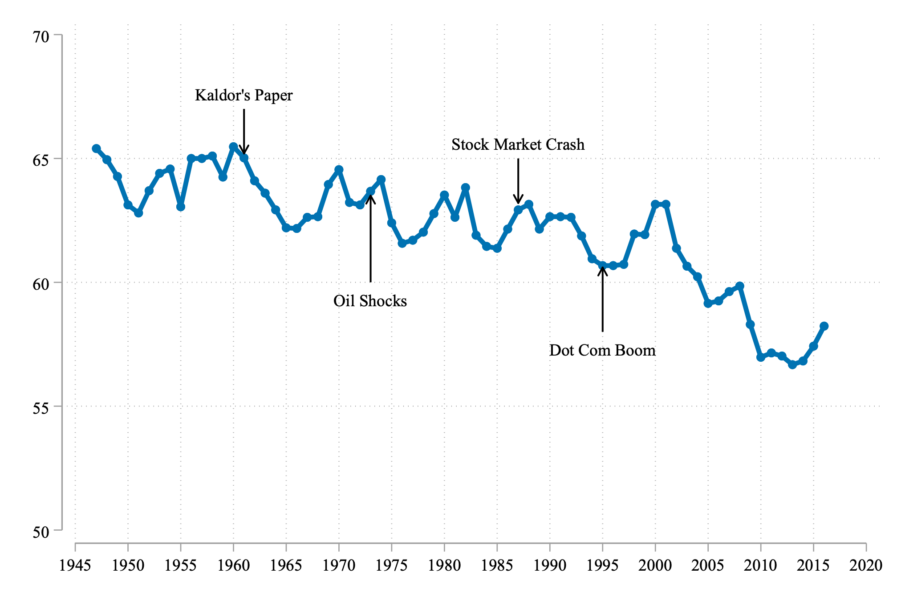
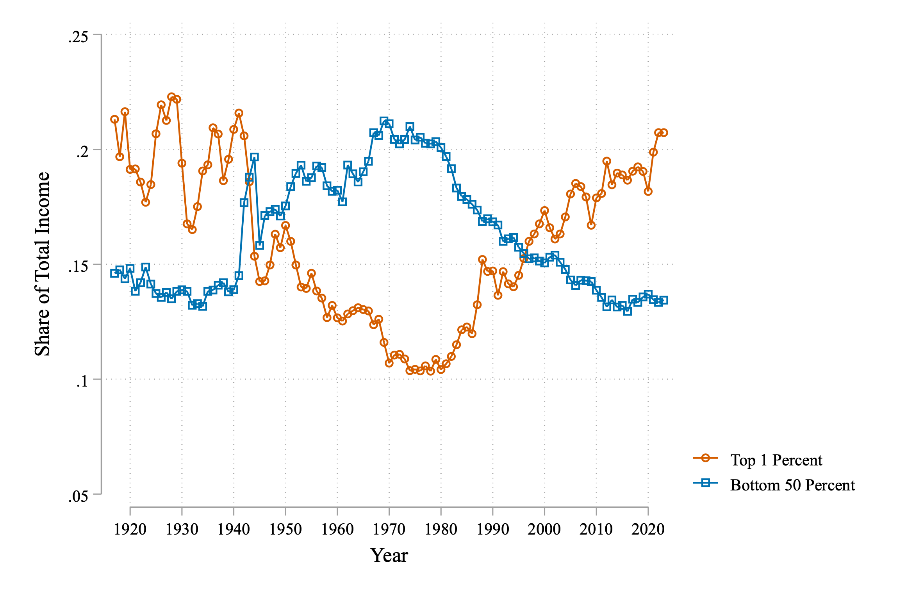
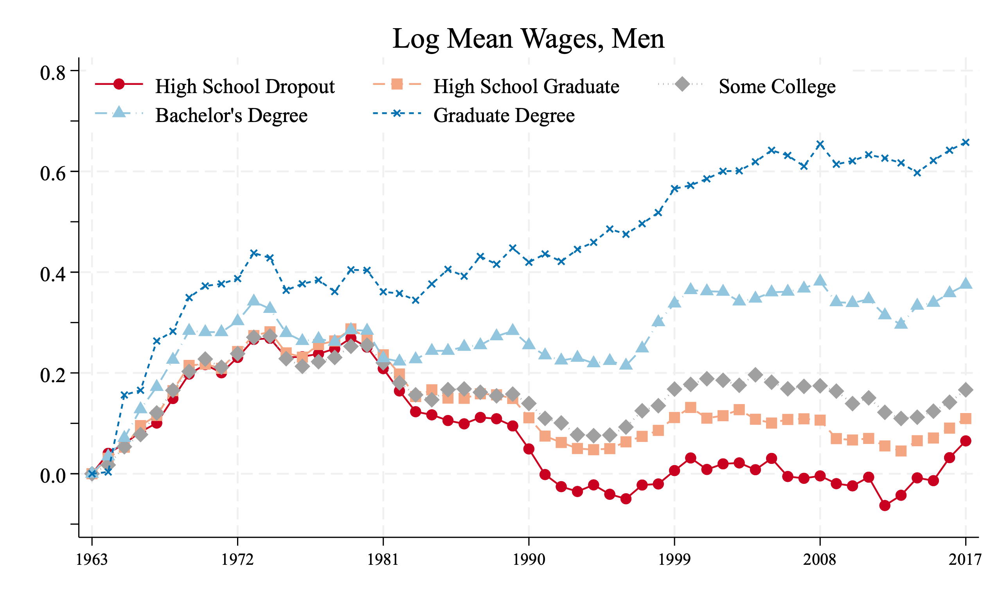
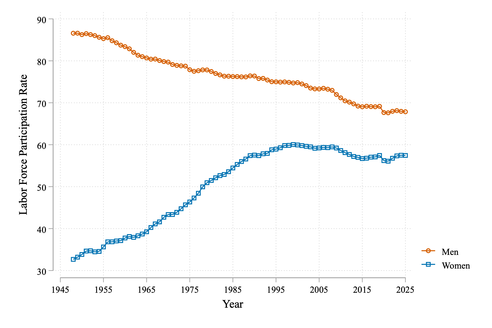

## Introduction

Three big questions that will guide our exploration of modern labor economics:

1. **The Fall in the Labor Share** - Why has labor's share of income been declining since 2000?

2. **The Rise of Wage Inequality** - What drove the dramatic increase in inequality since the 1980s?

3. **Dramatic Shifts in Labor Force Participation** - What explains the changing patterns of who works?

## The Fall in the Labor Share

### What is Labor Share?

- **Labor share of income**: The fraction of income paid to workers
- The rest goes to capital owners
- Can be calculated for individual firms or entire countries

### Apple Example (2024)

- **Revenue**: $390 billion
- **Value Added**: $180 billion (revenue minus input costs)
- **Labor Compensation**: $25 billion
- **Labor Share**: 25/180 ≈ 25%

### Walmart Comparison

- **Value Added**: $100 billion
- **Labor Compensation**: $75 billion  
- **Labor Share**: 75%

Much higher than Apple - reflects different business models

## Historical Pattern: The Kaldor Fact

### Nicholas Kaldor's Observation (1961)

- Labor share was remarkably **stable** throughout much of the 20th century
- Hovered around 65% in the U.S. from 1947-2000
- Persisted despite major economic changes:
  - Post-war boom
  - Oil shocks of the 1970s
  - 1987 stock market crash
  - Internet boom of the 1990s

### The Break: 2000 Onwards

- **Steady decline** since 2000
- First sustained drop in modern U.S. history
- **Key Question**: What changed after 2000?

{width=80%}

## Ancient Labor Share: Roman Empire

### Diocletian's Price Edicts (301 AD)

- Economic crisis led to price controls
- Stone tablets listed maximum prices and wages
- Provides rare glimpse into ancient economy

{width=60%}

### Rough Calculation

- **Agricultural worker wage**: 25 denarii per day
- **Wheat production**: 240 kg per day
- **Wheat value**: 1,400 denarii per day
- **Implied labor share**: 25/1,400 ≈ 1.8%

*Much lower than modern economies!*

## The Rise of Wage Inequality

### The Great Compression (1920s-1970s)

- **1929**: Top 1% earned 20% of all income
- **1970**: Top 1% earned just 10% of all income
- Post-WWII boom created large middle class
- Inequality dramatically decreased

### The Great Divergence (1980s-Present)

- **2020**: Inequality returned to 1920s levels
- Top 1% again earning ~20% of all income
- Bottom 50% share declined

{width=80%}

## Real Income: Comparing Across Time

### The Challenge

- **Nominal income** in 1950: $3,000 median household
- **Nominal income** in 2023: $80,000 median household
- But what about **purchasing power**?

### Simplified Example

**1950 vs 2023 Prices:**
- Housing: $42/month → $1,300/month (30x increase)
- Bread: $0.30/loaf → $2.00/loaf (6.7x increase)

**Price Index Calculation:**
- 50% housing + 50% groceries
- Average price increase: ~20x

### Real Income Comparison

**2023 income in 1950 dollars:**
$80,000 ÷ 20 = $4,000

**Conclusion**: Real median income has increased since 1950

## More Accurate Comparison

### Using Official Data

- **Consumer Price Index (CPI)**: Tracks thousands of goods
- **Actual price increase**: 12.6x (not 20x)
- **Real 2023 income**: $80,000 ÷ 12.6 = $6,350

### Key Finding

Real median household income has **more than doubled** since 1950

*Despite rising costs, purchasing power has increased significantly*

## Inequality by Education Level

### David Autor's Research

**Income trends by education (1963-2019):**

- **Graduate degree**: Steady income growth
- **College degree**: Strong growth after 1990s
- **High school or less**: Stagnant or declining

### The 1980s Turning Point

- **Before 1980**: All groups saw income growth
- **After 1980**: Dramatic divergence
- **High school dropouts**: Lost all 1960s gains by 1990

{width=80%}

## The McWage Index

### Creative International Comparison

**Ashenfelter & Jurajda's approach:**
- Compare McDonald's worker wages globally
- Measure in "Big Macs per hour"
- Controls for job standardization

### Results

- **U.S. worker**: ~2 Big Macs per hour
- **Chinese worker**: ~0.5 Big Macs per hour
- **Insight**: Clean measure of purchasing power differences

## Labor Force Participation

### The Metric

**Labor Force Participation Rate:**
- Fraction of adults (16+) who are employed OR actively seeking work
- Less volatile than unemployment rate
- Reveals long-term trends in work patterns

### Dramatic Gender Divergence

**Women (1948-2023):**
- 1948: ~30% participation
- 1990s: ~60% participation
- Recent: Slight decline

**Men (1948-2023):**
- 1948: ~90% participation  
- 2023: ~70% participation
- Steady, continuous decline

{width=80%}

## Understanding the Trends

### Women's Participation

- **Massive increase** from 1950s-1990s
- Reflects changing social norms, opportunities
- **Stabilized** since mid-1990s

### Men's Participation

- **Continuous decline** over 75 years
- Accelerated in recent decades
- **Not explained** by women's entry alone

## Three Categories of Explanations

### 1. Technology

- Rise of computers and automation
- Changes in how work is performed
- May affect different skill levels differently

### 2. Competition

- **Globalization**: Changes in what countries produce
- **Market power**: How competitive are labor markets?
- Traditional assumption: Perfect competition

### 3. Institutions

- Unionization rates
- Minimum wage policies
- Employment protection laws
- Government regulations

## Economic Models

### Why Models Matter

- Labor market has millions of participants
- Need simplified framework for understanding
- **Analogy**: Newton's gravity model
  - Ignore individual particles
  - Focus on mass and distance

### Two Key Models

**1. Perfect Competition**
- Traditional economic model
- Useful for technology analysis
- Predicts policies harm efficiency

**2. Monopsonistic Competition**
- Firms have market power over workers
- Wages may not reflect productivity
- Different policy implications

## Course Roadmap

### Our Approach

For each topic, we will:
1. **Examine the evidence** - What do the data show?
2. **Develop theories** - What could explain the patterns?
3. **Test predictions** - Do the theories match reality?
4. **Consider policy** - What should we do about it?

### The Big Questions

Throughout the course, we return to:
- **Labor share decline**
- **Rising inequality** 
- **Changing participation**

## Key Takeaways

### Historical Context Matters

- Many current trends have deep historical roots
- **1980s** appears to be a crucial turning point
- **2000s** marked new phase for labor share

### Multiple Factors at Play

- Technology, competition, and institutions all matter
- **No single explanation** likely sufficient
- Need frameworks to organize our thinking

### Models as Tools

- Simplify complex reality
- Make assumptions explicit
- Generate testable predictions
- Guide policy thinking

## Next Steps

### Coming Up

- **Technology and Labor Markets**
- **Globalization and Trade**
- **Market Power and Monopsony**
- **Institutions and Policy**

### Questions to Consider

- Which explanation seems most compelling to you?
- How might these factors interact?
- What additional evidence would help?
