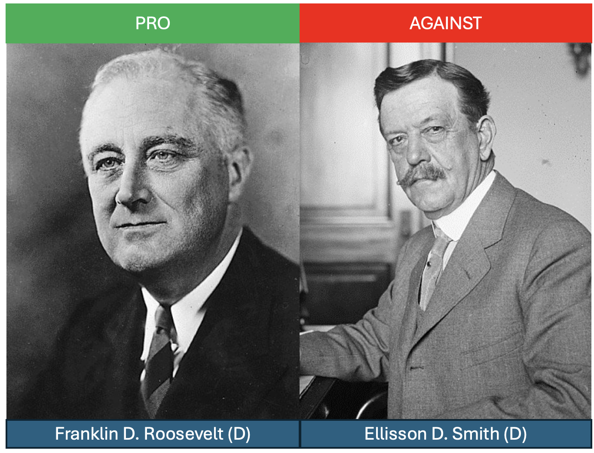
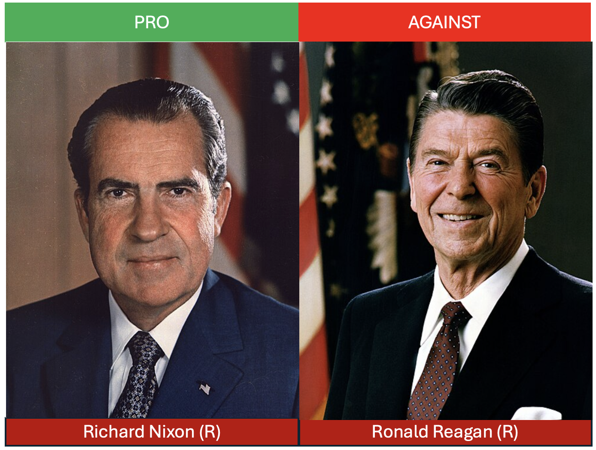

## A Brief History

In the US, a federal minimum wage was first passed in 1938 as part of the Fair Labor Standards Act. The Fair Labor Standards Act was a key part of the New Deal, a large economic stimulus bill aimed at pulling the US out of the Great Depression.

But ever since its inception, minimum wages have been hotly debated. @fig-minimum-wage-opinions shows a few famous pairs of politicians that had opposing views on the minimum wage. Franklin D. Roosevelt, the 32nd peresident of the United States, was a strong supporter of the minimum wage. The mastermind of the New Deal, Franklin D. Roosevelt felt that minimum wages were necessary to protect the most vulnerable workers in society, and would provide a much-needed boost to the economy by increasing the spending power of workers. At the time, there were many critics of the minimum wage, even those who supported the broader New Deal legislation. For example, Ellison D. Smith was a prominent Democratic senator from South Carolina who opposed the minimum wage, arguing that it would lead to economic collapse in the South. His argument was that his constituency in the South paid lower wages and would have a hard time adjusting to the new minimum wage. Businesses would fail. The workers the minimum wage was supposed to help would actually be hurt the most.

Later, in the 1970 and 80s, two prominent Republicans had somewhat different views. Richard Nixon was skeptical of large minimum wage changes (he might protest being labelled as pro-minimum wage). However, in 1974, he igned a bill that would raise the minimum wage from $1.60 to $2.30 over the course of three years, a roughly 43% increase. After signing the bill, Nixon stated, "raising the minimum wage is now a matter of justice that can no longer be fairly delayed."

His opinions however do stand in stark contrast to another prominent Republican, Ronald Reagan. Reagan was a strong opponent of the minimum wage. In an address to Congress, he stated he would vigorously oppose any attempt to increase the minimum wage, arguing "Raising the level of the minimum wage would cause many adult workers to lose their jobs."

Today we have similar debates. Bernie Sanders, a Democratic senator from Vermont, is a strong proponent of increasing the minimum wage to $15 per hour. He argues that the current federal minimum wage of $7.25 is insufficient to provide a decent standard of living for workers and that raising it would help reduce poverty and inequality. On the other hand, Senator Ted Cruz is staunchly opposed. He argues, "Every time you raise the minimum wage, the people who are hurt the most is the most vulnerable."


:::: {.columns}

::: {.column width="50%"}
::: {#fig-minimum-wage-opinions}





Minimum Wage Opinions Through Time 
:::
:::

::: {.column width="50%"}
```{python}
#| echo: false
#| label: fig-major-events
#| fig-cap: "Major Minimum Wage Events"

import matplotlib.pyplot as plt
import numpy as np

fig, ax = plt.subplots(figsize=(5, 9.55))

# Create elegant vertical timeline
# Main timeline line with rounded caps
ax.plot([0.3, 0.3], [0.1, 0.9], linewidth=8, color='#2C3E50', solid_capstyle='round')

# Arrow head at bottom
ax.annotate('', xy=(0.3, 0.1), xytext=(0.3, 0.2),
            arrowprops=dict(arrowstyle='->', lw=6, color='#2C3E50', 
                          mutation_scale=30, shrinkA=0, shrinkB=0))

# Key milestones positions (from top to bottom) - positioned by actual years
# Timeline spans 1938-2025 (87 years total)
# Calculate relative positions: (year - 1938) / 87
milestone_positions = [0.9, 0.52, 0.26, 0.1]  # 1938=0.9, 1968≈0.55, 1994≈0.26, 2025=0.1
milestone_years = ['1938', '1961', '1994', '2025']
milestone_labels = [
    'Fair Labor\nStandards Act',
    'Coverage\nExpanded',
    'Card-Krueger\nStudy',
    'Present'
]

# Decorative dots at milestone points
ax.scatter([0.3] * len(milestone_positions), milestone_positions, 
           s=220, c='#E74C3C', edgecolors='#2C3E50', linewidth=3, zorder=5)

# Add milestone labels - all on the right side for 50% width
for i, (pos, year, label) in enumerate(zip(milestone_positions, milestone_years, milestone_labels)):
    ax.text(0.45, pos, f'{year}\n{label}', ha='left', va='center', 
            fontsize=13, fontweight='bold', color='#2C3E50',
            bbox=dict(boxstyle="round,pad=0.4", facecolor='white', 
                     edgecolor='#2C3E50', alpha=0.9))

# Add subtle background gradient effect
gradient = np.linspace(0, 1, 100).reshape(100, 1)
ax.imshow(gradient, extent=[0.25, 0.35, 0.1, 0.9], aspect='auto', 
          cmap='Blues', alpha=0.15, zorder=0)

# Clean up the plot
ax.set_xlim(0, 1)
ax.set_ylim(0, 1)
ax.axis('off')

plt.tight_layout()
plt.show()
```
:::

::::


There are two perhaps surprsing things about these opposing views. First, the arguments have been basically the same for nearly a century. Individuals who support the minimum wage argue that employers need to provide a living wage to their workers. Having a minimum wage ensures those most vulnerable are not taken advantage of by employers. Those who oppose the minimum wage argue the exact opposite. The minimum wage is not protection for vulnerable workers, but reduces employment and destroys businesses. The individuals who are the worst off are those workers who lose their jobs as a result of the minimum wage. 

Therefore, the key question is this: does increases in the minimum wage lead to job losses? We will explore this question in steps. First, to better understand the minimum wage, we will study how it has changed over time. @fig-major-events plots a timeline of major events that we will consider. First, the federal minimum wage was established in 1938. Since that time, there have been many increases, but also periods of stagnation. The 1980s, in particular, were a period in which the real value of the minimum wage fell significantly. This suggests that a minimum wage may be a contributor to one of our three big trends: the rise in wage inequality. If the minimum wage has fallen in real terms, then this may be one reason why the wages of low-income workers have stagnated. In the first part of our analysis, we will explore these descriptives further.

However, to have the complete picture, we need to understand the impacts on employment. It could be that even if the minimum wage has fallen in real terms, low-wage workers are still better off because there are more jobs available. To understand the relationship between minimum wages and employment, we will explore the seminal study of David Card and Alan Krueger (1994). While there are prior studies, @card1994minimum introduced a new empirical approach that not only led to important insights into the employment effects of the minimum wage, but has made a lasting impression on empirics in economics. It is one of the first and most famous examples of a "natural experiment" in economics. "Natural experiments" are now ubiquitous in economics, and are useful for identifying causal effects, something that is notoriously difficult in practice. 

::: {.callout-tip title="📜 A Maximum Wage in the Middle Ages"}

In the 14th century, Black Death swept through much of Europe, killing large portions of the population. This led to a large labor shortage in England. The labor supply curve in medieval England shifted massively to the left. This resulted in widespread wage increases. 

Landowners were unhappy with the rising wages and used their influence in politics to pass the Statute of Laborers in 1351.  This law set the wage for laborers equal to the wage rate that had been paid before the Black Death. In other words, instead of a minimum wage, medieval England had a maximum wage. Essentially, the landowners were unhappy with competition in the labor market and so passed legislation to limit competition among owners of land. If there is a law that sets a maximum wage, then you know your competitor will not outbid you for labor.

You can probably guess that a maximum wage was not very popular among workers. It was one of the main contributing factors that led to the Peasants' Revolt of 1381, a major uprising in the history of England. 

:::


## Theory 

While politicians have more-or-less always been divided, economists, for a long time, were actually in broad agreement. In 1980, economist Charles Brown, in a Journal of Economic Perspectives article, asked the question: "Are minimum wage laws overrated?" At the time, the consensus was generally, "yes." 

To see why this was such a widely-held view, let's again consider the case of a perfectly competitive labor market. In the figure below, we plot a labor-demand curve vs. the labor supply curve. Let's assume that the equilibrium wage is $5.00 in this market. Now, suppose the federal minimum wage is set to $7.25. 

```{python}
#| echo: false
#| label: fig-minimum-wage-theory
#| fig-cap: "Minimum Wage in a Perfectly Competitive Labor Market"

import matplotlib.pyplot as plt
import numpy as np

fig, ax = plt.subplots(figsize=(8, 6))

# Create quantity range for curves (shorter range for textbook style)
quantity_demand = np.linspace(10, 80, 50)  # Demand curve range
quantity_supply = np.linspace(10, 80, 50)  # Supply curve range

# Labor demand curve (downward sloping) - intersects supply at Q=50, W=5
wage_demand = 10 - 0.1 * quantity_demand

# Labor supply curve (upward sloping) - intersects demand at Q=50, W=5  
wage_supply = 0 + 0.1 * quantity_supply

# Equilibrium point
equilibrium_quantity = 50
equilibrium_wage = 5.0

# Minimum wage level
min_wage = 7.25

# Find quantities at minimum wage
# For demand: 7.25 = 10 - 0.1*Q_d → Q_d = (10-7.25)/0.1 = 27.5
q_demand_at_min_wage = (10 - min_wage) / 0.1  
# For supply: 7.25 = 0 + 0.1*Q_s → Q_s = 7.25/0.1 = 72.5
q_supply_at_min_wage = min_wage / 0.1

# Plot supply and demand curves (only in their relevant ranges)
ax.plot(quantity_demand, wage_demand, color='#2E86AB', linewidth=2.5)
ax.plot(quantity_supply, wage_supply, color='#F18F01', linewidth=2.5)

# Add curve labels directly on the graph
ax.text(70, 3, 'Labor Demand', fontsize=12, fontweight='bold', color='#2E86AB', 
        bbox=dict(boxstyle="round,pad=0.3", facecolor='white', alpha=0.8))
ax.text(65, 8, 'Labor Supply', fontsize=12, fontweight='bold', color='#F18F01',
        bbox=dict(boxstyle="round,pad=0.3", facecolor='white', alpha=0.8))

# Mark equilibrium point
ax.plot(equilibrium_quantity, equilibrium_wage, 'go', markersize=10, label=f'Equilibrium (Q1)')

# Draw minimum wage line
ax.axhline(y=min_wage, color='purple', linestyle='--', linewidth=3, label='Minimum Wage ($7.25)')

# Mark quantities at minimum wage with better visibility
ax.plot(q_demand_at_min_wage, min_wage, color='#2E86AB', marker='s', markersize=10, markeredgecolor='white', markeredgewidth=2)
ax.plot(q_supply_at_min_wage, min_wage, color='#F18F01', marker='s', markersize=10, markeredgecolor='white', markeredgewidth=2)

# Add vertical lines and labels for Q1, Q2, and Q3 on x-axis
ax.axvline(x=equilibrium_quantity, color='green', linestyle=':', alpha=0.7, linewidth=2, ymax=equilibrium_wage/10)
ax.axvline(x=q_demand_at_min_wage, color='#2E86AB', linestyle=':', alpha=0.7, linewidth=2, ymax=min_wage/10)
ax.axvline(x=q_supply_at_min_wage, color='#F18F01', linestyle=':', alpha=0.7, linewidth=2, ymax=min_wage/10)

# Add labels on x-axis
ax.text(equilibrium_quantity, -0.5, 'Q₁', fontsize=12, fontweight='bold', ha='center', color='green')
ax.text(q_demand_at_min_wage, -0.5, 'Q₂', fontsize=12, fontweight='bold', ha='center', color='#2E86AB')
ax.text(q_supply_at_min_wage, -0.5, 'Q₃', fontsize=12, fontweight='bold', ha='center', color='#F18F01')

# Shade unemployment area with better pattern
ax.fill_betweenx([min_wage, min_wage], q_demand_at_min_wage, q_supply_at_min_wage, 
                 alpha=0.4, color='red', hatch='///', edgecolor='darkred', linewidth=0.5)

# Add unemployment bracket
mid_point = (q_demand_at_min_wage + q_supply_at_min_wage) / 2
bracket_height = 0.2
ax.plot([q_demand_at_min_wage, q_demand_at_min_wage], [min_wage + bracket_height, min_wage + bracket_height + 0.1], 'k-', linewidth=2)
ax.plot([q_supply_at_min_wage, q_supply_at_min_wage], [min_wage + bracket_height, min_wage + bracket_height + 0.1], 'k-', linewidth=2)
ax.plot([q_demand_at_min_wage, q_supply_at_min_wage], [min_wage + bracket_height + 0.1, min_wage + bracket_height + 0.1], 'k-', linewidth=2)
ax.text(mid_point, min_wage + bracket_height + 0.3, 'Unemployment', fontsize=11, fontweight='bold', ha='center', color='darkred')

# Labels and formatting - add custom x-axis label at far right
ax.set_ylabel('Wage ($)', fontsize=14, fontweight='bold')
ax.text(85, -0.8, 'Quantity of Labor', fontsize=14, fontweight='bold', ha='right', va='top')
ax.set_xlim(0, 90)
ax.set_ylim(0, 10)
ax.grid(True, alpha=0.3)
ax.legend(loc='upper right', fontsize=9)

# Remove x-axis tick labels for cleaner look
ax.set_xticks([])

plt.tight_layout()
plt.show()
```

Well at $7.25, firms are not willing to hire as many workers. The quantity of labor demanded falls from Q1 to Q2. However, at this higher wage, more workers are willing to work. The quantity of labor supplied increases from Q1 to Q3. The result is a surplus of labor, or unemployment. The number of unemployed workers is the difference between the quantity supplied and the quantity demanded, or Q3 - Q2.

The key insight here is that employment does drop from Q1 to Q2. This is a key reason why many economists and politicians believed that minimum wages are not particularly effective policies. It is true you are helping some vulnerable workers (those who keep their jobs are better off), but what about those who lose their jobs? The minimum wage did not help these indivduals.

While the theoretical prediction is clear here, the theory doesn't tell us how much employment drops by. This depends on the shape of the supply and demand curves. Therefore, this is an empirical question. 

## Confounding Factors

How do we measure the impact of the minimum wage on employment? One simple idea is to use variation across states. In the US, some states pass higher minimum wages than others. For example, in 2025, the state with the highest minimum wage is Washington, at $16.66 per hour. Alabama, in contrast, has no state-level minimum wage. Therefore, the prevailining minimum wage in Alabama is $7.25, the federal minimum wage.

If we look the current unemployment numbers, the unemployment rate in Washington is equal to 4.5%, while in Alabama it is equal to 3.3%. What can we conclude from this exercise? Can we say that a minimum wage of $16.66 relative to $7.25 causes a 1.2 percentage point increase in unemployment?

Not really. There are massive differences between the two states. For one, the cost of living in Washington may be very different than in Alabama, so maybe we should attempt to control for local prices. But are there other differences? Well, the types of jobs in the two locations may also be very different. Alabama and Washington have different industries present. The individuals who work in these locations may also be very different. They may have different education, different skills, and different preferences.

This is a perennial issue in economics and science more generally. Our goal here is to understand the **causal effect** of a minimum wage increase on employment. However, we cannot simply compare two states with different minimum wages because there may be **confounding factor**. A confounding factor is a variable that is correlated with our variable of interest (the minimum wage) and our outcome of interest (employment).

The idea of confounding factors is an extremely important concept, not only studying the minimum wage, not only in all of empirical economics generally, but also more broadly to science. Many question in science can be undestood in a causal framework. We want to know whether a change in X has a causal impact on Y. However, we cannot simply compare two groups with different X values because there may be confounding factors. 

So what do we do? How can we measure the causal effect of a minimum wage increase on employment? In medicine, researchers have found a solution to this problem: the randomized controlled trial (RCT). In an RCT, individuals are randomly assigned to a treatment group or a control group. In the context of our example, this would be akin to randomly assigning some states to a high-minimum wage and others to a low-minimum wage. Because the assignment is now random, the two groups will be similar on average. 

In the context of minimum wage, conducting an RCT is impossible. We cannot randomly assign individuals to different minimum wage levels. However, instead, researchers have taken advantages **natural experiments**. The key idea in a natural experiment is that sometimes you can look out into the world and find a situation that looks similar to an RCT. You can identify a group of individuals, firms, or states that receive a policy, but another group of individuals, firms, or states do not. Let's study how we might find a natural experiment in the context of minimum wage.

## Empirics: Difference-in-Differences

In 1992, New Jersey raised its minimum wage from $4.25 per hour to $5.05 per hour. At the time, this gave New Jersey the highest minimum wage in the country. Our goal here is to understand how the increase from $4.25 to $5.05 impacted employment in New Jersey.

Our goal is to understand how the increase from $4.25 to $5.05 impacted employment in New Jersey. To focus our discussion, we will consider employment in fast-food restaurants. These are a natural choice. Fast-food restaurants are a larger industry and are more likely to be affected by the minimum wage change than other industries. Our goal is to measure the change in employment in New Jersey fast-food restaurants before and after the minimum wage increase.

A simple way to potentially do this would be to compute the employment rate in New Jersey before and after the minimum wage increase. How is this exactly useful? Well, remember all those confounding factors we discussed? For example, the cost of living, the education level, the industries present. All of these things may vary between New Jersey and other states, but within New Jersey, these factors are likely to be similar before and after the minimum wage increase. The magic of comparing across time is that we don't actually need to figure out the entire list of confounding factors. We just need to assume that they are constant over time. The change in employment in New Jersey before and after the minimum wage increase is likely to be due to the minimum wage increase, not these confounding factors.

Let's write out the change in employment in New Jersey as follows:
$$
\Delta E_{NJ} = E_{NJ, 1992} - E_{NJ, 1991}
$$

Now, before we take $E_{NJ}$ as the causal impact of the minimum wage, let's think carefully about what this would imply. If we were to make this leap, then we would be saying that any change in employment in New Jersey between 1991 and 1992 is due to the minimum wage increase. 

This is a strong assumption. Employment changes all the time through the years even though there are often no policy changes. By taking this difference we have controlled for confounding factors specific to New Jersey, but now that we are comparing across time, we have a new set of confounding factors. For example, what if the economy went into a recession in 1992? Then we might accidently attribute a fall in employment to the minimum wage increase, when in fact it was due to the recession.

To control for this, we essentially need to understand what would have been the change in employment in New Jersey if the minimum wage had not changed. This is referred to as a **counterfactual**. 

One way to construct a counterfactual is to find a state that is similar to New Jersey, but did not change its minimum wage. In nearby Pennsylvania, the minimum wage was $4.25 in 1991 and did not change in 1992. New Jersey and Pennsylvania, especially on the border of the two, are quite similar. It is often difficult to tell that you've crossed the state line when travelling between the two states. Therefore, maybe we can use changes in Pennsylvania to understand what the time trend would have looked like in New Jersey if the minimum wage had not changed.

Let's write out the change in employment in Pennsylvania as follows:
$$\Delta E_{PA} = E_{PA, 1992} - E_{PA, 1991}$$

Now let's go back to New Jersey. Let's form a **counterfactual**, which is the change in employment in New Jersey if the minimum wage had not changed. To do this, let's take some concrete numbers. Let's say that on average in 1991, employment in New Jersey fast-food restaurants was 20 workers. Our counterfactual asks if the minimum wage had not changed, how many workers would there have been in 1992? We can't look in the actual data for this. The fact of the matter is that the minimum wage did change. 

However, to get a clue about what the counterfactual would have been, we can look at Pennsylvania. Let's say that in Pennsylvania, employment in fast-food restaurants was 25 workers in 1991 and 22 workers in 1992. So, on average, employment in Pennsylvania fell by 3 workers.

Therefore, let's use this as our counterfactual. We will assume that if the minimum wage had not changed in New Jersey, then employment would have fallen by 3 workers, just like it did in Pennsylvania. Now, we can look in the data to see what actually happened in New Jersey. Let's say that in 1992, employment in New Jersey fast-food restaurants was 15 workers. In this case, the fall in employment in New Jersey was 5 workers. Therefore, we would conclude that the minimum wage decreased employment in New Jersey by 2 workers. Based on Pennsylvania, we would have expected employment to fall by 3 workers, but in fact it fell by 5 workers. Therefore, the minimum wage must have caused a fall in employment of 2 workers.

Now let's be a bit more general. Let's call $\Delta E$, the effect of the minimum wage on employment. To estimate this, we take two differences. First, we take the difference in employment between New Jersey before and after the minimum wage change ($Delta E_{NJ}$). To understand what would have happened in New Jersey if the minimum wage had not changed, we take the difference in employment in Pennsylvania before and after the minimum wage change ($\Delta E_{PA}$). To compute the effect of the minimum wage on employment in New Jersey, we can then write this as follows:
$$\Delta E = \Delta E_{NJ} - \Delta E_{PA}$$

This is referred to as a **difference-in-differences** (or DiD) estimator. The name stems from the idea that we are taking two differences: the difference in employment in New Jersey before and after the minimum wage change, and the difference in employment in Pennsylvania before and after the minimum wage change.

A common way to visualize this is to plot the employment in New Jersey and Pennsylvania before and after the minimum wage change. In the figure below, we plot the employment in New Jersey and Pennsylvania before and after the minimum wage change for the illustrative example. The blue line represents New Jersey, while the orange line represents Pennsylvania. The vertical dashed line represents the time of the minimum wage change.

```{python}
#| echo: false
#| label: fig-did-illustration
#| fig-cap: "Difference-in-Differences Illustration: Employment in New Jersey and Pennsylvania"

import matplotlib.pyplot as plt
import numpy as np

fig, ax = plt.subplots(figsize=(8, 6))

# Time periods
time_periods = [1991, 1992]

# Employment data for the illustrative example
# New Jersey: 20 workers in 1991, 15 workers in 1992 (drop of 5)
# Pennsylvania: 25 workers in 1991, 22 workers in 1992 (drop of 3)
employment_nj = [20, 15]
employment_pa = [25, 22]

# Plot the lines
ax.plot(time_periods, employment_nj, color='#2E86AB', linewidth=3, marker='o', markersize=8, label='New Jersey (Treatment)')
ax.plot(time_periods, employment_pa, color='#F18F01', linewidth=3, marker='s', markersize=8, label='Pennsylvania (Control)')

# Add counterfactual New Jersey line (dashed) - what would have happened without minimum wage change
# This shows NJ employment falling by the same amount as PA (3 workers): 20 - 3 = 17
employment_nj_counterfactual = [20, 17]
ax.plot(time_periods, employment_nj_counterfactual, color='#2E86AB', linewidth=2, 
        linestyle='--', alpha=0.7, label='New Jersey (Counterfactual)')

# Add vertical line at the time of minimum wage change
ax.axvline(x=1991.5, color='gray', linestyle='--', linewidth=2, alpha=0.7)

# Add annotations for D1 and D2
# D1: Change in New Jersey (vertical arrow) - to the right of line
ax.annotate('', xy=(1992.02, 15), xytext=(1992.02, 20),
            arrowprops=dict(arrowstyle='<->', color='#2E86AB', lw=2))
ax.text(1992.06, 17.5, 'D1 (-5)', fontsize=12, fontweight='bold', color='#2E86AB', ha='left')

# D2: Change in Pennsylvania (vertical arrow) - to the right of line
ax.annotate('', xy=(1992.02, 22), xytext=(1992.02, 25),
            arrowprops=dict(arrowstyle='<->', color='#F18F01', lw=2))
ax.text(1992.06, 23.5, 'D2 (-3)', fontsize=12, fontweight='bold', color='#F18F01', ha='left')

# Add ΔE annotation - difference between counterfactual and actual NJ employment
ax.annotate('', xy=(1992, 15), xytext=(1992, 17),
            arrowprops=dict(arrowstyle='<->', color='black', lw=2))
ax.text(1991.95, 16, 'ΔE (-2)', fontsize=12, fontweight='bold', color='black', ha='right')

# Formatting
ax.set_xlabel('Year', fontsize=14, fontweight='bold')
ax.set_ylabel('Employment (Number of Workers)', fontsize=14, fontweight='bold')
ax.set_xlim(1990.8, 1992.3)
ax.set_ylim(12, 30)
ax.grid(True, alpha=0.3)
ax.legend(loc='upper right', fontsize=10)

# Set x-axis ticks
ax.set_xticks([1991, 1992])

plt.tight_layout()
plt.show()
```

To solidify the intuition here, let's walk through another example. This time, let's assume employment is growing rapidly in the area. Let's assume that in Pennsylvania, employment increased from 25 workers in 1991 to 30 workers in 1992 (an increase of 5 workers). In New Jersey, let's assume employment increased from 20 workers in 1991 to 21 workers in 1992 (an increase of 1 worker). Now let's plot the trends over time and compute the difference-in-differences estimator.

```{python}
#| echo: false
#| label: fig-did-growing-employment
#| fig-cap: "Difference-in-Differences with Growing Employment Example"

import matplotlib.pyplot as plt
import numpy as np

fig, ax = plt.subplots(figsize=(8, 6))

# Time periods
time_periods = [1991, 1992]

# Employment data for the growing employment example
# New Jersey: 20 workers in 1991, 21 workers in 1992 (increase of 1)
# Pennsylvania: 25 workers in 1991, 30 workers in 1992 (increase of 5)
employment_nj = [20, 21]
employment_pa = [25, 30]

# Plot the lines
ax.plot(time_periods, employment_nj, color='#2E86AB', linewidth=3, marker='o', markersize=8, label='New Jersey (Treatment)')
ax.plot(time_periods, employment_pa, color='#F18F01', linewidth=3, marker='s', markersize=8, label='Pennsylvania (Control)')

# Add counterfactual New Jersey line (dashed) - what would have happened without minimum wage change
# This shows NJ employment increasing by the same amount as PA (5 workers): 20 + 5 = 25
employment_nj_counterfactual = [20, 25]
ax.plot(time_periods, employment_nj_counterfactual, color='#2E86AB', linewidth=2, 
        linestyle='--', alpha=0.7, label='New Jersey (Counterfactual)')

# Add vertical line at the time of minimum wage change
ax.axvline(x=1991.5, color='gray', linestyle='--', linewidth=2, alpha=0.7)

# Add annotations for D1 and D2
# D1: Change in New Jersey (vertical arrow) - to the right of line
ax.annotate('', xy=(1992.02, 20), xytext=(1992.02, 21),
            arrowprops=dict(arrowstyle='<->', color='#2E86AB', lw=2))
ax.text(1992.06, 20.5, 'D1 (+1)', fontsize=12, fontweight='bold', color='#2E86AB', ha='left')

# D2: Change in Pennsylvania (vertical arrow) - to the right of line
ax.annotate('', xy=(1992.02, 25), xytext=(1992.02, 30),
            arrowprops=dict(arrowstyle='<->', color='#F18F01', lw=2))
ax.text(1992.06, 27.5, 'D2 (+5)', fontsize=12, fontweight='bold', color='#F18F01', ha='left')

# Add ΔE annotation - difference between counterfactual and actual NJ employment
ax.annotate('', xy=(1992, 21), xytext=(1992, 25),
            arrowprops=dict(arrowstyle='<->', color='black', lw=2))
ax.text(1991.95, 23, 'ΔE (-4)', fontsize=12, fontweight='bold', color='black', ha='right')

# Formatting
ax.set_xlabel('Year', fontsize=14, fontweight='bold')
ax.set_ylabel('Employment (Number of Workers)', fontsize=14, fontweight='bold')
ax.set_xlim(1990.8, 1992.3)
ax.set_ylim(18, 32)
ax.grid(True, alpha=0.3)
ax.legend(loc='upper left', fontsize=10)

# Set x-axis ticks
ax.set_xticks([1991, 1992])

plt.tight_layout()
plt.show()
```

If we use Pennsylvania as our counterfactual, we would have expected New Jersey employment to grow by 5 workers (from 20 to 25). However, it only grew by 1 worker (from 20 to 21). Therefore, the difference-in-differences estimator is ΔE = D1 - D2 = 1 - 5 = -4 workers. This suggests that the minimum wage reduced employment in New Jersey by 4 workers relative to what would have happened without the policy change, even though employment still increased in absolute terms.

This example illustrates why the difference-in-differences approach is so powerful. If we use only variation across states in the minimum wage, we would get the wrong answer. Pennsylvania has higher employment both before and after the minimum wage change, so at least a portion of this difference is due to differences across the states. If we use only variation across time, then we might falsely conclude here that minimum wages actually increase employment. But by using both dimensions of variation, it allows us to separate the effect of the policy from differences across states and differences across time.


## Card and Krueger (1994) 

Now, let's recreate this figure, but using the actual data from Card and Krueger (1994). In the figure below, we plot the actual employment in New Jersey and Pennsylvania before and after the minimum wage change.
```{python}
#| echo: false
#| label: fig-card-krueger-data
#| fig-cap: "Card and Krueger (1994) Data: Employment in New Jersey and Pennsylvania Fast-Food Restaurants"

import matplotlib.pyplot as plt
import numpy as np

fig, ax = plt.subplots(figsize=(8, 6))

# Time periods
time_periods = [1991, 1992]

# Employment data from Card and Krueger (1994)
# New Jersey: 20.44 workers in 1991, 21.03 workers in 1992 (increase of 0.59)
# Pennsylvania: 23.33 workers in 1991, 21.17 workers in 1992 (decrease of 2.16)
employment_nj = [20.44, 21.03]
employment_pa = [23.33, 21.17]

# Plot the lines
ax.plot(time_periods, employment_nj, color='#2E86AB', linewidth=3, marker='o', markersize=8, label='New Jersey (Treatment)')
ax.plot(time_periods, employment_pa, color='#F18F01', linewidth=3, marker='s', markersize=8, label='Pennsylvania (Control)')

# Add counterfactual New Jersey line (dashed) - what would have happened without minimum wage change
# This shows NJ employment falling by the same amount as PA (2.16 workers): 20.44 - 2.16 = 18.28
employment_nj_counterfactual = [20.44, 18.28]
ax.plot(time_periods, employment_nj_counterfactual, color='#2E86AB', linewidth=2, 
        linestyle='--', alpha=0.7, label='New Jersey (Counterfactual)')

# Add vertical line at the time of minimum wage change
ax.axvline(x=1991.5, color='gray', linestyle='--', linewidth=2, alpha=0.7)

# Add annotations for D1 and D2
# D1: Change in New Jersey (vertical arrow) - to the right of line
ax.annotate('', xy=(1992.02, 20.44), xytext=(1992.02, 21.03),
            arrowprops=dict(arrowstyle='<->', color='#2E86AB', lw=2))
ax.text(1992.06, 20.74, 'D1 (+0.59)', fontsize=12, fontweight='bold', color='#2E86AB', ha='left')

# D2: Change in Pennsylvania (vertical arrow) - to the right of line
ax.annotate('', xy=(1992.02, 21.17), xytext=(1992.02, 23.33),
            arrowprops=dict(arrowstyle='<->', color='#F18F01', lw=2))
ax.text(1992.06, 22.25, 'D2 (-2.16)', fontsize=12, fontweight='bold', color='#F18F01', ha='left')

# Add ΔE annotation - difference between counterfactual and actual NJ employment
ax.annotate('', xy=(1992, 18.28), xytext=(1992, 21.03),
            arrowprops=dict(arrowstyle='<->', color='black', lw=2))
ax.text(1991.95, 19.65, 'ΔE (+2.75)', fontsize=12, fontweight='bold', color='black', ha='right')

# Formatting
ax.set_xlabel('Year', fontsize=14, fontweight='bold')
ax.set_ylabel('Employment (Number of Workers)', fontsize=14, fontweight='bold')
ax.set_xlim(1990.8, 1992.3)
ax.set_ylim(15, 25)
ax.grid(True, alpha=0.3)
ax.legend(loc='upper right', fontsize=10)

# Set x-axis ticks
ax.set_xticks([1991, 1992])

plt.tight_layout()
plt.show()
```

The actual data tell a very different story than the theoretical prediction. To start, let's consider employment in New Jersey and Pennsylvania before the minimum wage change. In New Jersey, employment was 20.44 workers per fast-food restaurant, while in Pennsylvania it was 23.33 workers per fast-food restaurant. Therefore, employment in Pennsylvania was higher than in New Jersey by about 3 workers per restaurant. This is one reason we might not want to use a simple comparison across states. Before the policy, employment was already higher in Pennsylvania than in New Jersey. Instead, we are going to look how their changes over time differ. 

In Pennsylvania, employment dropped from 23.33 to 21.17 workers (D2=-2.16). If we assume that New Jersey would have experienced the same trend, then we would have expected employment in New Jersey to fall by 2.16 workers, from 20.44 to 18.28 workers. This is our counterfactual dashed line in the figure. 

However, you can see the actual change in employment in New Jersey was quite different. Employment in New Jersey actually increased from 20.44 to 21.03 workers (D1 =0.59). Therefore, the difference-in-differences estimator is ΔE = D1 - D2 = 0.59 - (-2.16) = 2.75 workers. This suggests that the minimum wage actually increased employment in New Jersey by about 2.75 workers per restaurant, contradicting the theoretical prediction of job losses.

We should take a moment here to pause and appreciate how surprising this result is. The theoretical prediction from a perfectly competitive labor market is that the minimum wage should reduce employment. Intuitively, if you raise the price of something, then you should buy less of it, right? However, the empirical evidence from Card and Krueger (1994) suggests the opposite: the minimum wage increase in New Jersey actually increased employment in fast-food restaurants.

The Card and Krueger (1994) result was extremely influential for two reasons. First, it challenged the conventional wisdom among economists that minimum wages reduce employment. Second, it is considered one of the most influential examples of a difference-in-differences design in economics. While this method had been around for some time (see @ashenfelter1978estimating for an early example estimating the impact of a job training program), the Card and Krueger (1994) study is often credited with popularizing it in economics. Today, many applied papers in economics use a difference-in-differences design to estimate causal effects.

## Critiques

In economics, and science more generally, when a very surprising result is found, it is often analyzed very carefully. For the minimum wage result in Card and Krueger (1994), this is especially true. Since the publishing of this article, there have many, many articles studying the minimum wage.

Before getting to the more specific critiques, we can first talk about critiques of difference-in-differences designs more generally. The key assumption in a difference-in-differences design is that the treatment and control groups would have experienced the same trends over time in the absence of the treatment. This is referred to as the **parallel trends assumption**. In our example, one critique of the study could be while New Jersey and Pennsylvania are similar, this doesn't necessarily prove that they would have experienced the same trends over time in the absence of the minimum wage. We already showed that employment was higher in Pennsylvania than in New Jersey before the minimum wage change. Maybe the trends in employment were also quite different.

In our example, we have only two time periods: 1991 and 1992. But what if Card and Krueger had collected data from 1988 onwards? How could we use this data to assess the credibility of the parallel trends assumption? Let's take some hypothetical examples and see how they would change our understanding of the Card and Krueger (1994) results. Let's consider the figure below which plots hypothetical employment data from 1988 to 1992 for New Jersey and Pennsylvania. 
```{python}
#| echo: false
#| label: fig-pre-trends-violation
#| fig-cap: "Hypothetical Pre-Trends Assumption Violation"

import matplotlib.pyplot as plt
import numpy as np

fig, ax = plt.subplots(figsize=(8, 6))

# Time periods from 1988 to 1992
time_periods = [1988, 1989, 1990, 1991, 1992]

# Hypothetical employment data showing different pre-trends
# New Jersey: increasing trend from 1988-1991, then continues to 1992
# Pennsylvania: decreasing trend from 1988-1991, then continues to 1992
employment_nj = [18, 18.5, 19.2, 20.44, 21.03]  # Steady increase
employment_pa = [26, 25.2, 24.5, 23.33, 21.17]   # Steady decrease

# Plot the lines
ax.plot(time_periods, employment_nj, color='#2E86AB', linewidth=3, marker='o', markersize=8, label='New Jersey (Treatment)')
ax.plot(time_periods, employment_pa, color='#F18F01', linewidth=3, marker='s', markersize=8, label='Pennsylvania (Control)')

# Add vertical line at the time of minimum wage change
ax.axvline(x=1991.5, color='gray', linestyle='--', linewidth=2, alpha=0.7, label='Minimum Wage Change')

# Formatting
ax.set_xlabel('Year', fontsize=14, fontweight='bold')
ax.set_ylabel('Employment (Number of Workers)', fontsize=14, fontweight='bold')
ax.set_xlim(1987.5, 1992.5)
ax.set_ylim(16, 28)
ax.grid(True, alpha=0.3)
ax.legend(loc='upper right', fontsize=10)

# Set x-axis ticks
ax.set_xticks([1988, 1989, 1990, 1991, 1992])

plt.tight_layout()
plt.show()
```

How does this picture change our interpretation of the Card and Krueger (1994) result? In this example, we see that employment in New Jersey was increasing steadily from 1988 to 1991. However, in nearby Pennsylvania, employment was decreasing steadily from 1988 to 1991. This violates the logic of our difference-in-differences design. If I just plotted the data between 1988 and 1991 and asked you, do you expect employment in New Jersey to increase in 1992, you would probably say yes. If I asked you, do you expect employment in Pennsylvania to increase in 1992, you would probably say no. Therefore, we can't use Pennsylvania as a control group for New Jersey. The trends in employment were already quite different before the minimum wage change.

Let's take another hypothetical example. This time, let's assume that employment in both New Jersey and Pennsylvania were stable from 1988 to 1991. 

```{python}
#| label: fig-did-stable-pretrends
#| fig-cap: "Hypothetical example with stable pre-trends (1988-1991)"
#| echo: false

# Create hypothetical data for stable pre-trends
years = [1988, 1989, 1990, 1991, 1992]
nj_employment = [20, 20, 20, 20, 21]  # Stable then slight increase
pa_employment = [23, 23, 23, 23, 21]  # Stable then decrease

fig, ax = plt.subplots(1, 1, figsize=(10, 6))

# Plot the lines
ax.plot(years, nj_employment, 'o-', color='#1f77b4', linewidth=2, markersize=6, label='New Jersey')
ax.plot(years, pa_employment, 's-', color='#ff7f0e', linewidth=2, markersize=6, label='Pennsylvania')

# Add vertical line for policy change
ax.axvline(x=1991.5, color='gray', linestyle='--', alpha=0.7, linewidth=2, label='Minimum Wage Change')

# Formatting
ax.set_xlabel('Year', fontsize=12)
ax.set_ylabel('Employment (Number of Workers)', fontsize=12)
ax.set_ylim(18, 25)
ax.set_xlim(1987.5, 1992.5)
ax.grid(True, alpha=0.3)
ax.legend(fontsize=11)

# Set x-axis ticks
ax.set_xticks(years)

plt.tight_layout()
plt.show()
```

In this case, the trends in New Jersey and Pennsylvania are very similar. It is fine that Pennsylvania has higher employment than New Jersey, as long as the trends are similar. In this case, it looks like Pennsylvania provides a reasonable way to construct a counterfactual for New Jersey. Therefore, this hypothetical example supports the credibility of the parallel trends assumption. For this set of hypothetical data, we would be more confident that our difference-in-differences estimator is valid and therefore identifies the causal effect of the minimum wage on employment.

In modern studies that use difference-in-differences designs, studying the trends before the event is essential. It is unlikely that results will be taken seriously if the researchers are unable to establish that the treatment and control groups had similar trends before the event. For minimum wage studies, the concern over this issue is especially severe. Minimum wage changes are not random. They are passed in response to potentially changing economic conditions. For example, if a state is experiencing a boom in the economy, then politicians may be more likely to pass a minimum wage increase. If the economy is booming, then employment may be increasing. Therefore, if we see employment increasing after a minimum wage increase, it may be due to the booming economy, not the minimum wage increase. 

## Modern Studies

Since the publishing of Card and Krueger (1994), there have been a range of more modern studies of the minimum wage. In the public discourse, the opinions on the minimum wage and its impact on workers is still extremely divided. Well, it turns out in this case, the academic literature is also divided. 

### Meta-Analyses

Recently, there have been many meta-analyses of the minimum wage literature. A meta-analysis is a study that looks across many different studies to summarize the overall evidence. For example, @neumark2022myth is a recent survey of the minimum wage literature. They review 67 studies on the minimum wage to summarize overall impacts. The studies they review differ along some important dimensions. Some use variation in the federal minimum wage over time, while others use variation across states. Some studies look at the impact of small changes in the minimum wage, while others look at large changes. Some studies look at teen workers, while other looks at low-wage industries (like fast-food restaurants), or individuals with low education levels.

Overall, their reading of the literature does not support the results of Card and Krueger (1994). They find that just under 80% of the studies they review find negative employment effects of minimum wage increases. The remaining 20% of studies find either no effect or positive effects.

Even among meta-analyses, there is disagreement on what one should take away from the literature on the minimum wage. @wolfson201915 is another recent meta-analysis that uses a different methodology to aggregate the results of many different studies. They find that the minimum wage has negative impacts on employment overall, but the magnitude is quite small. They report that they find "no support for the proposition that the minimum wage has had an important effect on U.S. employment."

### Cengiz et al. (2019)

@cengiz2019effect is another important contribution to the minimum wage literature. One argument in the paper (which occurs in other papers by the authors as well) is that considering many different studies at a time can be misleading. Some of the studies cited in @neumark2022myth look at small changes in the minimum wage, while others look at large changes. Some look at teen workers, while others look at low-wage industries. Some use different controls. 

@cengiz2019effect provide a new framework for understanding the impact of the minimum wage overall. Their methodology does not require picking a specific group of workers they think are targetted by the policy, such as restaurant workers or teen workers. Instead, they look at the entire distribution of wages. They find that minimum wage changes have small positive impacts on minimum wage. The results are quite similar qualitatively to the original results in Card and Krueger (1994) result.

### Summary of Current Evidence 

To summarize, there is still some disagreement over the overall impact of the minimum wage on employment. However, the predictions of large negative employment effects from minimum wage increases seem to be largely unsupported by the evidence. Most studies find small negative effects or no effects at all. Some studies even find small positive effects.

There are two important points to keep in mind when interpreting the evidence. First, many of the minimum wage changes studied are relatively small. One recent political movement has called for a $15 minimum wage (the Fight for $15). This would be an increase from $7.25 to $15.00, much larger than most of the changes studied in the U.S. context. It is unclear whether the results from small changes in the minimum wage can be extrapolated to large changes. Of course there will be a point in which the minimum wage is so high that it will cause large employment losses. However, we really don't know where this point is at the moment.

Second, we have studied one margin of adjustment: employment. However, firms have many margins through which they can adjust to the minimum wage. They can reduce hours, increase prices, reduce benefits, or change the types of workers they hire. We will discuss these other margins next.

## Non-Employment Margins 

The (potential) employment effects of the minimum wage dominate headlines. However, firms have many margins through which they can adjust to the minimum wage. While theoretical models often conceptualize firms as choosing employment, they actually choose a wide range of things. They make a choice on what type of job requirements to include when hiring workers. They don't just pay wages, but they also offer amenities, like health insurance. They choose the prices that they charge to consumers. The minimum wage could also impact these other margins of adjustment. @clemens2021firms offers a recent survey of the literature on how firms respond to minimum wage increases.

We can think through how these margins might impact workers with our simple supply and demand framework. First, it is helpful to review marginal revenue product of labor. The marginal revenue product of labor is the additional revenue that a firm earns from hiring one more worker. This can be decomposed into two parts: the marginal product of labor (MPL) and the price (P) that the firm charges. In Chapter 2, we showed that a firm's demand for labor is equal to the marginal revenue product of labor. 

@fig-clemens0 shows our standard analysis of the labor market that we previously discussed in @fig-minimum-wage-theory. This figure is taken from @clemens2021firms and studies a change in the minimum wage from $w_1$ to $w_{min,2}$. In this graph, the minimum wage causes a decline from $L_1$ to $L_2$. Next, we are going to discuss how other margins of adjustment could impact this analysis, and in particular, the magnitude of the employment decline.

{#fig-clemens0 width=90%}

### Prices

In the standard analysis, we assume that the demand curve for firms remains the same when the minimum wage changes. However, what if price also changes? This is often discussed by detractors of the minimum wage. How will an increase in price impact the impact of the minimum wage on employment?

{#fig-clemens1 width=90%}

If prices increase, this will shift the demand curve outwards. Why? Because if price is higher, then for each additional amount of output, the firm can earn more. This increases the marginal revenue product of labor. In the cafe example from Chapter 2, if the price of a latte increases, then the money earned from the workers also increases. Therefore, the marginal revenue product of labor increases. 

As can be seen in the graph, there is still a decline in employment from $L_1$ to $L_2$. However, the decline is smaller than in the original analysis. Therefore, if firms can pass on some of the cost of the minimum wage to consumers through higher prices, then this will reduce the negative employment effects of the minimum wage. This could be one reason why the empirical evidence does not find large negative employment effects of the minimum wage. 

But this might be different than what proponents of the minimum wage had in mind. If the minimum wage is paid by consumers, then this is basically a transfer from consumers to workers. Most proponents envision that it is a transfer from firm owners to workers. 

So what is the empirical evidence on price pass-through? @harasztosi2019pays is one of the most compelling studies on this question. They study the impact of a large minimum wage increase in Hungary. In 2001, the minimum wage in Hungary increased by a substantial amount. Before the increase, the minimum wage in Hungary was about 35% of the median wage. In the US in 2024, it was estimated that the median weekly earnings was around $1,134, so 35% of the median weekly earnings would be about $399. This would be equivalent to a wage of about $10 per hour for a full-time worker.

After the increase, the minimum wage in Hungary was about 55% of the median wage. Therefore, converting to US dollars this would be about $623 per week, or about $15.60 per hour for a full-time worker. So this is a somewhat unique, very large in the minimum wage. 

@harasztosi2019pays use adminstrative data to document a large increase in the cost of labor after a minimum wage change. They then ask, who pays for this increase in labor costs? They find that about 75% of the increase in labor costs is passed on to consumers through higher prices. The remaining 25% is paid for by the firm owners. Therefore, this suggests that in this context, price pass-through is an important margin of adjustment for firms in response to minimum wage increases.

### Nonwage Benefits

Another margin of adjustment for firms is nonwage benefits. Firms don't just pay wages, they also provide other benefits to workers. This could include health insurance, paid leave, retirement plans, or even amenities like free food or gym memberships. If the minimum wage increases, firms may be able to reduce other forms of compensation to offest the increase in wages. 

To be more general, let's write out compensation as follows:
$$C = w + A$$
where $C$ is total compensation, $w$ is the wage, and $A$ is the value of amenities, which could be things like health care and overtime pay, but also more abstract things like workplace culture. If the minimum wage increases, then $w$ increases. If firms can decrease $A$, and workers are indifferent between $w$ and $A$, then total compensation $C$ may not change. The presence of amenities is a much deeper point. It applies to many aspects of labor economics. Many of the models we use abstract from amenities, but if you think about the real world, amenities are important for deciding where to work.

To see how this works, we can go back to our cafe example. Imagine the cafe provides free food to its workers. They are paid a daily wage of $50, but also receive $10 worth of free food each day. Therefore, their total compensation is $60. If the minimum wage increases to $60, then the cafe may be able to reduce the value of free food provided to workers from $10 to $0. Therefore, total compensation remains at $60, but the cafe is able to comply with the minimum wage law.

How empirically relevant is this margin of adjustment? @clemens2018minimum study the impact of minimum wage laws on employer-provided health insurance. They find that low-wage occupations are about 2 percentage less likely to receive employer-provided health insurance after a minimum wage increase. This decrease in health insurance offsets about 9% of the increase in wages from the minimum wage. 

## Inequality 

Let's return to the original question we asked at the beginning of this chapter: does the minimum wage reduce inequality? We are going to focus on the period between 1979 and 1989, which saw some of the largest increases in inequality in the U.S. This was also a period in which the real value of the minimum wage declined. Basically, at the federal level, the minimum wage was not changed much during this period. Due to inflation, the real value of the minimum wage declined. 

As we discussed in a previous chapter, there are many ways to measure inequality. In this section, we are going to focus on the 90/10 wage ratio. This is the ratio of the wage at the 90th percentile of the wage distribution to the wage at the 10th percentile of the wage distribution. A higher 90/10 ratio indicates more inequality. If you are above the 90th percentile of wages, that means you make more than 90 percent of workers. If you are below the 10th percentile of wages, that means you make less than 90 percent of workers. Therefore, the 90-10 ratio tells you about the spread in wages between relatively rich workers and relatively poor workers.

In 1979, the 90/10 wage ratio was about 3.6. This means that the wage at the 90th percentile was about 3.6 times higher than the wage at the 10th percentile. @fig-90-10 shows how the 90/10 wage ratio changed over time. Throughout the 1980s, the 90/10 wage ratio increased substantially, reaching about 4.5 in 1989.

{#fig-90-10 width=90%}

Now, the 90/10 ratio can go up for two reasons. First, wages at the top could be going up. For example, the 1980s were a time in which computers were introduced in the workplace. If high-wage workers were more likely to use computers, then this could have increased their productivity and therefore their wages. We will explore this channel in a future chapter. Second, wages at the bottom could be going down. For example, if the real value of the minimum wage declined, then this could have reduced wages for low-wage workers. In this case, the 90/10 ratio would increase even if the wages of high-wage workers remained constant. Our goal is to understand potentially how much of the increase in the 90/10 ratio was due to changes at the bottom of the wage distribution.

To understand how to do this, we are going to plot the distribution of wages in 1989. In this plot, We are using data from the March Current Population Survey (CPS). The CPS is a large, nationally representative survey of households in the U.S. It is conducted by the U.S. Census Bureau and is the primary source of data on employment and unemployment in the U.S. The data presented here uses additional cleaning made availably in @autor2016contribution.

```{python}
#| echo: false
#| label: fig-wage-distribution
#| fig-cap: "Distribution of Hourly Wages in 1989"
import pandas as pd
import matplotlib.pyplot as plt
import numpy as np

# Load the dataset
data = pd.read_stata('/Users/davidarnold/Dropbox/Teaching/ECON139/data/03_data/morg_cleaned_1989.dta')

# Create the adjusted wage variable
adjusted_wage = data['hr_wage'] * (1 / data['gdp'])

# Create histogram
fig, ax = plt.subplots(figsize=(10, 6))

# Plot histogram with bin width of 0.5
bins = np.arange(0, adjusted_wage.dropna().max() + 0.5, 0.5)
ax.hist(adjusted_wage.dropna(), bins=bins, alpha=0.7, color='skyblue', edgecolor='black')

# Add minimum wage line at 3.35
ax.axvline(x=3.35, color='red', linestyle='--', linewidth=2, label='Minimum Wage (Actual in 1989)')

# Add minimum wage line at 5.14 
ax.axvline(x=5.14, color='orange', linestyle='--', linewidth=2, label='Minimum Wage (Counterfactual adjusted for Inflation)')

# Set higher y-axis limit first
ax.set_ylim(0, ax.get_ylim()[1] * 1.3)

# Add arrow between the two minimum wage lines
arrow_y = ax.get_ylim()[1] * 0.85
ax.annotate('', xy=(3.35, arrow_y), xytext=(5.14, arrow_y),
            arrowprops=dict(arrowstyle='<->', color='black', lw=2))
ax.text(4.25, arrow_y + ax.get_ylim()[1] * 0.03, 'Decline in Real Value', 
        ha='center', va='bottom', fontsize=11, fontweight='bold', color='black')

# Add labels and formatting
ax.set_xlabel('Hourly Wage', fontsize=12, fontweight='bold')
ax.set_ylabel('Frequency', fontsize=12, fontweight='bold')
ax.set_title('Distribution of Hourly Wages', fontsize=14, fontweight='bold')
ax.set_xlim(0, 40)  # Limit x-axis to 40
ax.legend()
ax.grid(True, alpha=0.3)

plt.tight_layout()
plt.show()
```

In @fig-wage-distribution, we are plotting the distribution of hourly wages in 1989. The x-axis shows the hourly wage, while the y-axis shows the frequency of workers at each wage level. The higher the bar, the more workers in that range. 

The red dashed line shows the actual minimum wage in 1989, which was $3.35 per hour. As you can see, there are a few workers who are paid below the minimum wage. This is likely due to some combination of non-compliance with the law and measurement error in the data.

Our goal with this figure is to ask: what would this look like if the minimum wage had kept up with inflation since 1979? In 1979, the federal minimum wage was $2.90 per hour. If we adjust this for inflation, the minimum wage would have been about $4.77 per hour in 1989. The orange dashed line shows this counterfactual minimum wage. Therefore, the distance between the red and orange dashed lines shows how much the real value of the minimum wage declined between 1979 and 1989.

Next, we are going to form a counteractual wage distribution in 1989. To do so, we are going to make some strong assumptions. First, we will assume that everyone below the counterfactual minimum wage of $4.77 per hour is paid exactly $4.77 per hour. This is a strong assumption, but it allows us to form a clear counterfactual wage distribution. What are potential issues with this assumption? First, as we have discussed in length, the minimum wage may have negative employment effects, so if the minimum wage was in fact $4.77 per hour, then there may be fewer workers overall. We are going to take the view of the literature that these effects are small.

Second, it is possible that there are spillovers on other workers. There are strong norms in the workplace that may generate spillovers. Earnings often grow with tenure at the firm. If a new minimum wage makes it so that new hires are making the same amount as existing workers, there may be pressures to increase the wages of existing workers. This could push up wages for workers above the minimum wage. We are going to ignore this possibility in our counterfactual, although there is evidence showing this is an important margin of adjustment for firms.

Third, firms may adjust in other ways, such as reducing hours or benefits, as we have discussed in the prior section. Lastly, we assume compliance is now perfect, meaning no workers are paid below the minimum wage. 

Below we plot the counterfactual wage distribution in 1989 if the minimum wage had kept up with inflation since 1979.

```{python}
#| echo: false
#| label: fig-counterfactual-wage-distribution
#| fig-cap: "Counterfactual Wage Distribution in 1989 with Minimum Wage Adjusted for Inflation"

import pandas as pd
import matplotlib.pyplot as plt
import numpy as np

# Load the dataset
data = pd.read_stata('/Users/davidarnold/Dropbox/Teaching/ECON139/data/03_data/morg_cleaned_1989.dta')

# Create the adjusted wage variable
adjusted_wage = data['hr_wage'] * (1 / data['gdp'])

# Create counterfactual wage distribution
# Set minimum wage to $4.77 (1979 minimum wage adjusted for inflation)
counterfactual_min_wage = 4.77
counterfactual_wage = adjusted_wage.copy()
counterfactual_wage[counterfactual_wage < counterfactual_min_wage] = counterfactual_min_wage

# Create figure with two subplots
fig, (ax1, ax2) = plt.subplots(2, 1, figsize=(10, 10))

# Plot original distribution (top)
bins = np.arange(0, adjusted_wage.dropna().max() + 0.5, 0.5)
counts1, _, _ = ax1.hist(adjusted_wage.dropna(), bins=bins, alpha=0.7, color='skyblue', edgecolor='black')
ax1.axvline(x=3.35, color='red', linestyle='--', linewidth=2, label='Actual Minimum Wage (1989)')
ax1.axvline(x=4.77, color='orange', linestyle='--', linewidth=2, label='Counterfactual Minimum Wage')
ax1.set_title('Actual Wage Distribution in 1989', fontsize=14, fontweight='bold')
ax1.set_xlabel('Hourly Wage', fontsize=12, fontweight='bold')
ax1.set_ylabel('Frequency', fontsize=12, fontweight='bold')
ax1.set_xlim(0, 40)
ax1.legend()
ax1.grid(True, alpha=0.3)

# Plot counterfactual distribution (bottom)
counts2, _, _ = ax2.hist(counterfactual_wage.dropna(), bins=bins, alpha=0.7, color='lightgreen', edgecolor='black')
ax2.axvline(x=4.77, color='orange', linestyle='--', linewidth=2, label='Counterfactual Minimum Wage')
ax2.set_title('Counterfactual Wage Distribution in 1989\n(If Minimum Wage Had Kept Up with Inflation)', fontsize=14, fontweight='bold')
ax2.set_xlabel('Hourly Wage', fontsize=12, fontweight='bold')
ax2.set_ylabel('Frequency', fontsize=12, fontweight='bold')
ax2.set_xlim(0, 40)
ax2.legend()
ax2.grid(True, alpha=0.3)

# Set the same y-axis scale for both plots
max_count = max(max(counts1), max(counts2))
ax1.set_ylim(0, max_count * 1.1)
ax2.set_ylim(0, max_count * 1.1)

plt.tight_layout()
plt.show()
```

This figure shows how the wage distribution would have looked if the minimum wage had kept up with inflation since 1979. In the counterfactual distribution, all workers who were earning less than $4.77 per hour are now earning exactly $4.77 per hour. This creates a large spike at the minimum wage level, showing how many workers would have been directly affected by the higher minimum wage.

Now let's go back to our original question: how much of the increase in the 90/10 wage ratio between 1979 and 1989 was due to changes at the bottom of the wage distribution? In 1989, the actual 90/10 wage ratio was about 4.5. In our counterfactual scenario, where the minimum wage had kept up with inflation, the 90/10 wage ratio would have been about 3.8. This is quite close to the 90/10 wage ratio in 1979, which was 3.6. Therefore, according to this simple exercise, the falling minimum wage can explain a significant portion of the increase in inequality during this period ((4.5-3.8)/(4.5-3.6) $\approx$ 78%).

This is an extremely suprising result. The rise in inequality during the 1980s led to a swarm of research tyring to understand the sources. Most papers studied supply and demand factors. Supply-side factors include things like changes in immigration. Demand-side factors include things like technology change. Supply and demand-side factors certainly impact wage levels and therefore, likely impact inequality in wages. However, this simple exercise suggests that the falling minimum wage can explain a large portion of the increase in inequality during this period. Policy-induced changes are often referred to as institutional factors. Other institutional factors that may impact inequality include changes in unionization rates and changes in tax policies.

Now, as we have discussed before, this is a simplified example. We assumed there would be no employment effects, no spillovers, and perfect compliance. So what do more careful studies find? @dinardo1996labor is a seminal study in the literature. They provide methods to perform counterfactual exercises like this one, but with more advanced statistical techniques than we will cover in this class. They find that about 40-65 percent of the rise in the 90/10 wage ratio between 1979 and 1988 can be explained by changes in the minimum wage. More recent analysis by @autor2016contribution finds similar results. They find that about 30-40 percent of the rise in the 90/10 wage ratio between 1979 and 2012 can be explained by changes in the minimum wage. Therefore, while it is unlikely that minimum wage can explain all of the rise in inequality, it seems to be a relatively important factor.

## Summary 

Minimum wage research has a long history in economics. The original theoretical predictions seemed clear: minimum wages should reduce employment.

However, the empirical evidence has been surprising. The seminal study by Card and Krueger (1994) found that a minimum wage increase in New Jersey actually increased employment in fast-food restaurants. This challenged the conventional wisdom among economists and led to a resurgence in minimum wage research. Overall, the evidence suggests having a nuanced view. The large employment effects of detractors do not seem to manifest in practice. However, there are other effects that may not be intended. In certain settings we have evidence of large price increases paid for by consumers.

In this chapter, we viewed the minimum wage through the lens of a perfectly competitive labor market. However, the finding in Card and Krueger (1994) and subsequent findings has led some to question whether this is really the right model for understanding the labor market. In the next chapter, we will deviate from perfect competition and turn to an alternative, more realistic way to think about the labor market: monopsony.

