## The Evidence 

We are going to discuss three separate sets of empirical evidence that support the existence of monopsony power in labor markets. The first set of evidence is most closely linked to the theory that was presented in the previous chapter. This evidence seeks to identify the elasticity of labor supply to the firm. The elasticity of labor supply to the firm is how changes in wages affect employment at the firm. A firm that can lower its wages without losing workers has a very inelastic labor supply curve. A firm that loses its workers for even small decreases in wages faces a very elastic labor supply curve. In a perfectly competitive labor market, the elasticity of labor supply to the firm is infinite.

The second set of evidence discusses other aspects of the labor market that appear inconsistent with the perfectly competitive model. This includes differences in wages across firms, the presence of shortages of workers, among others. The last set of evidence is case studies of documented collusion in labor markets. In this section we will also consider the implications of monopsony power for antitrust policy.

Lastly, we will again link our discussion of monopsony power to one of our big motivating questions: what explains changes in labor market inequality over time in the US?

## The Elasticity of Labor Supply to the Firm

To understand how difficult it is to estimate the elasticity of labor supply to the firm, let's consider what we would actually observe in the data about a firm. To make this concrete, let's consider a hypothetical example. Let's imagine a software engineering firm has 100 employees and pays a salary of $100,000 per year in 2023. Imagine in 2024 the firm raises the salary to $110,000 and we observe that the firm now has 120 employees.

We might naively attempt to use this data to estimate the elasticity of labor supply to the firm. In this case, there was a 10% increase in wages and a 20% increase in employment. Therefore, we might conclude that the elasticity of labor supply to the firm is:

$$
\eta = \frac{\Delta L / L}{\Delta w / w} = \frac{20\%}{10\%} = 2
$$

But why might this be the wrong conclusion? To figure this out, let's consider the plot below, which simply plots the number of employees at the firm against the wage.

::: {#fig-wage-employment-scatter}

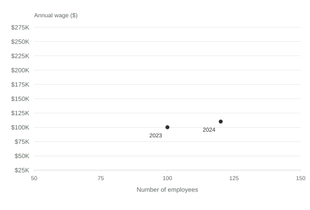
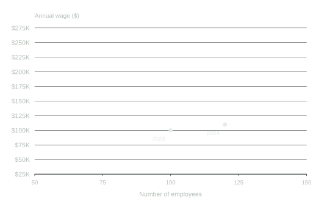

Observed Wage and Employment Data
:::

Now, when we use these two estimates to estimate the elasticity of labor supply to the firm, what are we actually doing? We are assuming that these two points are on the labor supply curve to the firm. If we assume it is linear, then we can simply draw a line between the two points and we've identified the entire labor supply curve to the firm.

Let's draw this supply curve to the firm below.

::: {#fig-labor-supply-line}

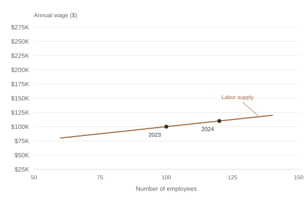
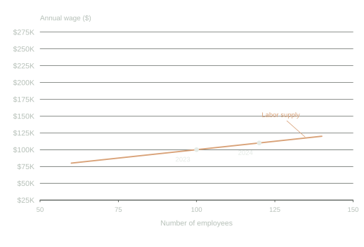

Assumed Labor Supply Curve to the Firm
:::

Now, let's think through why the firm might have raised wages. As we discussed in the previous chapter, the firm continues to hire until marginal revenue product of labor (MRPL) equals the marginal factor cost (MFC). Therefore, if these two points are equilibrium points, then these must be points in which the MRPL equals the MFC. Since the marginal revenue product of labor curve is downward sloping, it must be that the curve shifted upwards between 2023 and 2024 to sustain these as equilibrium points (it is impossible to draw a downward sloping curve that intersects the MFC at these points). This makes perfect sense. The reason the firm is increasing the wage is due to an increase in the MRPL of its workers. Let's draw these marginal revenue product of labor curves and the associated marginal factor cost (MFC) curves below. Why would the MRPL curve shift? It could be many things. For example, maybe the price of the firm's product increased, so that each additional unit now sells for more. Maybe demand for the product increased overall.

::: {#fig-mrp-curves-shift}

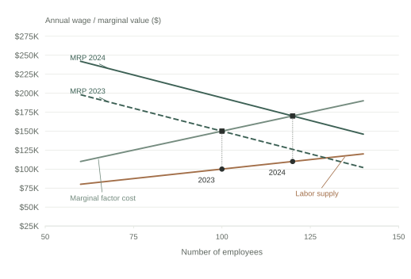
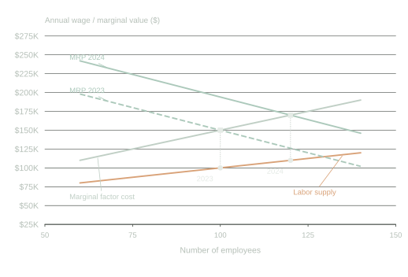

Equilibrium in the Software Engineering Firm
:::

But this leads to an interesting possibility. If the marginal revenue product of labor curve shifted upwards, what is to say the labor supply curve didn't also shift between 2023 and 2024? For example, imagine that more workers moved into the local area, or that another local software engineering firm closed down. This time, let's see if we can draw two labor supply curves, one for 2023 and one for 2024, that also pass through the two equilibrium points.

::: {#fig-shifting-supply-curves}

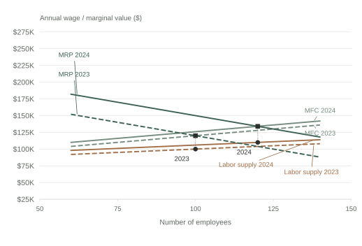
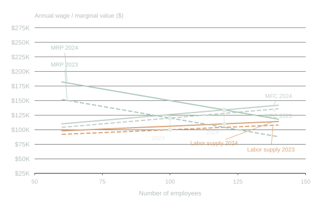

Equilibrium in the Software Engineering Firm with Flat Labor Supply Curves
:::

Now in this second scenario, the labor supply curve we drew was purposely quite flat. Therefore, a small change in wages leads to a much larger change in employment. This implies the firm has less monopsony power than in the first scenario.

But it did not need to be this way. For example, the plot below changes the labor supply curve to be much steeper. In this scenario, labor supply is shifting down instead of up. But the main point here is that these labor supply curves are also consistent with the observed data!

::: {#fig-steep-supply-curves-shifting}

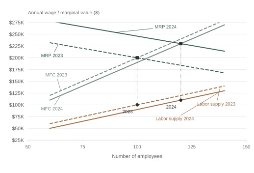
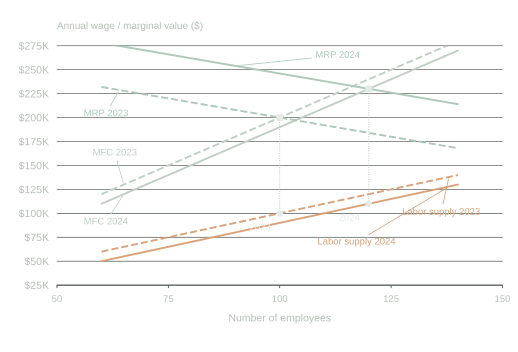

Equilibrium in the Software Engineering Firm with Steeper Labor Supply Curves
:::

What has this exercise shown us? From two sets of employment and wages, we can't really draw any strong conclusions about the labor supply curve to the firm. We have drawn three different versions of supply curves all consistent with the data, but which have different implications for the elasticity of labor supply facing the firm. The problem is that when both MRPL and labor supply can shift, then there is no way to conclude what the labor supply curve looks like. This is a very general problem in economics when estimating supply and demand. 

So what has the academic literature done to try to estimate the elasticity of labor supply to the firm? Imagine instead of a firm deciding to raise wages, we could experiment with the wages of a firm. For example, we could decrease the wage by 10% and see how many workers leave the firm. Why would this be helpful?

The reason is that now the change in wages is **exogenous** to the firm. We are not changing the wage because of shifts in the marginal revenue product of labor curve or supply curve. We are changing the wage because we are experimenting with the firm. If we did this for many firms, then we could get an average estimate of the elasticity of labor supply to the firm in the economy. 

Now, this probably sounds like a pretty unusual thing to do. Will firms allow researchers to experiment with their wages? Probably not. In general, most studies therefore try what are sometimes referred to as quasi-experimental methods. These methods try to find situations where wages change for reasons that are not related to the firm's marginal revenue product of labor or labor supply curve. 

Alan Manning's Handbook of Labor Economics chapter (@manning2011imperfect) on monopsony power provides a good overview of the empirical literature on estimating the elasticity of labor supply to the firm. The chapter discusses several different strategies that have been used to estimate the elasticity of labor supply to the firm. For example, @staiger2010there use a natural experiment where Veterans Affairs hospitals in the United States changed the way they were paying nurses. Before the experiment, Veterans Affairs hospitals paid nurses based on a fixed salary schedule at the national level. However, in 1991, salaries were switched to being paid based on local labor-market surveys. In effect, this led to an abrupt increase in the wages of nurses at VA hospitals, which @staiger2010there use to estimate the elasticity of labor supply to the firm. Another prominent example comes from @falch2010elasticity, who again uses a natural experiment in Norway which increased the wages for teachers in a subset of schools.

There are numerous other examples of natural experiments that have been used to estimate the elasticity of labor supply to the firm. The estimates vary from setting to setting, but in general, the qualitative results are similar: the elasticity of labor supply to the firm is far from infinite. In other words, firms do have some monopsony power in labor markets. A recent survey by @azar24 reports that empirical estimates to date suggest that the elasticity of labor supply to the firm falls between 1 and 4, with an associated wage markdown of approximately 15% to 50%, depending on the setting. This means that firms are paying workers 15% to 50% less than they would in a perfectly competitive labor market. The way these estimates are generally formulated is by first estimating the elasticity of labor supply to the firm, and then using this estimate to calculate the wage markdown through a theoretical link between the two.

Perhaps the most convincing estimate of a labor supply elasticity to the firm comes from @dal2013strengthening. In their study, they had the ideal experiment: truly randomized wages. In August 2011, the government of Mexico held a massive recruitment to hire workers to help with a public goods provision program. In total there were 106 recruitment sites in the study. For each recruitment site, the offered wage was randomized between 5,000 pesos per month and 3,750 pesos per month. This 33% increase in wages led to a 26% increase in the number of applicants, and then conditional on applying, a 35% increase in the probability an individual accepts the job. This implies an elasticity of labor supply to the firm of approximately 2.15, which is quite similar to the range of quasi-experimental estimates discussed above. There are a few additional experimental studies that have now been done. For example, @dube2020monopsony study Mechanical Turk, a popular online labor market. In this online labor market, the authors are able to randomly vary wages and estimate the elasticity of labor supply to the firm, finding substantial scope for monopsony power. Lastly, @caldwell2023gender use a field experiment to study the elasticity of labor supply to the firm among Uber drivers. The experiment offered drivers a 10-50% increase in wages, finding an elasticity of labor supply to the firm of approximately 1.5.

## Firm-Specific Pay Premia

In Chapter 2, we considered the case of two cafes. These two cafes had different marginal revenue product of labor curves, but under the assumption of perfect competition, they paid the exact same wage. Why? Because under perfect competition, firms have no control over the wage. If they want any workers, they have to pay the market wage. So what happens in equilibrium? The firm with the higher marginal revenue product of labor hires more workers, and the firm with the lower marginal revenue product of labor hires fewer workers, but they both pay the same wage.

However, this might seem like a somewhat unrealistic assumption. At least anecdotally, you might think that firms pay widely different wages. Do giant firms like Apple and Google pay the same wages as small startups? It doesn't seem like that would be the case. However, in practice, it is a bit more complicated. In our simple example, we assumed all workers were the same. It doesn't matter who you hire, the marginal revenue product of that worker will be the same regardless. But in practice, this may not be the case. Apple may pay higher wages because they are hiring the most-skilled workers.

@abowd1999high proposed a solution to this problem. To make things concrete, let's consider the case of Google and Apple. Imagine we want to understand whether Google or Apple pays higher wages. If we simply compare the average wage at Google and Apple, we might run into a number of issues. Although they are both tech firms, they may be hiring different types of workers. Maybe Google hires more high-wage engineers relative to Apple, which has more low-wage customer service workers. However, even conditional on the exact job the worker is performing, maybe Google is able to attract the highest-skilled workers. Therefore, even within occupation, maybe there are issues with just comparing across the two firms. 

The solution proposed by @abowd1999high is to compare the wages of workers as they transition across firms. So, for example, we have some workers that move from Apple to Google, and some workers that move from Google to Apple. Let's imagine in the data, that on average, we find that wages decrease by 5% when workers move from Google to Apple, and increase by 5% when workers move from Apple to Google. This suggests that Google pays a 5% wage premium relative to Apple. Now we can't argue that the difference in wages is due to worker quality, because we are only comparing changes in wages for the same worker.

This basic idea was expanded on in @card2013workplace, who also proposed methods to test the assumptions underlying this approach. Since the publication of @card2013workplace, this approach has been used in a number of different countries to understand the importance of firm-specific pay premia. In the U.S., the standard deviation of log pay across firms has been consistently estimated to be around 0.2 (@kline2024firm). What does this mean exactly? Let's plot a normal distribution with a standard deviation of 0.2 and mean zero below. When comparing firm-specific pay premia, we often de-mean the estimates meaning the average firm pay is zero.

::: {#fig-firm-pay-premia-distribution}

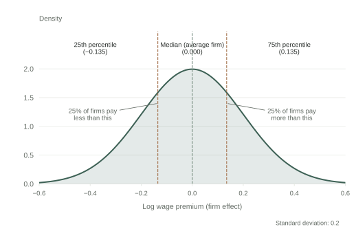
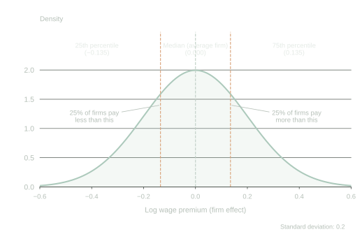

Hypothetical Distribution of Firm-Specific Pay Premia
:::

Now if moving from an average firm to the 75th percentile firm raises your log wage by 0.135, this implies that your wage increases by approximately 14.5% ($exp(0.135)-1=0.145$). This is a substantial difference in wages! Remember, this is a difference in wages for the same worker. So we can't necessarily attribute this to differences in the background skills of the workers. 

This type of variation is difficult to reconcile with the perfectly competitive model. In a perfectly competitive model, why would there be firms that pay higher wages for the exact same worker? However, in a monopsonistic model, this is what we would expect. Places need to pay higher wages to attract more or better workers, giving rise to variation in wages across firms. 

## Institutional Boundaries to Mobility

Remember, why does monopsony power arise? Because workers are not perfectly mobile across firms. They don't just leave the firm the minute wages fall behind the market wage. In this section, we will discuss some institutional boundaries to mobility that can lead to monopsony power in labor markets.

In the United States, some workers are required to sign non-compete agreements. There is a sound economic reason for having non-compete agreements in certain settings. For example, imagine there is a biotechnology firm that is aiming to patent a new drug. They need to recruit scientists to work on this. They need to invest in machinery. They may need to train the scientists to use this equipment. 

If they fear that a worker can leave the firm and immediately start working for a competitor, they may not find that it is worth investing in the first place. Non-compete agreements can help alleviate this hold-up problem. If the worker is not allowed to work for a competitor, then the firm can invest in training and equipment, knowing that the worker will not immediately leave and start working for a competitor.

However, @starr2021noncompete document some striking facts about the prevalence of non-compete agreements in the United States using a survey of workers. While non-competes are generally discussed as most relevant for high-skilled workers, they find that for workers with high-school education or less, 20% report having signed a non-compete agreement. Non-compete agreements are non-negligible in industries with little theoretical justification for them. They are even prevalent in states in which they are illegal. For example, California and North Dakota both do not enforce non-compete agreements, but about 19% of the surveyed workers in these states report having signed a non-compete agreement.

::: {#fig-noncompetes-education}

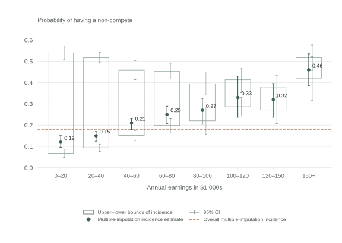
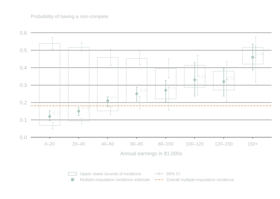

Share of Workers with Non-Compete Agreements by Annual Earnings
:::

::: {#fig-noncompetes-industry}

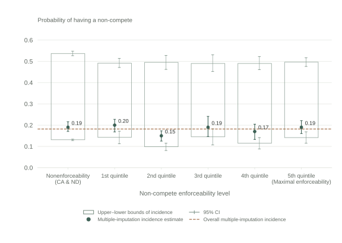
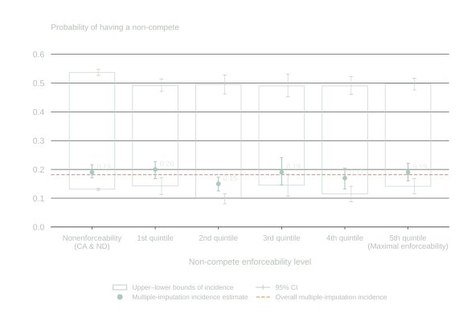

Share of Workers with Non-Compete Agreements by Enforceability
:::

One way to rationalize the prevalence of non-compete agreements is that they are also being used to restrict labor mobility. If a worker is not allowed to work for a competitor, then they will be less responsive to changes in wages at their own firm. This is one reason that the Federal Trade Commission proposed making the majority of non-compete agreements illegal in 2024. However, this proposal was blocked by federal courts in 2024, arguing the FTC exceeded its authority by proposing the ban on noncompetes.

## Concentration in Labor Markets 

We started [Chapter 4](04.qmd) with a quotation from Adam Smith about collusion arising in settings with few employers. For a long time, economists have believed that imperfect competition is more likely to arise in settings with few firms: both on the labor-market side and the product-market side. This could happen through explicit collusion, as Adam Smith suggested, or through other channels that lead to firms having market power.

In the 1950s-1960s, economists started coming up with measures that quantified the idea of "small number of firms". These are referred to as concentration measures. One of the most influential measures is the Herfindahl-Hirschman Index (HHI), named after economists Orris C. Herfindahl and Albert O. Hirschman. These economists independently developed a measure aimed at measuring concentration. To compute the measure, you take the market share of each firm, square it, and then sum up all of these market shares.

To take a concrete example, let's consider the US phone market. For now, we will take the traditional approach and compute the HHI based on market shares in the product market. We are going to consider the market as the three largest firms: Verizon, T-Mobile and AT&T. In practice, one should always include all firms in the market; focusing on just three is for simplicity. In the telecommunications market, these three have over 90% of the market, so our calculation will be close to correct. Among these three firms, the market share of Verizon is about 37%, T-Mobile is about 33%, AT&T is about 30%. Therefore, the HHI is computed as follows:

$$
\text{HHI} = 0.37^2 + 0.33^2 + 0.30^2 = 0.1369 + 0.1089 + 0.09 = 0.3358
$$

Next, let's consider the two extreme cases of HHI. If there is only one firm in the market, then the HHI will be 1 because the market share of that firm is 100%, and $1^2 = 1$. Now let's assume there are many, many firms. Let's say there are 10,000 firms, each with a market share of 0.0001 (or 0.01%). In this case, the HHI will be:
$$\text{HHI} = 10,000 \times (0.0001)^2 = 10,000 \times 0.00000001 = 0.0001$$

In other words, basically zero. So the HHI ranges between 0 and 1. Now that we understand the procedure to compute the HHI, let's ask a follow-up question. Why does it make sense to measure concentration in this way? 

The intuition can be seen in the following example. Imagine there are three firms, but two have small shares (let's say 0.1 each) and one has a large share (0.8). In this case, the HHI will be:
$$\text{HHI} = 0.1^2 + 0.1^2 + 0.8^2 = 0.66$$

Next, let's consider the case where there are three firms, but they all have equal shares (0.33 each). In this case, the HHI will be:
$$\text{HHI} = 0.33^2 + 0.33^2 + 0.33^2 = 0.3267$$

So the HHI is higher when there are two firms with small shares and one firm with a large share, compared to the case where all three firms have equal shares. This intuitively seems like it would make sense. If you have three larger competitors, they may be more likely to compete fiercely with each other. If there is one large dominant firm, and two smaller firms, then it seems like the large firm may be more able to dominate the market and exercise market power. By squaring the market shares, the HHI gives more weight to larger firms.

However, it is just one measure of concentration that has been proposed. There are other measures of concentration, some of which are more theoretically driven. One reason the HHI is so widely studied, however, is due to its practical use in antitrust policy.

In the United States, the Department of Justice (DOJ) and Federal Trade Commission (FTC) use the HHI to assess market concentration when evaluating mergers and acquisitions. The DOJ and FTC have established thresholds for the HHI to determine whether a merger is likely to substantially lessen competition. In the past, these thresholds and the use of HHI generally have been applied to product markets. However, they can also apply to labor markets. 

To test this, @azar2022labor measured HHI in labor markets across the United States. They defined a labor market as an occupation in a given commuting zone (a commuting zone is a geographic region defined by the U.S. Census Bureau that groups together counties based on commuting patterns). They then computed the HHI for each labor market, using the share of employment at each firm in a given commuting zone. What they find is that once you look within a given region and occupation, labor markets are actually quite concentrated. The figure below shows the average HHI within different commuting zones in the United States (the average is taken over the occupations in the commuting zone).

::: {#fig-concentration}

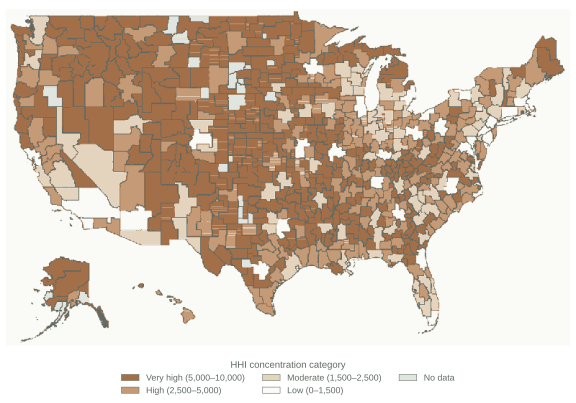
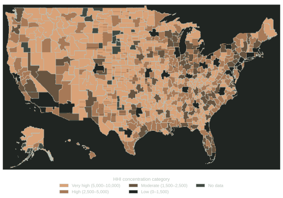

Concentration in US Labor Markets
:::

Further, they find evidence that labor markets that experience increases in concentration experience declines in wages. This provides empirical evidence that monopsony power is higher in more concentrated labor markets.

One concern with using measures of concentration is that they may be associated with changes to the marginal revenue product of labor curve. For example, imagine there is increased foreign competition that means the price in an industry is plummeting. Since the price is lower, that means the marginal revenue brought by each additional worker is lower. If the decline in prices also leads firms to exit, then there will be fewer firms in the market, leading to a higher HHI. 

One way to assess this concern is to look for events where this story is potentially less of a concern. One such event is perhaps a merger and acquisition (M&A). From a policy standpoint, these are the concentration-increasing events that are most relevant, as the DOJ and FTC can potentially block mergers that increase labor-market concentration. Therefore, it would be useful to understand whether mergers and acquisitions that generate concentration increases lead to declines in wages.

@prager2021employer and @arnold2025mergers are two papers that study this question. @prager2021employer study the effects of mergers and acquisitions in the U.S. hospital industry, while @arnold2025mergers study the effects of mergers and acquisitions across a wider range of industries. Both studies find qualitatively similar results. 

For example, @arnold2025mergers distinguishes between three different types of mergers. Low-impact mergers occur between two firms that are operating in different areas. Because labor-market competition is likely local in nature, these mergers have no impact on monopsony power. Indeed, @arnold2025mergers finds a minuscule 0.5 percent decline in earnings in these types of events. In mergers that do increase concentration, the impact depends on the baseline level of concentration. For markets with relatively low levels of concentration, there is again a small and statistically insignificant decline in earnings of about 0.8 percent. Again, these medium-impact mergers likely have no impact on monopsony power, because these are not concentrated markets to begin with. However, in the high-impact mergers, which occur in high-concentration markets, @arnold2025mergers finds a decline in earnings of about 3.1 percent.  

::: {#fig-merger-earnings-impact}

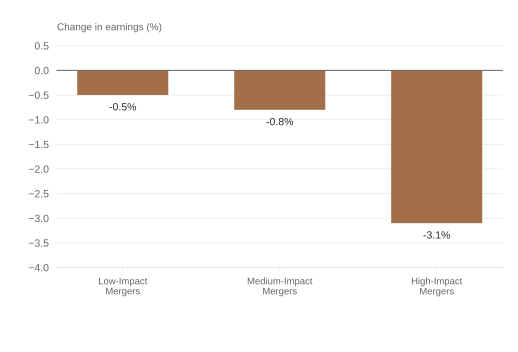
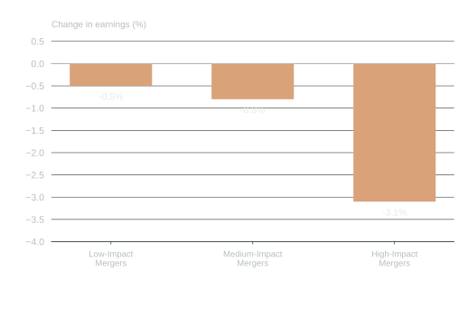

Impact of Different Types of Mergers on Worker Earnings
:::

The fact that these large mergers lead to wage losses is a potential concern for antitrust authorities. However, traditionally antitrust authorities have been solely focused on product-market competition. This is changing. A recent complaint against Kroger and Albertsons, two large grocery chains in the United States, alleged that the merger would not only increase grocery prices, but also lower wages for grocery store workers. This is one of the first examples of labor-market concerns making their way into merger enforcement.

While the antitrust authorities are starting to consider labor markets in relation to mergers, there is a bit more history considering collusion in labor markets. Collusion is a notoriously difficult concept to study in economics. By its nature, firms have a strong incentive to keep it hidden. The industrial organization literature in economics has spent a lot of effort trying to detect collusion in product markets. 

However, in some cases, antitrust authorities have uncovered collusion, giving economists an opportunity to study it empirically. This includes collusion in labor markets. One of the most famous cases of collusion in labor markets is the case of Silicon Valley tech firms. In 2010, the U.S. Department of Justice (DOJ) launched an investigation into several major tech firms, including Apple, Google, Intel, and Adobe, for allegedly colluding to suppress wages for tech workers. The investigation revealed that these firms had entered into "no-poach" agreements, where they agreed not to recruit or hire each other's employees. After the high-tech investigation, there was another similar case involving animation studios, including many you have likely heard about: Disney, Pixar, Lucasfilm, Blue Sky, and DreamWorks. These studios allegedly agreed not to poach each other's employees, which again suppressed wages for animators. The interesting thing is that by the time the lawsuit was settled, many of these animation studios had already been bought by Disney.

## Monopsony and Inequality

As we discussed in [Chapter 1](01.qmd), a large body of research in economics has been focused on what drove the rise in labor-market inequality in the United States. In this section, we will discuss how monopsony power can help explain the changes in labor-market inequality in the United States. To recap, since the 1980s, there has been a large increase in wage inequality in the United States. One way we discussed how to measure this is by looking at the ratio of the 90th percentile wage to the 10th percentile wage. The logic of this is the 90th percentile is a measure of how rich those with the highest incomes are (if you are above the 90th percentile, you are richer than 90% of the population), while the 10th percentile is a measure of how poor those with the lowest incomes are (if you are below the 10th percentile, you are poorer than 90% of the population). The ratio of these two numbers therefore gives a measure of inequality.

Sometimes, researchers instead study the 90/50 ratio and the 50/10 ratio. The 90/50 ratio is a measure of inequality among relatively higher-wage workers. It studies whether the richest workers are pulling away from the median worker. The 50/10 ratio is a measure of inequality among relatively lower-wage workers. It tells us whether the lowest-wage workers are falling behind the median worker. 

Sometimes, instead of reporting the ratio, researchers will report the log of the ratio. For example, if the 90th percentile wage is $150,000 and the 10th percentile wage is $50,000, then the 90/10 ratio is 3. The log of this ratio is log(3) = 1.098 (we are using the natural logarithm here).

So why do we take the log of the ratio? One is that small changes in the log ratio correspond to percent changes in the ratio. For example, imagine the 90th percentile wage increases to $160,000 while the 10th percentile wage remains at $50,000. The new 90/10 ratio is 3.2, and the log of this ratio is log(3.2) = 1.163. The change in the log ratio is 1.163 - 1.098 = 0.065, which corresponds to a percent change of about 6.5% in the original ratio (this is an approximation, but it is close). While we do not cover regression analysis in this book, using logs is very common in regression analysis in economics, as it allows one to interpret coefficients as elasticities. As you have probably noticed, elasticities come up a lot in economic theory. 

For our purposes, one nice feature of the log ratio is that it is additive. This will allow us to clearly decompose changes in the 90/10 ratio into changes in the 90/50 ratio and the 50/10 ratio. We can use this information to understand how inequality has been changing over time in the United States. First, to see why this is true, the log of the 90/10 ratio can be written as:

$$
\log\left(\frac{W_{90}}{W_{10}}\right) = \log(W_{90}) - \log(W_{10})
$$

This is using a property of logarithms: $\log(A/B) = \log(A) - \log(B)$. Next, we can add and subtract the log of the median wage ($W_{50}$) to the right-hand side:

$$
\log\left(\frac{W_{90}}{W_{10}}\right) = \underbrace{\log(W_{90}) - \log(W_{50})}_{\text{Upper Tail Inequality}} + \underbrace{\log(W_{50}) - \log(W_{10})}_{\text{Lower Tail Inequality}}
$$

This equality shows that we can decompose the log of the 90/10 ratio into two parts: the log of the 90/50 ratio (which measures inequality among higher-wage workers) and the log of the 50/10 ratio (which measures inequality among lower-wage workers).

This decomposition is useful for understanding the dynamics of wage inequality. For example, if the log of the 90/50 ratio is increasing while the log of the 50/10 ratio is stable, it suggests that inequality is rising among higher-wage workers without a corresponding increase in inequality among lower-wage workers. For example, one claim is that rising CEO or more generally, manager pay, is a driver of inequality. However, if we see that the 50/10 ratio is also increasing, then this probably isn't the only story going on. We would need a story about why the lowest-wage workers are also falling behind the median worker.

In @autor2023unexpected, the authors plot this decomposition for three different time periods. The first they refer to as the great compression (1940-1950). We found similar results in [Chapter 1](01.qmd). During this period, inequality was falling. The majority of this decline in inequality was driven by a decline in the log(90/50) ratio. In other words, median workers were catching up to higher-wage workers. This is the classic story of the middle class growing in the post-war period.

::: {#fig-inequality-decomp}

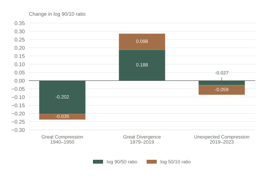
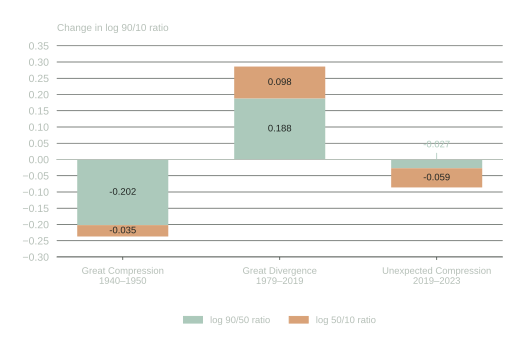

Decomposition of Wage Inequality in the US
:::

The second period is the great divergence (1979-2019). During this period, inequality was rising. We have already talked about this a bit in [Chapter 3](03.qmd), arguing at least a portion of it was due to the falling real value of the minimum wage. However, we can also see that the log(90/50) ratio was rising. In other words, inequality was rising both among higher-wage workers and lower-wage workers during this period. 

Now, for a long time, all we saw in the data was increasing inequality. But perhaps surprisingly, since 2019, in particular after COVID, inequality has been falling. In this short period between 2019 and 2023, the log(90/10) ratio has fallen by 0.086 (= -0.059 - 0.027). To compare to the great divergence, inequality rose by 0.282.

To put some of these numbers in perspective, let's assume for illustrative purposes that the 10th percentile wage in 1980 (adjusting for inflation) was $10,000. The 90th percentile (adjusting for inflation) was $100,000. These are just approximate numbers to get a sense of the math, but the real 90/10 ratio is not far off.

Now if the 90/10 ratio is 10, then the log of the 90/10 ratio is log(10) = 2.302. If the log(90/10) ratio rose by 0.282 during the great divergence, then the new log(90/10) ratio would be 2.584. If we are to convert that to a ratio of wages, we would get: $exp(2.584) = 13.23$. $exp$ is the inverse log function. So $\exp(\log(X)) = X$, where $X$ is some positive number. Therefore, if the 10th percentile wage remained at $10,000, the 90th percentile wage would have risen to $132,300. So workers at the 90th percentile are earning 13 times more than workers at the 10th percentile, while previously they were earning 10 times more.

Now let's consider what happens during the unexpected compression. The log(90/10) ratio fell by 0.086. Therefore, the new log(90/10) ratio would be 2.584 - 0.086 = 2.498. Converting this back to a ratio, we get $exp(2.498) = 12.15$. Therefore, if the 10th percentile wage remained at $10,000, the 90th percentile wage would have fallen to $121,500. So workers at the 90th percentile are now earning 121.5% more than workers at the 10th percentile, down from 132% more.

This is a substantial change! The great divergence took place over 40 years, while the unexpected compression took place over just 4 years. Still, even in this short amount of time, we have seen a substantial change in inequality. This isn't actually unprecedented. In the 1940s and 1950s, inequality fell quite rapidly as well. But it is perhaps surprising. The post-war period was a time of rapid economic growth, while the post-COVID period has been a time of economic uncertainty.

So what is driving this unexpected compression? The decomposition shows that the majority of the decline in inequality has been driven by a decline in the log(50/10) ratio. In other words, lower-wage workers have been catching up to median workers. @autor2023unexpected argue that the key factor in this unexpected compression has been an increase in competition in the low-wage labor market. 

Hypothetically, this could be explained in a perfectly competitive model. For whatever reason, there has been an increase in the demand for low-wage workers. This has led to an increase in the wages for these workers, thereby decreasing inequality. 

However, @autor2023unexpected argue that this is unlikely to be the full story. Instead, they argue that monopsony power is key in explaining this compression. The argument is that during this time, as demand for low-wage workers has increased, workers became more sensitive to wage differences across firms. In other words, if your employer was paying slightly lower than another employer, in this period, workers were much more likely to quit and move jobs. This increase in mobility has decreased the monopsony power of firms, leading to higher wages for low-wage workers. The perfectly competitive model cannot explain this, as in a perfectly competitive model, workers are always perfectly mobile across firms. 

In this setting, the monopsony model offers a richer, more realistic explanation for the observed changes in inequality. What they find is that after the pandemic, low-wage workers became more sensitive to wage differences across firms. Remember, our key assumption in the monopsony model is that firms face an upward sloping labor supply curve. If they can decrease their wage a lot, but only lose a few workers, this implies they have significant monopsony power. However, if they can decrease their wage a little and lose a lot of workers, then they have less monopsony power. @autor2023unexpected find that after the pandemic, low-wage workers became more sensitive to wage differences across firms, implying that firms' monopsony power decreased. Therefore, the post-pandemic labor market for low-wage workers had two important mechanisms at play: an increase in demand for low-wage workers and a decrease in monopsony power. These two forces led to a rapid rise in wages for low-wage workers, thereby decreasing inequality.