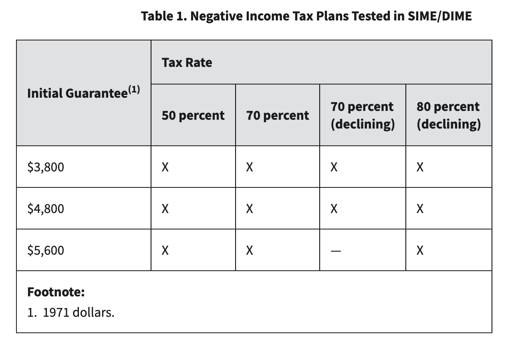
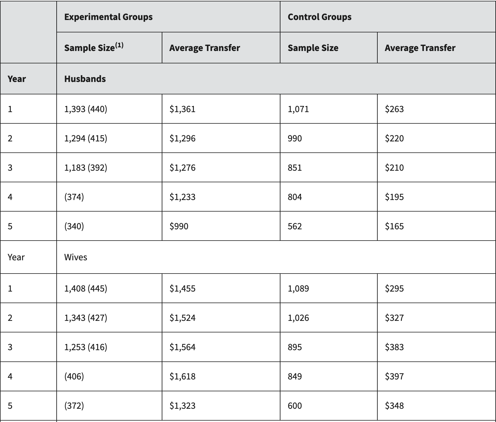
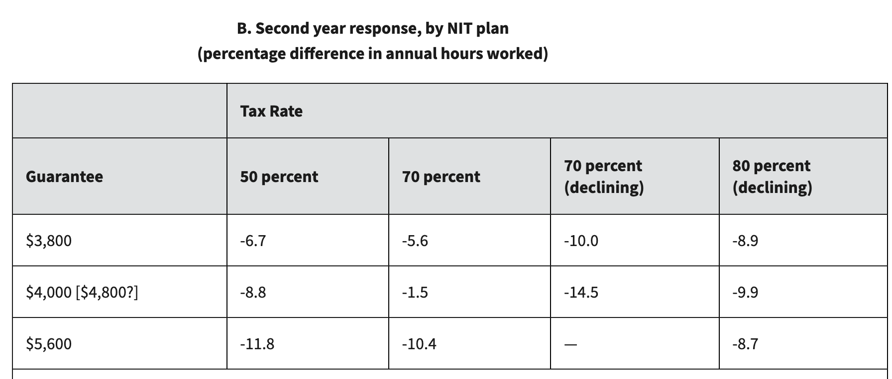
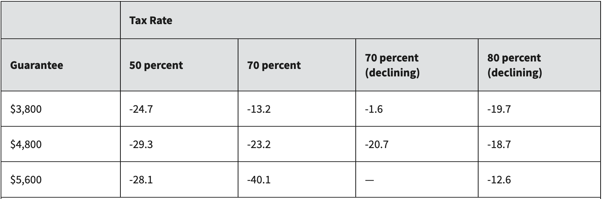
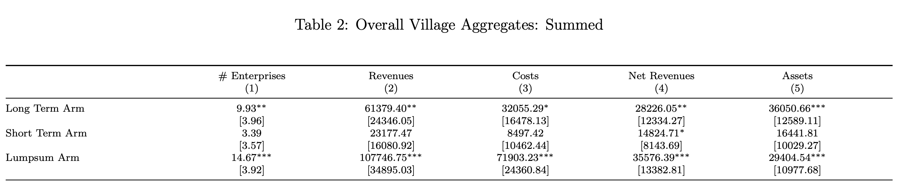
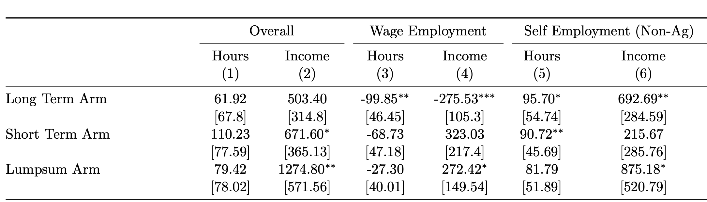
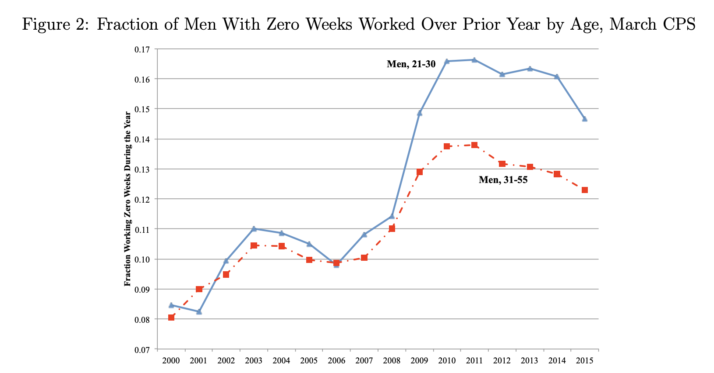

## Introduction

Many of the aspects of the labor market that we have studied so far have focused on demand-side factors. For example, changes in technology can impact how many workers firms would like to hire. Changes in the minimum wage change the cost for labor for firms. In this chapter we are changing focus to the supply side of the labor market. To do so, we will first illustrate a simple conceptual framework for thinking about how much labor is supplied in the labor market. Then we will consider some important factors that impact workers' labor supply in the real world, with a focus on policy-relevant issues.


## The Decision to Work 

So far in the course, we have treated the labor supply curve as the aggregate amount of labor that workers are willing to provide at different wage rates. In this section, we are going to think about this from an individual worker's perspective. The classic labor supply model is very similar to other models we have studied on the firm side. For a firm deciding how much labor to hire, they face a tradeoff between the cost of hiring labor and the benefit of hiring labor. For an individual deciding how much labor to supply, they face a tradeoff between working and leisure activity. At a high level, we will assume that individuals have a set number of hours that they can work and they decide the optimal amount of work. If they work more, they have higher income, but less leisure time. If they work less, they have more leisure time, but lower income. At a **utility-maximizing** level of work, the individual chooses the optimal tradeoff between income and leisure.

Now let's get a little more specific. Let's take an individual who can earn a wage of $w$ per hour worked. This individual has a total of $T$ hours available in a week that they can allocate between working and leisure. If they spend $L$ hours on leisure activities, then they will have $T-L$ hours worked. So their total income will be $$ \text{Income} = w \times (T - L) $$ 

It might seem a little odd to define leisure as $L$ instead of hours worked. This is because we are going to focus on the tradeoff between leisure and income, so it is more natural to define leisure as the variable of interest. Leisure will also be the x-axis in our graphs, so it makes sense to define it this way.

To summarize the tradeoffs, the individual faces a tradeoff between income and leisure. Again, the more hours they work, the more income they earn, but the less leisure time they have. This tradeoff can be represented graphically with a budget constraint, where the x-axis represents leisure time and the y-axis represents income. The slope of the budget constraint is determined by the wage rate $w$.

To see this more clearly, let's consider a concrete example. An individual faces a wage rate of $w = 20$ dollars per hour and has a maximum amount of time that can be worked equal to $T = 80$ hours available in a week. If they choose to work all 80 hours, they will earn an income of $20 \times 80 = 1600$ dollars. However, they can of course work less than 80 hours.  In an extreme case, if they choose zero hours, then they will have no income. Each leisure choice comes with a corresponding income level based on how many hours are worked. This is the individual's budget constraint, which is illustrated in the figure below.

Now, of course, we should stop and pause to think about what is realistic about this model and what is potentially unrealistic. The most unrealistic aspect of this model is that we are going to assume that workers can very precisely choose how many hours they work. In reality, there are constraints on how many hours a worker can choose to work. You might be able to choose between part-time and full-time, but not necessarily the exact number of hours. This is something we will return to. For now, it will make it analytically simpler to assume that workers can choose any number of hours to work.

```{python}
#| echo: false
#| label: fig-budget-constraint
#| fig-cap: "Budget Constraint for Labor-Leisure Tradeoff"

import matplotlib.pyplot as plt
import numpy as np

# Set parameters
T = 80  # Total hours in a week
w = 20   # Wage rate per hour

# Budget constraint: when leisure = 0, income = w*T; when leisure = T, income = 0
leisure = np.array([0, T])
income = np.array([w * T, 0])

# Create the plot
fig, ax = plt.subplots(figsize=(8, 6))
ax.plot(leisure, income, 'b-', linewidth=2, label='Budget Constraint')
ax.fill_between(leisure, 0, income, alpha=0.1, color='blue')

# Add labels and formatting
ax.set_xlabel('Leisure (hours per week)', fontsize=12)
ax.set_ylabel('Income ($)', fontsize=12)
ax.set_title('Labor-Leisure Budget Constraint', fontsize=14, fontweight='bold')
ax.grid(True, alpha=0.3)
ax.set_xlim(0, T)
ax.set_ylim(0, w * T * 1.05)

# Add annotations
ax.annotate(f'Max Income = ${w * T:,.0f}\n(zero leisure)', 
            xy=(0, w * T), xytext=(20, w * T - 400),
            arrowprops=dict(arrowstyle='->', color='black', lw=1.5),
            fontsize=10, ha='left')
ax.annotate(f'Max Leisure = {T} hours\n(zero income)', 
            xy=(T, 0), xytext=(T - 35, 400),
            arrowprops=dict(arrowstyle='->', color='black', lw=1.5),
            fontsize=10, ha='center')
ax.text(T/2, w*T/2 +250, f'Slope = -w = -${w}/hour', 
        fontsize=11, ha='center', style='italic',
        bbox=dict(boxstyle='round', facecolor='wheat', alpha=0.5))

plt.tight_layout()
plt.show()
```

Now, how does an individual worker decide how much to work? In other words, where does the individual choose to be on this budget constraint? Well the answer depends on the utility function. A utility function is a mathematical representation of how much happiness an individual derives from different combinations. It gives us a way to think about what combinations of leisure and income make the individual better or worse off. You may have seen this concept in prior classes when studying consumer choice. How much should one consume of good A vs. good B? Here, we are applying the same concept to the labor-leisure tradeoff.

For example, imagine I offer you two choices: Job A: 60 hours and earn $1200, or Job B: you can work 40 hours and earn $800. Which do you prefer? The answer depends on your preferences and can be different between people. If you would prefer to work 40 hours and earn $800, then we would say that Job B gives you higher utility than Job A. 

Now, there are probably some combinations that you would be indifferent between. For example, imagine we change Job A so that you earn $1400 for 60 hours of work. We have made Job A more attractive by increasing the total income from the job. Now, maybe you are indifferent between Job A and Job B. In this case, both jobs give you the same level of utility.

Every combination of leisure and income that gives you the same level of utility is on the same **indifference curve**. For example, let's take the two jobs we just discussed. If you are indifferent between Job A (60 hours, $1400) and Job B (40 hours, $800), then both of these points are on the same indifference curve. Let's plot an entire indifference curve that is consistent with this description. 

```{python}
#| echo: false
#| label: fig-indifference-curve
#| fig-cap: "Indifference Curve for Labor-Leisure Tradeoff"

import matplotlib.pyplot as plt
import numpy as np

# Set parameters
T = 80  # Total hours in a week
w = 20   # Wage rate per hour

# Define two points on the indifference curve
# Job A: 60 hours work means 20 hours leisure, income $1400
# Job B: 40 hours work means 40 hours leisure, income $800
leisure_A = 20
income_A = 1400
leisure_B = 40
income_B = 800

# Create a smooth indifference curve using a Cobb-Douglas-style utility function
# We'll calibrate it to pass through both points
# Using functional form: U = leisure^alpha * income^(1-alpha)
# We can use a simple transformation to create the curve

# Generate leisure values
leisure_vals = np.linspace(10, 80, 100)

# Create indifference curve that passes through both points
# Using a Cobb-Douglas utility function: U = leisure^alpha * income^(1-alpha)
# First, find alpha such that both points give the same utility
# U_A = leisure_A^alpha * income_A^(1-alpha) = U_B = leisure_B^alpha * income_B^(1-alpha)
# Solving: alpha = log(income_A/income_B) / (log(income_A/income_B) + log(leisure_B/leisure_A))
alpha = np.log(income_A / income_B) / (np.log(income_A / income_B) + np.log(leisure_B / leisure_A))

# Now calculate the utility level using point A (or B, should be the same)
U = (leisure_A ** alpha) * (income_A ** (1 - alpha))

# Generate the indifference curve: income = (U / leisure^alpha)^(1/(1-alpha))
income_vals = (U / (leisure_vals ** alpha)) ** (1 / (1 - alpha))

# Create the plot
fig, ax = plt.subplots(figsize=(8, 6))

# Plot indifference curve
ax.plot(leisure_vals, income_vals, '-', color='gray', linewidth=2.5, label='Indifference Curve')

# Plot the two specific points
ax.plot(leisure_A, income_A, 'bo', markersize=10, label='Job A (20 hrs leisure, $1400)', zorder=5)
ax.plot(leisure_B, income_B, 'go', markersize=10, label='Job B (40 hrs leisure, $800)', zorder=5)

# Add labels and formatting
ax.set_xlabel('Leisure (hours per week)', fontsize=12)
ax.set_ylabel('Income ($)', fontsize=12)
ax.set_title('Indifference Curve: Equal Utility Combinations', fontsize=14, fontweight='bold')
ax.grid(True, alpha=0.3)
ax.set_xlim(0, 80)
ax.set_ylim(0, 2000)
ax.legend(loc='upper right', fontsize=10)

plt.tight_layout()
plt.show()
```

Now, you can think about an individual having many different indifference curves. Let's plot an indifference curve B that gives the individual strictly higher utility than indifference curve A. 

```{python}
#| echo: false
#| label: fig-indifference-curves
#| fig-cap: "Multiple Indifference Curves"

import matplotlib.pyplot as plt
import numpy as np

# Set parameters
T = 80  # Total hours in a week
w = 20   # Wage rate per hour

# Define two points on indifference curve A (same as before)
leisure_A = 20
income_A = 1400
leisure_B = 40
income_B = 800

# Generate leisure values
leisure_vals = np.linspace(10, 80, 100)

# Create indifference curve A
alpha = np.log(income_A / income_B) / (np.log(income_A / income_B) + np.log(leisure_B / leisure_A))
U_A = (leisure_A ** alpha) * (income_A ** (1 - alpha))
income_vals_A = (U_A / (leisure_vals ** alpha)) ** (1 / (1 - alpha))

# Create indifference curve B (higher utility - shift up by multiplying utility by a factor)
U_B = U_A * 1.3  # 30% higher utility
income_vals_B = (U_B / (leisure_vals ** alpha)) ** (1 / (1 - alpha))

# Create the plot
fig, ax = plt.subplots(figsize=(8, 6))

# Plot indifference curve A (solid)
ax.plot(leisure_vals, income_vals_A, '-', color='gray', linewidth=2.5, label='Indifference Curve A')

# Plot indifference curve B (dashed)
ax.plot(leisure_vals, income_vals_B, '--', color='gray', linewidth=2.5, label='Indifference Curve B')

# Add labels and formatting
ax.set_xlabel('Leisure (hours per week)', fontsize=12)
ax.set_ylabel('Income ($)', fontsize=12)
ax.set_title('Multiple Indifference Curves', fontsize=14, fontweight='bold')
ax.grid(True, alpha=0.3)
ax.set_xlim(0, 80)
ax.set_ylim(0, 2500)
ax.legend(loc='upper right', fontsize=10)

plt.tight_layout()
plt.show()
```


How do we know indifference curve B gives higher utility than indifference curve A? Because let's take a given amount of leisure, say 40 hours. On indifference curve A, the income level corresponding to 40 hours of leisure is $800. On indifference curve B, the income level corresponding to 40 hours is around $1300. Since we are assuming more income leads to higher utility, indifference curve B must give higher utility than indifference curve A. The exact same logic applies if we fix an income level. For example, at $1500 dollars of income, the leisure level on indifference curve A is less than 20 hours, while on indifference curve B it is above 30 hours. So clearly you would prefer more leisure given the same amount of income, so indifference curve B gives higher utility.

One important note about indifference curves: they never cross (within an individual). Let's think about what it would mean if two indifference curves crossed. Imagine we had two indifference curves, C and D. Since we are assuming these are different indifference curves, they must yield different overall utility levels. Just to put some concrete numbers on it, let's assume indifference curve C gives utility of 100 and indifference curve D gives utility of 200. Now imagine that these two indifference curves cross at some point, again for concreteness, let's say 40 hours of leisure and 1000 in income. Since this point is on indifference curve C it must give utility of 100. But since it is also on indifference curve D, it must give utility of 200. This is a contradiction. It doesn't make sense for the same combination of leisure and income to give two different utility levels. Therefore, indifference curves cannot cross.

However, people can certainly have different indifference curves. What determines the shape is how individuals trade off income and leisure. Some individuals may value leisure more highly relative to income, while others may prioritize income more. For example, let's consider below the indifference curve of someone who places low value on leisure relative to income.

```{python}
#| echo: false
#| label: fig-low-leisure-value
#| fig-cap: "Indifference Curve for Someone Who Values Leisure Less"

import matplotlib.pyplot as plt
import numpy as np

# Generate leisure values
leisure_vals = np.linspace(10, 80, 100)

# Create indifference curve for someone who values leisure less
# Using a lower alpha (preference for leisure) - more willing to give up leisure for income
alpha_low = 0.3  # Low preference for leisure
# Set utility level to ensure curve is in visible range
# Using a reference point: at 40 hours leisure, income should be around 1000
leisure_ref = 40
income_ref = 1000
U = (leisure_ref ** alpha_low) * (income_ref ** (1 - alpha_low))
income_vals_low = (U / (leisure_vals ** alpha_low)) ** (1 / (1 - alpha_low))

# Create the plot
fig, ax = plt.subplots(figsize=(8, 6))

# Plot indifference curve
ax.plot(leisure_vals, income_vals_low, '-', color='gray', linewidth=2.5, label='Indifference Curve')

# Add labels and formatting
ax.set_xlabel('Leisure (hours per week)', fontsize=12)
ax.set_ylabel('Income ($)', fontsize=12)
ax.set_title('Indifference Curve: Low Value on Leisure', fontsize=14, fontweight='bold')
ax.grid(True, alpha=0.3)
ax.set_xlim(0, 80)
ax.set_ylim(0, 2500)
ax.legend(loc='upper right', fontsize=10)

plt.tight_layout()
plt.show()
```


How can we tell this individual values leisure less? Let's take a fixed income level, say $1000. On this individual's indifference curve, at an income of $1000, the leisure level is around 40 hours. Now, let's consider a new leisure level of 50 hours. This is a relatively large increase in leisure, but the indifference curve tells us how much income the individual would be willing to give up to get that extra leisure. As we can see it is only a small amount, around $100. This is because the indifference curve is relatively flat at this point, indicating that the individual is willing to give up only a small amount of income for a relatively large increase in leisure. This reflects their lower valuation of leisure compared to income. If instead the indifference curve was steep, the individual would be willing to give up a larger amount of money for an equivalent increase in leisure, indicating a higher valuation of leisure.

Therefore, the slope of the indifference curve at any point reflects how the individual values leisure relative to income. A steeper slope indicates a higher value placed on leisure, while a flatter slope indicates a lower value placed on leisure. This is often referred to as the **marginal rate of substitution** between leisure and income.

Now let's think about the optimal decision from a worker perspective. The worker will continue to work until the value of the additional income is equal to the value of the additional leisure time given up. For example, imagine the worker is at 60 hours of leisure and $600 income. If the individual has a wage of $20 per hour, the individual will consider whether they would prefer $20 of more income or one less hour of leisure. They will keep working more hours until they are indifferent between the $20 more dollars vs. the additional hour of leisure. This is the optimal point where the individual maximizes their utility given their budget constraint.

Now, we can visualize this in terms of indifference curves. What we will find is that the optimal point occurs where the budget constraint is tangent to the highest possible indifference curve. This is because at this point, the slope of the budget constraint (which is determined by the wage rate) is equal to the slope of the indifference curve (which reflects the individual's valuation of leisure vs. income). Why this is the optimal can be a bit confusing if you haven't seen this before. To understand this more concretely, let's plot an example where the individual is **not** at an optimal point. 

For example, let's return to our original budget constraint and plot an indifference curve that is not tangent to the budget constraint. Let's see if 20 hours of leisure and $1200 income is an optimal decision. To answer this, let's assume the indifference curve for this decision is given in the plot below.

```{python}
#| echo: false
#| label: fig-non-optimal-choice
#| fig-cap: "Non-Optimal Choice: Indifference Curve Not Tangent to Budget Constraint"

import matplotlib.pyplot as plt
import numpy as np

# Set parameters
T = 80  # Total hours in a week
w = 20   # Wage rate per hour

# Budget constraint: when leisure = 0, income = w*T; when leisure = T, income = 0
leisure_bc = np.array([0, T])
income_bc = np.array([w * T, 0])

# Point of interest: (20, 1200)
leisure_point = 20
income_point = 1200

# Generate leisure values for indifference curve
leisure_vals = np.linspace(10, 75, 100)

# Create an indifference curve through (20, 1200) that is NOT tangent to budget constraint
# Budget constraint slope is -w = -20
# We want a steeper slope (more negative) at the point (20, 1200)
# Using alpha = 0.6 (higher preference for leisure than the tangency would require)
alpha = 0.6
U = (leisure_point ** alpha) * (income_point ** (1 - alpha))
income_vals = (U / (leisure_vals ** alpha)) ** (1 / (1 - alpha))

# Create the plot
fig, ax = plt.subplots(figsize=(8, 6))

# Plot budget constraint
ax.plot(leisure_bc, income_bc, 'b-', linewidth=2.5, label='Budget Constraint')
ax.fill_between(leisure_bc, 0, income_bc, alpha=0.1, color='blue')

# Plot indifference curve
ax.plot(leisure_vals, income_vals, '-', color='gray', linewidth=2.5, label='Indifference Curve')

# Plot the point
ax.plot(leisure_point, income_point, 'ro', markersize=12, label=f'Point: ({leisure_point} hrs, ${income_point})', zorder=5)

# Add labels and formatting
ax.set_xlabel('Leisure (hours per week)', fontsize=12)
ax.set_ylabel('Income ($)', fontsize=12)
ax.set_title('Budget Constraint with Non-Tangent Indifference Curve', fontsize=14, fontweight='bold')
ax.grid(True, alpha=0.3)
ax.set_xlim(0, T)
ax.set_ylim(0, w * T * 1.05)
ax.legend(loc='upper right', fontsize=10)

plt.tight_layout()
plt.show()
```

So why is this not an optimal choice? Well, one easy thing to do is find a point that is clearly preferred to this point (20 hours, $1200). For example, let's consider whether the individual prefers 30 hours of leisure and an income of $1000. Well, at 30 hours of leisure, the indifference curve tells us how much income the individual needs to be indifferent between 20 hours and 30 hours of leisure. As we can see from the graph, at 30 hours of leisure, the individual would need just above $600. The indifference curve is quite steep at this point. The individual is willing to give up a lot of income for more leisure time.

So what we have figured out is that the individual is indifferent between (20 hours, $1200) and (30 hours, just above $600). However, the individual can actually achieve anything on the budget constraint. So it is possible to choose 30 hours of leisure and earn $1000. This is obviously better than (30 hours, just above $600), and therefore, also clearly better than (20 hours, $1200).

So when does an individual reach their optimal choice? When the budget constraint is tangent to the highest possible indifference curve. At this point, the individual cannot find any other combination of leisure and income that gives them higher utility while still being feasible given their budget constraint. Let's see this point in the graph below.

```{python}
#| echo: false
#| label: fig-optimal-choice
#| fig-cap: "Optimal Choice: Indifference Curve Tangent to Budget Constraint"

import matplotlib.pyplot as plt
import numpy as np

# Set parameters
T = 80  # Total hours in a week
w = 20   # Wage rate per hour

# Budget constraint: when leisure = 0, income = w*T; when leisure = T, income = 0
leisure_bc = np.array([0, T])
income_bc = np.array([w * T, 0])

# For tangency, the slope of indifference curve equals slope of budget constraint
# Budget constraint slope = -w = -20
# Indifference curve slope: d(income)/d(leisure) = -(alpha/(1-alpha)) * (income/leisure)
# At tangency: -(alpha/(1-alpha)) * (income/leisure) = -w
# So: alpha/(1-alpha) = w * leisure/income
# Also on budget line: income = w*(T - leisure)
# Substituting: alpha/(1-alpha) = w * leisure / (w*(T - leisure))
# Simplifying: alpha/(1-alpha) = leisure / (T - leisure)
# Solving for leisure: alpha(T - leisure) = (1-alpha)*leisure
# alpha*T = leisure
# So optimal leisure = alpha * T

# Let's use alpha = 0.5 for a nice symmetric case
alpha = 0.5
leisure_optimal = alpha * T  # 40 hours
income_optimal = w * (T - leisure_optimal)  # $800

# Calculate utility at optimal point
U = (leisure_optimal ** alpha) * (income_optimal ** (1 - alpha))

# Generate leisure values for indifference curve
leisure_vals = np.linspace(15, 75, 100)
income_vals = (U / (leisure_vals ** alpha)) ** (1 / (1 - alpha))

# Create the plot
fig, ax = plt.subplots(figsize=(8, 6))

# Plot budget constraint
ax.plot(leisure_bc, income_bc, 'b-', linewidth=2.5, label='Budget Constraint')
ax.fill_between(leisure_bc, 0, income_bc, alpha=0.1, color='blue')

# Plot indifference curve
ax.plot(leisure_vals, income_vals, '-', color='gray', linewidth=2.5, label='Indifference Curve')

# Plot the optimal point
ax.plot(leisure_optimal, income_optimal, 'ro', markersize=12, 
        label=f'Optimal Point: ({leisure_optimal:.0f} hrs, ${income_optimal:.0f})', zorder=5)

# Add labels and formatting
ax.set_xlabel('Leisure (hours per week)', fontsize=12)
ax.set_ylabel('Income ($)', fontsize=12)
ax.set_title('Optimal Choice: Tangency Point', fontsize=14, fontweight='bold')
ax.grid(True, alpha=0.3)
ax.set_xlim(0, T)
ax.set_ylim(0, w * T * 1.05)
ax.legend(loc='upper right', fontsize=10)

# Add annotation for tangency
ax.annotate('Tangency: Slopes are equal\nMarginal rate of substitution = wage', 
            xy=(leisure_optimal, income_optimal), xytext=(leisure_optimal + 15, income_optimal + 300),
            arrowprops=dict(arrowstyle='->', color='black', lw=1.5),
            fontsize=10, ha='left',
            bbox=dict(boxstyle='round', facecolor='wheat', alpha=0.5))

plt.tight_layout()
plt.show()
```

Now, if you want to get to higher utility, you would need to move to an indifference curve that is above the current one. But any point on that higher indifference curve would lie outside the budget constraint, meaning it is not feasible given the individual's wage and total time available.

What is happening mathematically? Well, the slope of the indifference curve gives us the tradeoff between leisure and income that the individual is willing to make. The slope of the budget constraint gives us the tradeoff between leisure and income that the market offers, which is determined by the wage rate. At the optimal point, these two slopes are equal, meaning the individual's valuation of leisure vs. income matches what the market offers. 

Now, again, it is important to revisit the realism of this model. In reality, workers tend to have limited options for how many hours they can work. Therefore, hours decisions are often determined by the demand-side (firms) rather than the supply-side (workers). However, much of the intuition from this model can still apply to many situations. For example, while at a particular firm the hours choice may be limited, worker preferences can generate change over the long run. For example, in countries that undergo economic growth, we see a secular decline in hours worked. During the industrial revolution, for example, people worked more days per week and more hours per day. As incomes rose, pressure was placed on firms to reduce hours worked, leading to the modern 40-hour work week in many countries. 

## Income and Substitution Effects

### Income Effects

A common discussion in labor supply analysis is the distinction between income and substitution effects. Intuitively, when the wage rate goes up, there are two impacts on labor supply. First, the higher wage rate makes workers wealthier. If you are wealthier, you may feel like you need to work less. This is called the **income effect**. Second, the higher wage rate makes leisure more expensive in terms of forgone income. For each additional hour you earn more, so this may incentivize you to work more. This is called the **substitution effect**.


To understand the difference between these, we are first going to focus on the income effect. Imagine you win the lottery and suddenly have a lot more income. How would this be reflected in your labor supply decision? To see how, let's first understand how this impacts your budget constraint. Well, before, we assumed that if you chose 80 hours of leisure, you would receive zero income. But if you won the lottery, you would have some positive income even if you chose to not work at all. This effectively shifts your budget constraint up, because now you can achieve higher income levels for any given amount of leisure. Let's consider a person that will receive $500 per week from the lottery regardless of how much they work. This changes their budget constraint as illustrated below.

```{python}
#| echo: false
#| label: fig-budget-constraint-lottery
#| fig-cap: "Budget Constraint with Non-Labor Income"

import matplotlib.pyplot as plt
import numpy as np

# Set parameters
T = 80  # Total hours in a week
w = 20   # Wage rate per hour
non_labor_income = 500  # Lottery winnings per week

# Original budget constraint: income = w*(T - leisure)
leisure_original = np.array([0, T])
income_original = np.array([w * T, 0])

# New budget constraint with non-labor income: income = w*(T - leisure) + non_labor_income
leisure_new = np.array([0, T])
income_new = np.array([w * T + non_labor_income, non_labor_income])

# Create the plot
fig, ax = plt.subplots(figsize=(8, 6))

# Plot original budget constraint
ax.plot(leisure_original, income_original, 'b--', linewidth=2, label='Original Budget Constraint', alpha=0.6)

# Plot new budget constraint with lottery income
ax.plot(leisure_new, income_new, 'g-', linewidth=2.5, label='New Budget Constraint (with $500 lottery)')
ax.fill_between(leisure_new, 0, income_new, alpha=0.1, color='green')

# Add labels and formatting
ax.set_xlabel('Leisure (hours per week)', fontsize=12)
ax.set_ylabel('Income ($)', fontsize=12)
ax.set_title('Budget Constraint with Non-Labor Income', fontsize=14, fontweight='bold')
ax.grid(True, alpha=0.3)
ax.set_xlim(0, T)
ax.set_ylim(0, (w * T + non_labor_income) * 1.05)
ax.legend(loc='upper right', fontsize=10)

# Add annotations
ax.annotate(f'Non-labor income = ${non_labor_income}\n(even with max leisure)', 
            xy=(T, non_labor_income), xytext=(T - 35, non_labor_income + 300),
            arrowprops=dict(arrowstyle='->', color='black', lw=1.5),
            fontsize=10, ha='center')
ax.annotate(f'Max Income = ${w * T + non_labor_income:,.0f}', 
            xy=(0, w * T + non_labor_income), xytext=(20, w * T + non_labor_income - 250),
            arrowprops=dict(arrowstyle='->', color='black', lw=1.5),
            fontsize=10, ha='left')


plt.tight_layout()
plt.show()
```

To be precise, an income effect is the change in labor supply resulting from a change in non-labor income, holding the wage rate constant. In this figure above, the wage rate is exactly the same as before ($20 per hour), but the budget constraint has shifted up due to the $500 of non-labor income. This means that for any given amount of leisure, the individual can now achieve a higher income level. This will likely change their optimal labor supply decision. To see an extreme example, imagine the lottery winnings were very large, say $5000 per week. In this case, the individual might choose to work zero hours, because they can achieve a high income level without working at all. Letting $H$ be the hours worked and $I$ be the non-labor income, we can express the income effect mathematically as:

$$ 
\text{Income Effect} = \frac{\Delta H}{\Delta I} | Wage\ Constant
$$

The way to read this mathematical expression is that the income effect measures how much the hours worked change in response to a change in non-labor income, conditional on keeping the wage rate constant. Income effects are central to many policy discussions. For example, one common argument against providing more generous welfare benefits is that it could reduce labor supply. This is one reason why many public assistance programs have work requirements.

This debate has received renewed attention as universal basic income programs have been increasing in popularity. A universal basic income is a guaranteed monthly income for every individual, regardless of their circumstances. It has received renewed interest, with one potential reason being increasing fears about AI automating a substantial portion of jobs. 

While theory gives us a prediction: increased non-labor income will decrease hours worked, it doesn't give us a clear quantitative prediction. We can visualize the change in labor supply by looking at the location of the optimal point on the budget constraint before and after the change in non-labor income. For example, the figure below depicts an individual's optimal choice before and after receiving $500 of non-labor income, showing they increase leisure by 10 hours (and therefore decrease work by 10 hours). However, theory doesn't tell us the magnitude of this change. This is one example, but we could have drawn different indifference curves that generate different changes in labor supply. We could have drawn the indifference curves such that the individual only reduces their hours worked by a small amount, or we could have drawn them such that the individual reduces their hours worked by an even larger amount. Therefore, we will need to turn to empirics to answer this question.

```{python}
#| echo: false
#| label: fig-income-effect-optimal-choice
#| fig-cap: "Optimal Choice Before and After Income Effect"

import matplotlib.pyplot as plt
import numpy as np

# Set parameters
T = 80  # Total hours in a week
w = 20   # Wage rate per hour
non_labor_income = 500  # Non-labor income

# Original budget constraint: income = w*(T - leisure)
leisure_original = np.array([0, T])
income_original = np.array([w * T, 0])

# New budget constraint with non-labor income: income = w*(T - leisure) + non_labor_income
leisure_new = np.array([0, T])
income_new = np.array([w * T + non_labor_income, non_labor_income])

# For tangency, slope of indifference curve must equal slope of budget constraint
# Slope of budget constraint = -w (both before and after, since wage doesn't change)
# For Cobb-Douglas U = leisure^alpha * income^(1-alpha), MRS = -(alpha/(1-alpha)) * (income/leisure)
# At tangency: MRS = -w, so (alpha/(1-alpha)) * (income/leisure) = w
# This gives us: income/leisure = w * (1-alpha)/alpha

# Choose alpha to create reasonable-looking curves
alpha = 0.4  # This will make income relatively more valued

# Original optimal point (example: 30 hours of leisure, 50 hours worked)
leisure_opt_original = 30
income_opt_original = w * (T - leisure_opt_original)

# New optimal point (example: 40 hours of leisure, 40 hours worked, less work due to income effect)
leisure_opt_new = 40
income_opt_new = w * (T - leisure_opt_new) + non_labor_income

# Generate indifference curves using Cobb-Douglas utility function
# U = leisure^alpha * income^(1-alpha)
# For a given utility level U, income = (U / leisure^alpha)^(1/(1-alpha))

# Original indifference curve
U_original = (leisure_opt_original ** alpha) * (income_opt_original ** (1 - alpha))
leisure_range_orig = np.linspace(15, 65, 100)
income_indiff_original = (U_original / (leisure_range_orig ** alpha)) ** (1 / (1 - alpha))

# New indifference curve (higher utility)
U_new = (leisure_opt_new ** alpha) * (income_opt_new ** (1 - alpha))
leisure_range_new = np.linspace(20, 75, 100)
income_indiff_new = (U_new / (leisure_range_new ** alpha)) ** (1 / (1 - alpha))

# Create the plot
fig, ax = plt.subplots(figsize=(7, 6))

# Plot budget constraints
ax.plot(leisure_original, income_original, 'b--', linewidth=2, label='Original Budget Constraint', alpha=0.6)
ax.plot(leisure_new, income_new, 'g-', linewidth=2.5, label='New Budget Constraint (with $500 non-labor income)')

# Plot indifference curves
ax.plot(leisure_range_orig, income_indiff_original, 'b-', linewidth=1.5, alpha=0.7)
ax.plot(leisure_range_new, income_indiff_new, 'g-', linewidth=1.5, alpha=0.7)

# Plot optimal points
ax.plot(leisure_opt_original, income_opt_original, 'bo', markersize=10)
ax.plot(leisure_opt_new, income_opt_new, 'go', markersize=10)

# Add labels and formatting
ax.set_xlabel('Leisure (hours per week)', fontsize=12)
ax.set_ylabel('Income ($)', fontsize=12)
ax.set_title('Income Effect on Labor Supply', fontsize=14, fontweight='bold')
ax.grid(True, alpha=0.3)
ax.set_xlim(0, T)
ax.set_ylim(0, (w * T + non_labor_income) * 1.1)
ax.legend(loc='upper right', fontsize=9)

# Add annotations for optimal points
ax.annotate(f'Original:\n{T - leisure_opt_original} hrs worked\n{leisure_opt_original} hrs leisure', 
            xy=(leisure_opt_original, income_opt_original), xytext=(leisure_opt_original - 18, income_opt_original - 300),
            arrowprops=dict(arrowstyle='->', color='blue', lw=1.5),
            fontsize=9, ha='center',
            bbox=dict(boxstyle='round', facecolor='lightblue', alpha=0.7))

ax.annotate(f'New:\n{T - leisure_opt_new} hrs worked\n{leisure_opt_new} hrs leisure', 
            xy=(leisure_opt_new, income_opt_new), xytext=(leisure_opt_new + 15, income_opt_new + 250),
            arrowprops=dict(arrowstyle='->', color='green', lw=1.5),
            fontsize=9, ha='center',
            bbox=dict(boxstyle='round', facecolor='lightgreen', alpha=0.7))

plt.tight_layout()
plt.show()
```


### Substitution Effects

Now, instead of changing the amount of non-labor income that an individual has, we will change the wage rate they face. This will involve an income effect, just like above, but also a substitution effect. 

To be concrete, let's imagine the wage rate increases from $20 per hour to $30 per hour. How does this impact the individual's budget constraint? Well, at a wage of $30 per hour, if the individual works all 80 hours, they will earn $2400 instead of $1600. Therefore, the budget constraint becomes steeper, reflecting the higher wage rate. This is illustrated in the figure below.

```{python}
#| echo: false
#| label: fig-budget-constraint-wage-increase
#| fig-cap: "Budget Constraint with Higher Wage Rate"

import matplotlib.pyplot as plt
import numpy as np

# Set parameters
T = 80  # Total hours in a week
w_original = 20   # Original wage rate per hour
w_new = 30   # New higher wage rate per hour

# Original budget constraint: income = w_original*(T - leisure)
leisure_original = np.array([0, T])
income_original = np.array([w_original * T, 0])

# New budget constraint with higher wage: income = w_new*(T - leisure)
leisure_new = np.array([0, T])
income_new = np.array([w_new * T, 0])

# Create the plot
fig, ax = plt.subplots(figsize=(8, 6))

# Plot original budget constraint
ax.plot(leisure_original, income_original, 'b--', linewidth=2, label=f'Original Budget Constraint (w=${w_original}/hr)', alpha=0.6)

# Plot new budget constraint with higher wage
ax.plot(leisure_new, income_new, 'r-', linewidth=2.5, label=f'New Budget Constraint (w=${w_new}/hr)')
ax.fill_between(leisure_new, 0, income_new, alpha=0.1, color='red')

# Add labels and formatting
ax.set_xlabel('Leisure (hours per week)', fontsize=12)
ax.set_ylabel('Income ($)', fontsize=12)
ax.set_title('Budget Constraint with Higher Wage Rate', fontsize=14, fontweight='bold')
ax.grid(True, alpha=0.3)
ax.set_xlim(0, T)
ax.set_ylim(0, w_new * T * 1.05)
ax.legend(loc='upper right', fontsize=10)

# Add annotations
ax.annotate(f'Max Income (w=${w_original}) = ${w_original * T:,.0f}', 
            xy=(0, w_original * T), xytext=(20, w_original * T + 100),
            arrowprops=dict(arrowstyle='->', color='blue', lw=1.5),
            fontsize=10, ha='left')
ax.annotate(f'Max Income (w=${w_new}) = ${w_new * T:,.0f}', 
            xy=(0, w_new * T), xytext=(20, w_new * T - 200),
            arrowprops=dict(arrowstyle='->', color='red', lw=1.5),
            fontsize=10, ha='left')


plt.tight_layout()
plt.show()
```

Now, when the wage rate rises, there are two separate effects that we have already mentioned. First, there is the same effect as before: the income effect. With a higher wage, for the same amount of work, you receive more income. Therefore, you may choose to work less because you can achieve the same income level with fewer hours worked.

However, there is now also a substitution effect. The substitution effect asks, conditional on the same amount of utility, how does the optimal decision change when the wage rate changes? Written out in math, it is:
$$
\text{Substitution Effect} = \frac{\Delta H}{\Delta w} | Utility\ Constant
$$

Generally, we think this effect is positive. What it is trying to get at is the idea that when the wage rate increases, the opportunity cost of your leisure time also increases. If before a wage increase, you were indifferent between working an extra hour for $20 vs. one more hour of leisure, after the wage increase you probably would want to work for that extra hour since you would receive $30 instead of $20. The key here is that the substitution effect holds utility constant. Therefore, we are only looking at how the change in wage rate impacts the tradeoff between leisure and income, not the overall income level.

In practice, it is extremely rare to be able to observe only the substitution effect. First, the definition relied on utility, which is a mathematical abstraction, not something we actually can observe in a dataset. It isn't clear exactly how we would change the wage rate, but then also change non-labor income in a way that would keep utility constant. However, what is useful is that we can think about the total effect of a wage change as being the sum of the income and substitution effects. Let's see how this works graphically. In the figure below, we show an individual's optimal choice before and after a wage increase from $20 to $30 per hour. We can see that the individual decreases their leisure from 30 hours to 20 hours, meaning they increase their work from 50 hours to 60 hours.

```{python}
#| echo: false
#| label: fig-substitution-effect-total
#| fig-cap: "Total Effect of Wage Increase on Labor Supply"

import matplotlib.pyplot as plt
import numpy as np

# Set parameters
T = 80  # Total hours in a week
w_original = 20   # Original wage rate per hour
w_new = 30   # New higher wage rate per hour

# Original budget constraint: income = w_original*(T - leisure)
leisure_original_bc = np.array([0, T])
income_original_bc = np.array([w_original * T, 0])

# New budget constraint with higher wage: income = w_new*(T - leisure)
leisure_new_bc = np.array([0, T])
income_new_bc = np.array([w_new * T, 0])

# Optimal points
# Original optimal point: 30 hours of leisure, 50 hours worked
leisure_opt_original = 30
income_opt_original = w_original * (T - leisure_opt_original)

# New optimal point: 20 hours of leisure, 60 hours worked (substitution effect dominates)
leisure_opt_new = 20
income_opt_new = w_new * (T - leisure_opt_new)

# Generate indifference curves using Cobb-Douglas utility function
# For tangency with budget constraint at wage w: MRS = w
# For Cobb-Douglas U = L^alpha * I^(1-alpha), MRS = (alpha/(1-alpha)) * (I/L)
# At tangency: (alpha/(1-alpha)) * (I/L) = w
# So: I/L = w * (1-alpha)/alpha

# For original optimal point, find alpha that makes it tangent
# income_opt_original / leisure_opt_original = w_original * (1-alpha)/alpha
# Solve for alpha
ratio_original = income_opt_original / leisure_opt_original
alpha_original = w_original / (w_original + ratio_original)

# Original indifference curve
U_original = (leisure_opt_original ** alpha_original) * (income_opt_original ** (1 - alpha_original))
leisure_range_orig = np.linspace(15, 60, 100)
income_indiff_original = (U_original / (leisure_range_orig ** alpha_original)) ** (1 / (1 - alpha_original))

# For new optimal point, find alpha that makes it tangent to new budget constraint
ratio_new = income_opt_new / leisure_opt_new
alpha_new = w_new / (w_new + ratio_new)

# New indifference curve (higher utility due to higher wage)
U_new = (leisure_opt_new ** alpha_new) * (income_opt_new ** (1 - alpha_new))
leisure_range_new = np.linspace(10, 50, 100)
income_indiff_new = (U_new / (leisure_range_new ** alpha_new)) ** (1 / (1 - alpha_new))

# Create the plot
fig, ax = plt.subplots(figsize=(7, 6))

# Plot budget constraints
ax.plot(leisure_original_bc, income_original_bc, 'b--', linewidth=2, label=f'Original Budget Constraint (w=${w_original}/hr)', alpha=0.6)
ax.plot(leisure_new_bc, income_new_bc, 'r-', linewidth=2.5, label=f'New Budget Constraint (w=${w_new}/hr)')

# Plot indifference curves
ax.plot(leisure_range_orig, income_indiff_original, 'b-', linewidth=1.5, alpha=0.7)
ax.plot(leisure_range_new, income_indiff_new, 'r-', linewidth=1.5, alpha=0.7)

# Plot optimal points
ax.plot(leisure_opt_original, income_opt_original, 'bo', markersize=10, zorder=5)
ax.plot(leisure_opt_new, income_opt_new, 'ro', markersize=10, zorder=5)

# Add labels for indifference curves
ax.text(55, income_indiff_original[np.argmin(np.abs(leisure_range_orig - 55))] - 80, 
        '$U_1$', fontsize=14, color='blue', fontweight='bold')
ax.text(45, income_indiff_new[np.argmin(np.abs(leisure_range_new - 45))] + 100, 
        '$U_2$', fontsize=14, color='red', fontweight='bold')

# Add labels and formatting
ax.set_xlabel('Leisure (hours per week)', fontsize=12)
ax.set_ylabel('Income ($)', fontsize=12)
ax.set_title('Total Effect of Wage Increase on Labor Supply', fontsize=14, fontweight='bold')
ax.grid(True, alpha=0.3)
ax.set_xlim(0, T)
ax.set_ylim(0, w_new * T * 1.1)
ax.legend(loc='upper right', fontsize=9)

plt.tight_layout()
plt.show()
```

So for this wage change, which effect dominates? In this case, the substitution effect dominates the income effect. The individual ends up working more hours (60 hours instead of 50 hours) after the wage increase. Therefore, it must be that the substitution effect (which increases work) is larger than the income effect (which decreases work).

How can we decompose the overall change into the income and substitution effects? One way to do this is to ask a hypothetical question. Imagine I want to get the worker from U1 (the original indifference curve) to U2 (the new indifference curve) but having the exact same wage rate. This is an imaginary scenario, but it allows us to isolate the income effect. Why, because answering this question requires changing the non-labor income. Changing non-labor income is the only way to move the individual to a higher indifference curve while keeping the wage rate constant. Therefore, we label the change in hours worked from U1 to this hypothetical point as the income effect. Let's depict this graphically below. As we can see in this example, the income effect is very small here. It only increases leisure from 30 hours to about 31 hours.

```{python}
#| echo: false
#| label: fig-income-effect-decomposition
#| fig-cap: "Isolating the Income Effect"

import matplotlib.pyplot as plt
import numpy as np

# Set parameters (same as previous figure)
T = 80  # Total hours in a week
w_original = 20   # Original wage rate per hour
w_new = 30   # New higher wage rate per hour

# Original budget constraint: income = w_original*(T - leisure)
leisure_original_bc = np.array([0, T])
income_original_bc = np.array([w_original * T, 0])

# Original optimal point: 30 hours of leisure, 50 hours worked
leisure_opt_original = 30
income_opt_original = w_original * (T - leisure_opt_original)

# New optimal point from previous figure: 20 hours of leisure, 60 hours worked
leisure_opt_new = 20
income_opt_new = w_new * (T - leisure_opt_new)

# Generate indifference curves
# For original optimal point
ratio_original = income_opt_original / leisure_opt_original
alpha_original = w_original / (w_original + ratio_original)
U_original = (leisure_opt_original ** alpha_original) * (income_opt_original ** (1 - alpha_original))
leisure_range_orig = np.linspace(15, 60, 100)
income_indiff_original = (U_original / (leisure_range_orig ** alpha_original)) ** (1 / (1 - alpha_original))

# For new optimal point (U2)
ratio_new = income_opt_new / leisure_opt_new
alpha_new = w_new / (w_new + ratio_new)
U_new = (leisure_opt_new ** alpha_new) * (income_opt_new ** (1 - alpha_new))
leisure_range_new = np.linspace(10, 50, 100)
income_indiff_new = (U_new / (leisure_range_new ** alpha_new)) ** (1 / (1 - alpha_new))

# Find hypothetical point: parallel shift of original budget constraint tangent to U2
# We want the same slope (w_original) but tangent to U2
# For tangency with U2: MRS = w_original
# Income effect increases leisure, so hypothetical point must have MORE leisure than original
# MRS = (alpha_new/(1-alpha_new)) * (income/leisure) = w_original
# So: income/leisure = w_original * (1-alpha_new)/alpha_new
target_ratio = w_original * (1 - alpha_new) / alpha_new

# Search on U2 for point where slope = w_original AND leisure > original leisure
leisure_hypothetical_range = np.linspace(leisure_opt_original + 1, 70, 1000)
income_hypothetical_curve = (U_new / (leisure_hypothetical_range ** alpha_new)) ** (1 / (1 - alpha_new))

# Find tangency point where income/leisure ratio matches target
best_idx = np.argmin(np.abs(income_hypothetical_curve / leisure_hypothetical_range - target_ratio))
leisure_opt_hypothetical = leisure_hypothetical_range[best_idx]
income_opt_hypothetical = income_hypothetical_curve[best_idx]

# Parallel shifted budget constraint through hypothetical point
# income = w_original * (T - leisure) + non_labor_income
# At hypothetical point: income_opt_hypothetical = w_original * (T - leisure_opt_hypothetical) + non_labor_income
non_labor_income_hypothetical = income_opt_hypothetical - w_original * (T - leisure_opt_hypothetical)
leisure_shifted_bc = np.array([0, T])
income_shifted_bc = np.array([w_original * T + non_labor_income_hypothetical, non_labor_income_hypothetical])

# Create the plot
fig, ax = plt.subplots(figsize=(7, 6))

# Plot original budget constraint
ax.plot(leisure_original_bc, income_original_bc, 'b-', linewidth=2, label='Original Budget Constraint')

# Plot shifted budget constraint (parallel to original)
ax.plot(leisure_shifted_bc, income_shifted_bc, 'g--', linewidth=2, label='Shifted Budget Constraint (same wage)', alpha=0.7)

# Plot indifference curves
ax.plot(leisure_range_orig, income_indiff_original, 'b-', linewidth=1.5, alpha=0.7)
ax.plot(leisure_range_new, income_indiff_new, 'r-', linewidth=1.5, alpha=0.7)

# Plot optimal points
ax.plot(leisure_opt_original, income_opt_original, 'bo', markersize=10, zorder=5)
ax.plot(leisure_opt_hypothetical, income_opt_hypothetical, 'go', markersize=10, zorder=5)

# Add labels for indifference curves
ax.text(55, income_indiff_original[np.argmin(np.abs(leisure_range_orig - 55))] - 80, 
        '$U_1$', fontsize=14, color='blue', fontweight='bold')
ax.text(45, income_indiff_new[np.argmin(np.abs(leisure_range_new - 45))] + 100, 
        '$U_2$', fontsize=14, color='red', fontweight='bold')

# Add arrow showing income effect
ax.annotate('', xy=(leisure_opt_hypothetical, income_opt_hypothetical), 
            xytext=(leisure_opt_original, income_opt_original),
            arrowprops=dict(arrowstyle='->', color='black', lw=2.5))
# Label for income effect
mid_leisure = (leisure_opt_original + leisure_opt_hypothetical) / 2
mid_income = (income_opt_original + income_opt_hypothetical) / 2
ax.text(mid_leisure + 5, mid_income, 'Income\nEffect', fontsize=11, ha='left', va='center',
        bbox=dict(boxstyle='round', facecolor='yellow', alpha=0.7))

# Add labels and formatting
ax.set_xlabel('Leisure (hours per week)', fontsize=12)
ax.set_ylabel('Income ($)', fontsize=12)
ax.set_title('Decomposing the Income Effect', fontsize=14, fontweight='bold')
ax.grid(True, alpha=0.3)
ax.set_xlim(0, T)
ax.set_ylim(0, max(income_shifted_bc[0], income_opt_hypothetical) * 1.1)
ax.legend(loc='upper right', fontsize=9)

plt.tight_layout()
plt.show()
```

Now, the final step is to show the substitution effect. This is the change from the hypothetical point (on the shifted budget constraint) to the actual new optimum (on the new budget constraint with the higher wage). This is a substitution effect because we are keeping the individual on the same indifference curve (U2), but moving the wage rate. The figure below shows both effects together.

```{python}
#| echo: false
#| label: fig-income-substitution-decomposition
#| fig-cap: "Complete Decomposition: Income and Substitution Effects"

import matplotlib.pyplot as plt
import numpy as np

# Set parameters (same as previous figures)
T = 80  # Total hours in a week
w_original = 20   # Original wage rate per hour
w_new = 30   # New higher wage rate per hour

# Original budget constraint
leisure_original_bc = np.array([0, T])
income_original_bc = np.array([w_original * T, 0])

# New budget constraint with higher wage
leisure_new_bc = np.array([0, T])
income_new_bc = np.array([w_new * T, 0])

# Optimal points
leisure_opt_original = 30
income_opt_original = w_original * (T - leisure_opt_original)

leisure_opt_new = 20
income_opt_new = w_new * (T - leisure_opt_new)

# Generate indifference curves
ratio_original = income_opt_original / leisure_opt_original
alpha_original = w_original / (w_original + ratio_original)
U_original = (leisure_opt_original ** alpha_original) * (income_opt_original ** (1 - alpha_original))
leisure_range_orig = np.linspace(15, 60, 100)
income_indiff_original = (U_original / (leisure_range_orig ** alpha_original)) ** (1 / (1 - alpha_original))

ratio_new = income_opt_new / leisure_opt_new
alpha_new = w_new / (w_new + ratio_new)
U_new = (leisure_opt_new ** alpha_new) * (income_opt_new ** (1 - alpha_new))
leisure_range_new = np.linspace(10, 50, 100)
income_indiff_new = (U_new / (leisure_range_new ** alpha_new)) ** (1 / (1 - alpha_new))

# Find hypothetical point (same calculation as before)
target_ratio = w_original * (1 - alpha_new) / alpha_new
leisure_hypothetical_range = np.linspace(leisure_opt_original + 1, 70, 1000)
income_hypothetical_curve = (U_new / (leisure_hypothetical_range ** alpha_new)) ** (1 / (1 - alpha_new))
best_idx = np.argmin(np.abs(income_hypothetical_curve / leisure_hypothetical_range - target_ratio))
leisure_opt_hypothetical = leisure_hypothetical_range[best_idx]
income_opt_hypothetical = income_hypothetical_curve[best_idx]

# Shifted budget constraint
non_labor_income_hypothetical = income_opt_hypothetical - w_original * (T - leisure_opt_hypothetical)
leisure_shifted_bc = np.array([0, T])
income_shifted_bc = np.array([w_original * T + non_labor_income_hypothetical, non_labor_income_hypothetical])

# Create the plot
fig, ax = plt.subplots(figsize=(7, 6))

# Plot all three budget constraints
ax.plot(leisure_original_bc, income_original_bc, 'b-', linewidth=2, label='Original Budget Constraint', alpha=0.7)
ax.plot(leisure_shifted_bc, income_shifted_bc, 'g--', linewidth=2, label='Shifted Budget Constraint (same wage)', alpha=0.7)
ax.plot(leisure_new_bc, income_new_bc, 'r-', linewidth=2.5, label='New Budget Constraint (higher wage)')

# Plot indifference curves
ax.plot(leisure_range_orig, income_indiff_original, 'b-', linewidth=1.5, alpha=0.7)
ax.plot(leisure_range_new, income_indiff_new, 'r-', linewidth=1.5, alpha=0.7)

# Plot optimal points
ax.plot(leisure_opt_original, income_opt_original, 'bo', markersize=10, zorder=5)
ax.plot(leisure_opt_hypothetical, income_opt_hypothetical, 'go', markersize=10, zorder=5)
ax.plot(leisure_opt_new, income_opt_new, 'ro', markersize=10, zorder=5)

# Add labels for indifference curves
ax.text(55, income_indiff_original[np.argmin(np.abs(leisure_range_orig - 55))] - 80, 
        '$U_1$', fontsize=14, color='blue', fontweight='bold')
ax.text(45, income_indiff_new[np.argmin(np.abs(leisure_range_new - 45))] + 100, 
        '$U_2$', fontsize=14, color='red', fontweight='bold')

# Add arrow showing income effect (blue to green)
ax.annotate('', xy=(leisure_opt_hypothetical, income_opt_hypothetical), 
            xytext=(leisure_opt_original, income_opt_original),
            arrowprops=dict(arrowstyle='->', color='black', lw=2.5))
mid_leisure_income = (leisure_opt_original + leisure_opt_hypothetical) / 2
mid_income_income = (income_opt_original + income_opt_hypothetical) / 2.2
ax.text(mid_leisure_income + 2, mid_income_income, 'Income\nEffect', fontsize=11, ha='left', va='center',
        bbox=dict(boxstyle='round', facecolor='yellow', alpha=0.7))

# Add arrow showing substitution effect (green to red)
ax.annotate('', xy=(leisure_opt_new, income_opt_new), 
            xytext=(leisure_opt_hypothetical, income_opt_hypothetical),
            arrowprops=dict(arrowstyle='->', color='black', lw=2.5))
mid_leisure_sub = (leisure_opt_hypothetical + leisure_opt_new) / 2
mid_income_sub = (income_opt_hypothetical + income_opt_new) / 2
ax.text(mid_leisure_sub+6, mid_income_sub + 150, 'Substitution\nEffect', fontsize=11, ha='center', va='center',
        bbox=dict(boxstyle='round', facecolor='lightblue', alpha=0.7))

# Add labels and formatting
ax.set_xlabel('Leisure (hours per week)', fontsize=12)
ax.set_ylabel('Income ($)', fontsize=12)
ax.set_title('Complete Decomposition: Income and Substitution Effects', fontsize=14, fontweight='bold')
ax.grid(True, alpha=0.3)
ax.set_xlim(0, T)
ax.set_ylim(0, max(income_new_bc[0], income_shifted_bc[0]) * 1.05)
ax.legend(loc='upper right', fontsize=9)

plt.tight_layout()
plt.show()
```

So if we were to summarize what we have described in this example, when we increased the wage rate from $20 to $30 per hour, we observed that the person would decrease leisure by 10 hours. This is due to two effects. First, the income effect pushes this person to increase leisure by about 1 hour. However, the substitution effect pushes this person to decrease leisure by about 11 hours. Therefore, the net effect is a decrease in leisure of 10 hours, meaning an increase in work of 10 hours.

## Negative Income Tax Experiments

Before Universal Basic Income (UBI) became a popular topic, there was a policy proposal referred to as the Negative Income Tax (NIT). The idea behind the NIT is extremely similar to UBI: for individuals below a certain income threshold, the government would provide a guaranteed income. However, unlike UBI, NIT would phase out as individuals earned more income. 

The Negative Income Tax became a popular policy when it was proposed by economist Milton Friedman in the 1960s. The idea was to simplify the welfare system and provide a safety net for low-income individuals. Instead of having different programs targeting specific needs (like food stamps, housing assistance, etc.), the NIT would provide a single cash transfer that individuals could use. The goal would also be to reduce administrative burdens of welfare programs by having a single program.

To understand how a negative income tax would work, let's consider an example. Imagine the government sets a NIT program where households are given $20,000 per year in guaranteed income. If the households earns zero dollars in the year, then the total household income would be $20,000. However, for every dollar the household earns, the government reduces the NIT payment by 50 cents. Therefore, if the household earns $10,000 in a year, they would receive $15,000 from the government (because $20,000 - 0.5*$10,000 = $15,000), resulting in a total income of $25,000. The figure below shows the amount you receive from the government as a function of your earned income. Once you hit $40,000 in earned income, you no longer receive any government payment and start paying "normal" taxes on any additional income you earn.

There are a couple of different ways you can change the structure of the NIT. First, you can change the guaranteed income amount. Increasing this amount provides a stronger safety net, but also increases the cost of the program. Second, you can change the phase-out rate (i.e., how quickly the government payment decreases as you earn more income). A higher phase-out rate means that individuals additional earnings are being taxed at a higher rate, which could discourage work. However, there are no benefit cliffs with a NIT. A benefit cliff is when an individual loses all benefits once they reach a certain income level. With a NIT, the benefits phase out gradually, so there is always some incentive to work more.

```{python}
#| echo: false
#| label: fig-nit-payment
#| fig-cap: "Negative Income Tax Payment as a Function of Earned Income"

import matplotlib.pyplot as plt
import numpy as np

# Set parameters for NIT example
guaranteed_income = 20000  # $20,000 guaranteed income
phase_out_rate = 0.5  # 50% phase-out rate (50 cents per dollar earned)

# Calculate the break-even point (where NIT payment = 0)
# 0 = guaranteed_income - phase_out_rate * earned_income
# earned_income = guaranteed_income / phase_out_rate
break_even = guaranteed_income / phase_out_rate

# Create earned income range from 0 to beyond break-even
earned_income = np.linspace(0, 60000, 1000)

# Calculate NIT payment
# Payment = guaranteed_income - phase_out_rate * earned_income
# But payment cannot be negative (once you hit break-even, payment = 0)
nit_payment = np.maximum(0, guaranteed_income - phase_out_rate * earned_income)

# Create the plot
fig, ax = plt.subplots(figsize=(8, 6))

# Plot NIT payment
ax.plot(earned_income, nit_payment, 'b-', linewidth=2.5, label='NIT Payment')
ax.fill_between(earned_income, 0, nit_payment, alpha=0.2, color='blue')

# Add vertical line at break-even point
ax.axvline(x=break_even, color='red', linestyle='--', linewidth=1.5, alpha=0.7, label=f'Break-even: ${break_even:,.0f}')


# Add labels and formatting
ax.set_xlabel('Earned Income ($)', fontsize=12)
ax.set_ylabel('NIT Payment ($)', fontsize=12)
ax.set_title('Negative Income Tax Payment Structure', fontsize=14, fontweight='bold')
ax.grid(True, alpha=0.3)
ax.legend(loc='upper right', fontsize=10)

# Format y-axis as currency
ax.yaxis.set_major_formatter(plt.FuncFormatter(lambda x, p: f'${x:,.0f}'))
ax.xaxis.set_major_formatter(plt.FuncFormatter(lambda x, p: f'${x:,.0f}'))


ax.annotate(f'Earn ${break_even:,.0f}:\nReceive $0', 
            xy=(break_even, 0), xytext=(break_even + 5000, 5000),
            arrowprops=dict(arrowstyle='->', color='black', lw=1.5),
            fontsize=9, ha='left',
            bbox=dict(boxstyle='round', facecolor='wheat', alpha=0.7))


plt.tight_layout()
plt.show()
```

The proponents of this system argued that negative income tax would provide a strong safety net for low-income individuals, while still maintaining some work incentives given there is no benefit cliff. Others, however, feared that the cash payments would be enough to discourage work. In other words, proponents and opponents had differing views on the labor-supply response to such a program. In order to study this question, a number of income experiments were conducted in the 1970s and 1980s in the United States. Two of the most prominent were the Seattle-Denver Income Maintenance Experiment (SIME/DIME) experiment. These experiments are some of the first field experiments in Economics. A field experiment is an experiment that is implemented in a real-world setting, as opposed to a laboratory experiment.

The basic way these experiments worked is that a subset of families in Seattle and Denver were randomized into a treatment and control group. The treatment group received a negative income tax. This meant that they were guaranteed a certain level of income, and for every dollar they earned, their government payment would be reduced by a certain amount. The study randomized both the guaranteed income level and the phase-out rate (i.e., how quickly the government payment decreased as the individual earned more income). The control group did not receive any negative income tax payments. In total, there were around 5,000 families that participated in the experiment over a period of several years.

Let's first look at a table of the various treatment groups in the SIME/DIME experiment.

{fig-cap="Table 1: SIME/DIME Treatment Groups"}

So the amount of guaranteed income varied from $3,800 to $5,600 per year. This is in 1971 dollars, so 3,800 is a considerable amount. Converted to 2025 dollars, this is about $30,000 per year. The tax rates varied from 50% to 80%. The declining tax rates indicate that the tax rates start at some higher amount, but then get lower as you increase your income. 

Now, while the guaranteed amount is $3,800 to $5,600, it is likely that many of the families are not receiving this full amount. Each dollar of earned income reduces the government payment. Therefore, let's look in the data and see how much treatment households actually received on average relative to control households. We are going to look at results separately by husbands vs. wives, so we will show both of these in the table below.

{fig-cap="Table 2: SIME/DIME Average Income by Treatment Group"}

This table breaks down how much (on average) treatment households received in government transfers relative to control households. It also does this separately for each year. There are some households that received these payments for three years, while others received them for 5 years. The number of people in the five year group is shown in parentheses in the first column.

As we can see, across time, treatment groups are receiving substantially more in government transfers than the control group. Of course, the control group is not receiving zero transfers. This is a low-income population that may be receiving government assistance outside of the NIT program. However, the treatment groups are receiving significantly more. For example, in the first year of the experiment, households in the treatment are receiving $1,361 in transfers relative to $263 in the control group. This difference amounts to around $8,700 in 2025 dollars.

Now, let's look at how labor supply changed in response to these negative income tax payments. First, we will consider husbands.

{fig-cap="Table 3: SIME/DIME Labor Supply for Husbands"}

The values shown are the percent decline in annual hours worked relative to the control group for each of the various treatment groups. As we can see across the groups, there is a persistent decrease in hours worked. The evidence finds that the size of the reduction depends on the size of the guaranteed income. For example, if we consider column 1 (the 50 percent tax rate) a household that receives the $3,800 guaranteed income, husbands reduce their hours worked by around 6.7%. But if they receive the $5,600 guaranteed income, they reduce their hours worked by around 11.8%. For the middle payment (which was $4,800, not $4,000, this is why there is brackets around the $4,800 which is a correction of the original report which falsely labelled this row as $4,000), the reduction is around 8.8%.

The evidence on tax rates is a little bit less clear. For example, for the large payment of $5,600, it doesn't seem to matter what the tax rate is. While there is some variation between different tax rates, it is relatively inconsistent and there is not a clear pattern. While the declining tax rates were designed to provide more work incentives, the actual results suggest that this was not particularly important. 

Where is this decline in hours worked coming from? Is it coming from individuals reducing annual hours or dropping out of the labor force entirely? The study finds evidence for both. First, the study finds that there is an increase in the number of weeks unemployed. Unemployed implies that the individuals are looking for jobs. So this increase is not driven by just dropping out of the labor force. However, for a subset of individuals, the study finds that some individuals drop out of the labor force entirely. This is particularly true for those in the highest guaranteed income group. For example, during the second year of the experiment the proportion of men in the treatment group who worked at least one week during the year dropped by 7 percent in comparison to that observed in the control group.

Now let's consider the labor supply response of wives. 

{fig-cap="Table 4: SIME/DIME Labor Supply for Wives"}

Across the board, we see much larger changes in labor supply for wives relative to husbands. For example, in the 50 percent tax rate group, wives reduced their hours worked by 25-30%. For wives in the experimental group, the fraction that did not work at all during the year increased significantly.

The SIME/DIME experiments provided some of the first clear, causal evidence on how income changes impact labor supply. However, their public impact ended up being rather limited. After the experiments were completed, there was not much policy interest in implementing a negative income tax. However, this has changed a bit recently with renewed interest in Universal Basic Income programs. 

## Universal Basic Income 

A slight variant of the negative income tax is Universal Basic Income (UBI). The idea behind UBI is that the government would provide a guaranteed income to all individuals, regardless of their income or employment status. Now, since a truly Universal Basic Income would apply to everyone, it has been difficult in the practice to get evidence on this in practice. For example, while the SIME/DIME showed us what would happen if a small set of individuals in a city receive guaranteed income, it is not clear how this would scale up to a national level program. For example, imagine you give everyone in the country $10,000 per year. They use this to consume more goods and services. This stimulates the local economy. This type of effect would never be realized in a small experiment. The macroeconomic effects can't be realized if you are just subsidizing a small number of individuals within a big city.

So what evidence can we possibly have on this question? We are going to discuss two briefly. The first comes from @jones2022labor, who use a unique program from the state of Alaska. Since 1982, Alaska has had a program called the Alaska Permanent Fund. This program provides an annual cash payment to all residents of Alaska. Now, it isn't exactly what proponents envision when they discuss UBI. The payment varies from year to year, but the average family receives about $3,900 per year. Therefore, it is not enough to live on, but is still useful as a way to understand how non-labor income impacts labor supply.

In order to identify the impact of this payment on labor supply, they take advantage of the fact that it was introduced in 1982. They then construct a "synthetic Alaska" to predict what would have happened in Alaska after 1982 if a universal payment had not been passed. The details of this procedure to construct a "synthetic Alaska" are beyond the scope of this book, but the idea is to create a comparison group that is similar to Alaska in terms of employment rates trends before the 1982 Alaska Permanent Fund started. In practice, they find that Utah and Wyoming are most similar to Alaska in terms of employment trends before 1982. Therefore, you can conceptually think about this procedure as comparing Alaska to an average of Utah and Wyoming. In practice, there are more states included in the synthetic Alaska, but Utah and Wyoming are the most heavily weighted.

The figure below shows the employment-population ratio in Alaska relative to the synthetic Alaska from 1977 to 2014. The vertical line indicates when the Alaska Permanent Fund started in 1982.

{#fig-alaska width=90%}

As we can see in the figure, Alaska's employment rate is very similar to the synthetic Alaska. Yes, sometimes Alaska's is higher, sometimes the synthetic control's is higher, but there is no clear pattern. This suggests the presence of the Alaska Permanent Fund did not have a large impact on employment rates in Alaska. This is consistent with the idea that the income effect of the cash payment is relatively small. Therefore, this is a relatively different finding than the SIME/DIME experiment, which found somewhat large labor supply responses to guaranteed income payments.

The last study (@banerjee2023universal) we will consider is, to my knowledge, the only truly experimental evidence on Universal Basic Income that implements a UBI program at the scale it is generally envisioned. The authors on this paper take advantage of a charitable organization called GiveDirectly. This organization provides cash transfers to individuals in low-income countries. Unlike many charities which provide a specific service, the idea behind GiveDirectly is to provide cash transfers that have no conditions. Therefore, in this sense, it is just like a Universal Basic Income program. 

However, UBI programs generally have two goals: First, they are truly universal. Everyone gets the payment. This is important because local economic effects may only arise if everyone gets the payment. We can't see this if you only give the payment to a small subset of individuals in the community. Second, UBI programs are generally envisioned to be permanent. Therefore, individuals can plan their lives around the expectation of receiving this income in the future. While this is true for the Alaska Permanent Fund, it is not true for the negative income tax experiments. 

In @banerjee2023universal, the authors work with GiveDirectly to implement a large-scale UBI program in rural Kenya. Villages in rural Kenya were randomized into treatment and control groups. In the treated villages (there were 195 treated villages), every individual in the village received some type of cash transfer. While the exact form of the cash transfer varied (some received lump sums, some received monthly payments, some received a payment for only 2 years instead of 12), everyone in the village received some type of cash transfer. The amount of the payments were calculated in order to be roughly equivalent to an income that would cover basic needs.

This study is still ongoing, but the authors have released some preliminary findings after 2 years of the program. The table below shows some of the key outcomes.

{fig-cap="Impact of UBI on Village-Level Economic Activity Outcomes"}

The different rows show the different treatment arms. The numbers in the table tell you difference between the treatment and control villages after 2 years of the program. For example, in the first row, we are considering the long-term treatment arm. This is a treatment arm where every individual in the village received a monthly cash transfer and they expect to receive this for a total of 12 years. We find villages in this group saw increases in economic activity. There are, on average, 9 more enterprises in these villages relative to control villages. To give you a sense of this size of this effect, on average, there are 73 enterprises per village, so an increase of 9 is a roughly 12 percent increase in the number of enterprises. In this context, many individuals are self-employed, implying they run their own small enterprise. Many of these individuals, for example, will be farmers. So you should think of this result as the UBI payment allowed more individuals to start their own small businesses.

If you look at how the individuals are spending their work time, you see this play out in the data. In Column 3 of the table below, the authors show the difference in hours working for wages between treated individuals and control individuals. In other words, these are hours spent working for an employer. Wage hours do go down for individuals. If you just looked at this result in isolation you would come to the wrong conclusion that UBI decreases work. However, if you look at self-employment hours (Column 5), you see a large increase in self-employment hours that offsets the decrease in wage hours. Overall, it appears that the amount of hours worked does not change much, but individuals are actually earning more income by starting their own businesses. 

{fig-cap="Impact of UBI on Individual-Level Work Activity"}


## Long-Run Trends 

Let's return to one of the big picture trends we discussed at the start of the chapter: the decrease in labor force participation. This is a natural place to revisit this question as our focus this chapter has been on what motivates people to supply labor. To remind us, below we plot the labor force participation rate in the United States from 1948 to 2024.


{#fig-fred1 width=100%}


Now, when studying trends in labor force participation, a natural starting point is the role of age. If the population is aging, then we would expect labor force participation to decline since older individuals tend to participate less in the labor force. We are going to try and explain the decline in labor force participation between 2007 and 2015 using only changes in the age distribution of the population. This is a particular episode of interest. The Great Recession occurred in late 2007, and the recovery was slow. The labor force participation rate declined substantially during this period.

Now, let's consider two groups: individuals that are 55 years old or older, and individuals that are between 25-54 years old. The idea is that we naturally think labor force participation rates are lower for older individuals, so if the population is aging, this could explain some of the decline. We are going to exclude the younger groups to make this exercise simpler, but they can be included as well.

In 2007, there were around 68 million individuals 55 or over in the US, while there were roughly 125 million individuals between 25-54. Therefore, the share of the population we are studying that is 55 or over is around 35%. The labor force participation rate for those 55 or over in 2007 was around 38%. In contrast the labor force participation rate for those between 25-54 was around 83%. Therefore, in this population, the labor force participation rate in 2007 can be expressed as:
$$
LFP_{2007} = 0.35 \cdot 0.38 + 0.65 \cdot 0.83 = 0.673
$$

Now, we can ask the question: what if the only change between 2007 and 2015 was the age distribution of the population? In other words, what would we expect the labor force participation rate to be in 2015 if the labor force participation rates within each age group remained constant at their 2007 levels, but the age distribution changed to reflect the actual age distribution in 2015?

Well, we need to compute the new age distribution in 2015. In 2015, there were around 86 million individuals 55 or over, and around 125 million individuals between 25-54. Therefore, the share of the population that is 55 or over is now around 41%. Therefore, using the same labor force participation rates from 2007, we can compute the expected labor force participation rate in 2015 as:

$$
LFP_{2015} = 0.41 \cdot 0.38 + 0.59 \cdot 0.83 = 0.646
$$

Therefore, just using shifts in the distribution of ages, we would expect that the labor force participation rate would decline from around 67.3% in 2007 to around 64.6% in 2015. This is a decline of around 2.7 percentage points. However, the actual labor force participation rate in 2015 was 62.8 percent. Therefore, the actual decline was around 4.5 percentage points. 

The conclusion from this exercise that changes in the age distribution can explain a lot, but not all of the decline in labor force participation during this period. 50 percent is a remarkably large share, especially considering we are only considering a relatively short time period. For this distinct period of history (2007-2015), there is another clear factor that likely played a role: the Great Recession. The fact that job opportunities were limited during this period is a clear reason why labor force participation would decline. One puzzle, however, is that drop in labor force participation continued even after the economy recovered. In this last part, we are going to consider two other factors that have been proposed as playing a role in this persistent decline. 

First, one empirical fact that has been documented, is that there has been a persistent decline in labor force participation among young men aged 21-30. For example, the figure below shows the fraction of individuals aged 21-30 that worked zero hours in the past year, with the fraction of individuals aged 31-55 as a comparison group. This figure comes from @aguiar2021leisure.


{fig-cap="Fraction of Individuals with Zero Hours Worked in the Past Year by Age Group"}

Now, this secular decline in labor force participation among young men may have many different causes. For, example, there is good evidence that individuals most impacted by automation are the ones that are seeing the largest declines in labor force participation. If routine manual jobs were more likely to be done by younger male workers, then this could explain some of the decline. @cortes2017disappearing provide good evidence on this mechanism.

@aguiar2021leisure propose another mechanism that may be playing a role. They document that there has been a large increase in the amount of time spent on the computer, and in particular, playing video games. For example, for younger men, they spent 5.2 hours per week on recreational computer use. This is up 45 percent from the early 2000s. The paper argues that innovations in gaming technology have made leisure time more attractive. In the context of our simply labor-leisure tradeoff, the indifference curve for individuals has changed in a way that places more value on leisure time relative to income. 

## Conclusion

Labor supply is a large topic that we could have spent more time on. We haven't discussed important topics such as how labor supply is determined within a household, how individuals form expectations and choose occupations, or how labor supply is impacted by broader social insurance programs. 

However, we have covered some core concepts that are important in understanding labor supply. In particular, we discussed income and substitution effects, and how these can be used to understand how individuals respond to changes in wages or non-labor income. Understanding labor supply responses is an important input in designing and predicting costs of government programs. If you don't know how individual labor supply will respond to a program, it will be difficult to predict the cost of the program or its overall impact on the economy.