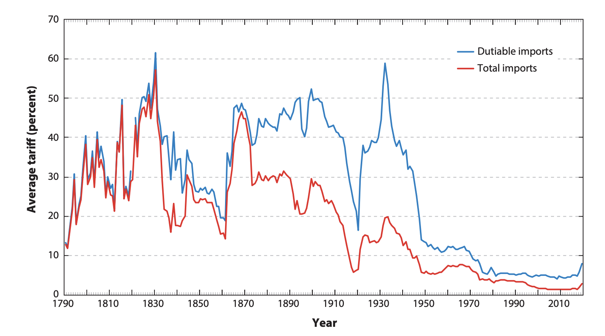
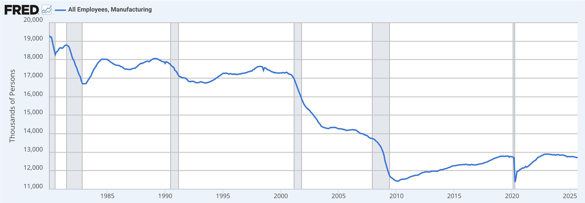
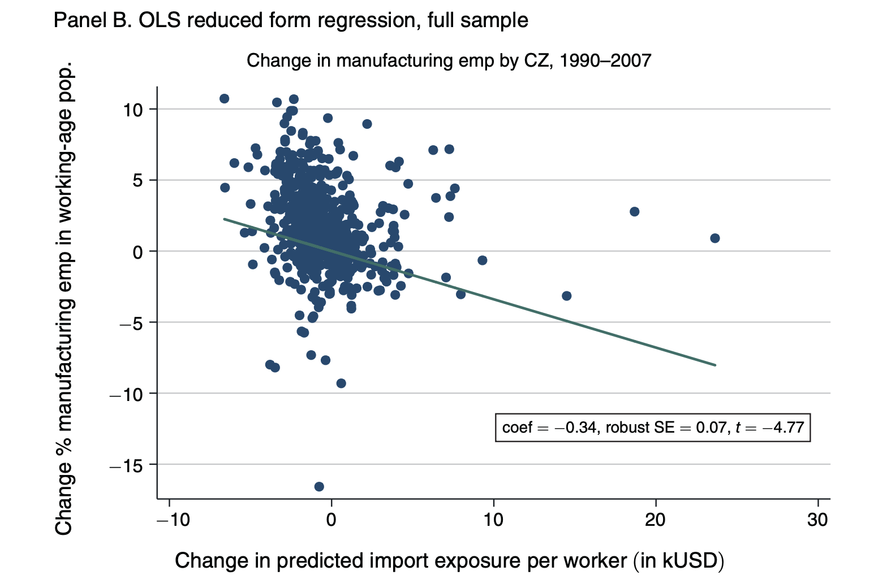

## Introduction

The Clark Center at University of Chicago regularly surveys many of the leading economists in the world on a variety of topics. In 2012, they asked the following question: 

> "Freer trade improves productive efficiency and offers consumers better choices, and in the long run these gains are much larger than any effects on employment"

```{python}
#| echo: false
import matplotlib.pyplot as plt
import numpy as np

# Survey responses
categories = ['Strongly\nAgree', 'Agree', 'Uncertain', 'Disagree', 'Strongly\nDisagree', 'Did Not\nAnswer']
percentages = [29, 56, 5, 0, 0, 10]

# Create the bar chart
fig, ax = plt.subplots(figsize=(7, 6))
bars = ax.bar(categories, percentages, color='#64B5F6')

# Add percentage labels on top of bars
for i, (bar, pct) in enumerate(zip(bars, percentages)):
    height = bar.get_height()
    if height > 0:
        ax.text(bar.get_x() + bar.get_width()/2., height,
                f'{pct}%',
                ha='center', va='bottom', fontsize=11, fontweight='bold')

# Formatting
ax.set_ylabel('Percentage (%)', fontsize=12)
ax.set_xlabel('Response', fontsize=12)
ax.set_title('Survey Responses on Free Trade from Economists', fontsize=14, fontweight='bold', pad=20)
ax.set_ylim(0, max(percentages) * 1.15)
ax.grid(axis='y', alpha=0.3, linestyle='--')

plt.tight_layout()
plt.show()
```

The fact that free trade generally makes countries richer is one of the least controversial opinions among economists. The next question in this survey asked particularly about the North American Free Trade Agreement (NAFTA). This is a trade agreement between the United States, Canada, and Mexico that went into effect in 1994 and reduced trade barriers between the countries. Similarly to the question above, the vast majority agreed that, on average, NAFTA improved welfare for U.S. citizens.  

However, this is often not the general opinion among the public. For example, in 2012, the American National Election Studies (ANES) asked a question about free trade to a representative sample of U.S. adults: 

> Some people have suggested placing new limits on foreign imports in order
to protect American jobs. Others say that such limits would raise consumer
prices and hurt American exports. Do you FAVOR or OPPOSE placing new
limits on imports, or haven't you thought much about this?

Below are the results.

```{python}
#| echo: false
import matplotlib.pyplot as plt

# Survey responses
categories = ['Favor\nQuotas', 'Oppose\nQuotas', 'Unsure']
percentages = [37, 16, 47]

# Create the bar chart
fig, ax = plt.subplots(figsize=(7, 6))
bars = ax.bar(categories, percentages, color='#66BB6A')

# Add percentage labels on top of bars
for i, (bar, pct) in enumerate(zip(bars, percentages)):
    height = bar.get_height()
    if height > 0:
        ax.text(bar.get_x() + bar.get_width()/2., height,
                f'{pct}%',
                ha='center', va='bottom', fontsize=11, fontweight='bold')

# Formatting
ax.set_ylabel('Percentage (%)', fontsize=12)
ax.set_xlabel('Response', fontsize=12)
ax.set_title('Public Opinion on Import Quotas', fontsize=14, fontweight='bold', pad=20)
ax.set_ylim(0, max(percentages) * 1.15)
ax.grid(axis='y', alpha=0.3, linestyle='--')

plt.tight_layout()
plt.show()
```

In contrast to economists, generally people have more mixed opinions on free trade. For the ANES question, most people were actually unsure, while a significant portion favored placing new limits on imports. This is in stark contrast to the overwhelming agreement among economists that free trade is beneficial. 

This is also reflected in policy. Historically, many countries have placed tariffs (taxes on imports) in order to protect domestic industries. For example, in the U.S., high tariff rates were common in the 19th century and early 20th century. For example, the plot below shows the average tariff rate in the U.S. from 1821 to 2020. This figure comes from @irwin2020trade.




Something that has long been recognized is that trade creates winners and losers. Often the losers are concentrated in very specific industries or regions. You hear of specific stories of manufacturing plants being shut down due to competition from imports. On the flip side, the gains from trade may be more spread out through the economy. People benefit from lower prices. Lower prices on imports will increase the purchasing power of consumers, leading them to spend more in their local economies. These benefits are there, but maybe a bit harder to see. 

In this chapter we will explore first the economic theory of free trade. Why do economists generally agree that free trade raises the standard of living of individuals? Then we will consider the losses. What happens in places where industries are harmed by trade? How can we think about policies to help those who are negatively affected by trade?


## Trends in Trade 

To set the context of what we are going to discuss, let's look at some data on trade over time. The following figure shows imports into the U.S. over time. The blue line shows total imports from all countries, while the orange dashed line shows imports from China only. The left axis corresponds to all imports, while the right axis corresponds to imports from China only.

As can be seen in the figure, imports into the U.S. have increased dramatically over time. These are in nominal terms, so some of the increase is due to inflation, although the bulk is due to real increases in trade over time. 

```{python}
#| echo: false
import pandas as pd
import matplotlib.pyplot as plt
from matplotlib.ticker import FuncFormatter

# Load the data
df = pd.read_csv('/Users/davidarnold/Dropbox/Teaching/ECON139/data/trade/trade.csv')

# Create figure and first axis
fig, ax1 = plt.subplots(figsize=(7, 6))

# Plot trade_all on the first y-axis
color1 = '#64B5F6'
ax1.set_xlabel('Year', fontsize=12)
ax1.set_ylabel('Millions of Dollars (All Trade)', fontsize=12, color=color1)
ax1.plot(df['year'], df['trade_all'], color=color1, linewidth=2, label='All Trade')
ax1.tick_params(axis='y', labelcolor=color1)

# Format y-axis to avoid scientific notation
ax1.yaxis.set_major_formatter(FuncFormatter(lambda x, p: f'{int(x):,}'))

# Create second y-axis
ax2 = ax1.twinx()
color2 = '#FF9800'
ax2.set_ylabel('Millions of Dollars (China Only)', fontsize=12, color=color2)
ax2.plot(df['year'], df['trade_china'], color=color2, linewidth=2, linestyle='--', label='Trade with China')
ax2.tick_params(axis='y', labelcolor=color2)

# Format y-axis to avoid scientific notation
ax2.yaxis.set_major_formatter(FuncFormatter(lambda x, p: f'{int(x):,}'))

# Add title
plt.title('Imports in the U.S. over Time', fontsize=14, fontweight='bold', pad=20)

# Add legend
lines1, labels1 = ax1.get_legend_handles_labels()
lines2, labels2 = ax2.get_legend_handles_labels()
ax1.legend(lines1 + lines2, labels1 + labels2, loc='upper left')

plt.tight_layout()
plt.show()
```

Now, one key focus, both in policy and in academia, has been studying how the rise of trade with China has affected U.S. workers. In 1985 (the first period with data), trade with China was extremely minimal. However, over time, China has steadily increased its exports to the U.S., becoming one of the largest trading partners. In 2024, for example, China accounts for about 12% of all U.S. imports (in terms of value of those imports). This is still less than imports from Mexico (16%) and Canada (14%). You may (or may not) find it surprising that China actually ranks third, given the attention it receives in the media. One potential reason is that both Mexico and Canada have been substantial trading partners for a long time. The rise of trade with China has been much more recent and dramatic, leading many to fear that trade has become the reason for declining manufacturing in the US. 

## Comparative Advantage

Stanislaw Ulam was a famous mathematician who met economist Paul Samuelson while they were both at Harvard University. Ulam used to tease Samuelson that the social sciences were not as scientific as the hard sciences. He would teasingly challenge Samuelson to "name one proposition in all of the social sciences which is both true and non-trivial."

Paul Samuelson eventually came up with an answer: comparative advantage. As we will find out, it is true. It works. We've seen it happen in the real world. And it is also non-trivial. As Paul Samuelson explained, "that \[comparative advantage\] is not trivial is attested by the thousands of important and intelligent men who have never been able to grasp the doctrine for themselves or to believe it after it was explained to them."

The basic idea behind comparative advantage is that trade is mutually beneficial even when one country is better at producing everything relative to another country. To illustrate this, let's consider two countries: Country A and Country B. Each country can produce two goods: clothing and food.

It's intuitive that if Country A can produce clothing more cheaply than Country B, and Country B can grow food more cheaply than Country A, then both countries could benefit from trade. But what remains true is that they will benefit from trade even if one country is better at producing both goods. This is the power of the principle of comparative advantage.

Let's put some concrete numbers to this example. Imagine Country A can produce 100 units of clothing if it devotes the entirety of its resources to clothing production. If it instead devotes the entirety of its resources to food production, it can produce 50 units of food. In a world without trade, we say country A is an autarky. It must produce everything it consumes itself. In autarky, since country A needs both goods, it will produce some combination of clothing and food. We will assume this country has a linear production possibilities frontier (PPF). This means if it would like to produce one more unit of clothing, it must give up producing half a unit of food. Let's plot the production possibilities frontier for Country A.

```{python}
#| echo: false
import matplotlib.pyplot as plt
import numpy as np

# Country A can produce: 100 clothing OR 50 food
# PPF: linear trade-off between the two goods

fig, ax = plt.subplots(figsize=(7, 6))

# Define the PPF endpoints
clothing_max = 100
food_max = 50

# Plot the PPF line
ax.plot([0, clothing_max], [food_max, 0], color='#64B5F6', linewidth=2.5)

# Formatting
ax.set_xlabel('Clothing (units)', fontsize=12)
ax.set_ylabel('Food (units)', fontsize=12)
ax.set_title('Production Possibilities Frontier for Country A', fontsize=14, fontweight='bold', pad=20)
ax.set_xlim(-5, 110)
ax.set_ylim(-5, 60)
ax.grid(True, alpha=0.3, linestyle='--')
ax.axhline(y=0, color='black', linewidth=0.8)
ax.axvline(x=0, color='black', linewidth=0.8)

plt.tight_layout()
plt.show()
```

Next, we will consider Country B. Country B is strictly more productive than Country A. If it devotes all its resources to clothing production, it can produce 200 units of clothing. If it devotes all its resources to food production, it can produce 200 units of food. Let's plot the production possibilities frontier for Country B next to the one for Country A.

```{python}
#| echo: false
import matplotlib.pyplot as plt
import numpy as np

# Country A: 100 clothing OR 50 food
# Country B: 200 clothing OR 200 food

fig, ax = plt.subplots(figsize=(7, 6))

# Country A PPF
clothing_max_a = 100
food_max_a = 50
ax.plot([0, clothing_max_a], [food_max_a, 0], color='#64B5F6', linewidth=2.5, label='Country A')

# Country B PPF
clothing_max_b = 200
food_max_b = 200
ax.plot([0, clothing_max_b], [food_max_b, 0], color='#FF9800', linewidth=2.5, linestyle='--', label='Country B')

# Formatting
ax.set_xlabel('Clothing (units)', fontsize=12)
ax.set_ylabel('Food (units)', fontsize=12)
ax.set_title('Production Possibilities Frontiers', fontsize=14, fontweight='bold', pad=20)
ax.set_xlim(-5, 210)
ax.set_ylim(-5, 210)
ax.grid(True, alpha=0.3, linestyle='--')
ax.axhline(y=0, color='black', linewidth=0.8)
ax.axvline(x=0, color='black', linewidth=0.8)
ax.legend(fontsize=11, loc='upper right')

plt.tight_layout()
plt.show()
```

So the naive response might be: well, Country B is better at producing both goods. There is no scope for gains from trade here. However, that would be incorrect. Let's see why. To do so, we will compute the opportunity costs of producing each good in each country.

For Country A, what is the opportunity cost of an additional unit of clothing? To produce one more unit of clothing, Country A must give up producing 0.5 units of food. Therefore, the opportunity cost of 1 unit of clothing in Country A is 0.5 units of food. 

In Country B, what is the opportunity cost of an additional unit of clothing? To produce one more unit of clothing, Country B must give up producing 1 unit of food. Therefore, the opportunity cost of 1 unit of clothing in Country B is 1 unit of food. 

Therefore, the opportunity cost of producing clothing is lower in Country A than in Country B. We say that Country A has a **comparative advantage** in producing clothing. To produce another unit of clothing, Country A must give up 0.5 units of food, whereas Country B must give up 1 unit of food.

Now, to see why both countries can benefit from trade, let's consider the autarky equilibrium first. Country A and Country B must both be on their respective production possibilities frontiers. The exact point depends on the preferences of individuals in the country. To understand that trade improves outcomes we don't actually need to know which point they will choose. We will show that with free trade the two countries can consume more of both goods. Hence, they will be better off than under autarky.

To do so, let's pick a price of trade. Let's assume that with trade, that country A can trade 1 unit of clothing to Country B for 0.75 units of food. Let's first examine how this changes the possibilities of Country A. To do this we will assume that it can exchange as many goods as it wants at this price (note: in equilibrium, the price will adjust so that the amount supplied equals the amount demanded, but we will not worry about that here. Our goal is to show that a given exchange rate can increase total welfare).

Well, now, instead of getting 0.5 units of food for giving up 1 unit of clothing (its opportunity cost), Country A can get 0.75 units of food for giving up 1 unit of clothing. This means that Country A can effectively consume more food for any given level of clothing production. Therefore, its production possibilities frontier expands outward relative to its original autarky PPF. At an extreme case, imagine it produced 100 units of clothing and then traded all 100 units of clothing to Country B. It would receive 75 units of food in return. Let's see what this looks like in the figure below.

```{python}
#| echo: false
import matplotlib.pyplot as plt
import numpy as np

# Country A PPF: 100 clothing OR 50 food
clothing_max_a = 100
food_max_a = 50

fig, ax = plt.subplots(figsize=(7, 6))

# Plot Country A's PPF
ax.plot([0, clothing_max_a], [food_max_a, 0], color='#64B5F6', linewidth=2.5, label='PPF (without trade)')

# Plot Country A's CPF with trade (exchange rate: 1 clothing = 0.75 food)
# If Country A produces 100 clothing and trades it all, gets 75 food
# The CPF passes through (100, 0) and (0, 75)
cpf_clothing = 100
cpf_food = 75
ax.plot([0, cpf_clothing], [cpf_food, 0], color='#64B5F6', linewidth=2.5, linestyle='--', label='PPF (with trade)')

# Formatting
ax.set_xlabel('Clothing (units)', fontsize=12)
ax.set_ylabel('Food (units)', fontsize=12)
ax.set_title('PPF With and Without Trade', fontsize=14, fontweight='bold', pad=20)
ax.set_xlim(-5, 110)
ax.set_ylim(-5, 80)
ax.grid(True, alpha=0.3, linestyle='--')
ax.axhline(y=0, color='black', linewidth=0.8)
ax.axvline(x=0, color='black', linewidth=0.8)
ax.legend(fontsize=11, loc='upper right')

plt.tight_layout()
plt.show()
```

So what have we learned. With the exchange rate of 1 clothing = 0.75 food, Country A can now consume combinations of clothing and food that were previously unattainable in autarky. Therefore, country A is better off. 

But remember, Country B is strictly more productive than Country A. So how can Country B benefit from trade? To see this, let's consider how the production possibilities frontier of Country B changes with trade. Well, Country B has an opportunity cost of 1 unit of food for every 1 unit of clothing. However, with trade, it can get 1 unit of food for giving up only 0.75 units of clothing. Therefore, Country B can also consume more food for any given level of clothing production. Its PPF with trade also expands outward relative to its original PPF in autarky. Now, one thing to consider is that the maximum amount of clothing Country A can produce is 100 units. So we will assume for the first 100 units, Country B can trade at the rate of 1 clothing = 0.75 food. However, if it wants to trade more than 100 units of clothing, it must do so at its opportunity cost of 1 clothing = 1 food (since Country A cannot supply any more clothing beyond 100 units). Therefore, the consumption possibilities frontier for Country B with trade will have a kink in it. Let's plot this below.

```{python}
#| echo: false
import matplotlib.pyplot as plt
import numpy as np

# Country B PPF: 200 clothing OR 200 food
clothing_max_b = 200
food_max_b = 200

fig, ax = plt.subplots(figsize=(7, 6))

# Plot Country B's PPF
ax.plot([0, clothing_max_b], [food_max_b, 0], color='#64B5F6', linewidth=2.5, label='PPF (without trade)')

# Plot Country B's CPF with trade (kinked)
# Country B produces all food (200 units)
# Can trade up to 100 units at rate: 1 food = 0.75 clothing (or equivalently, 1 clothing = 0.75 food from Country A's perspective)
# Wait, Country B is trading food FOR clothing from Country A
# From Country B's perspective: gives up 0.75 food to get 1 clothing
# Starting at (0, 200): can get up to 100/0.75 = 133.33 clothing by trading away 100 food
# But Country A can only supply 100 clothing max
# So: Starting at (0, 200), trade 75 food for 100 clothing -> reach (100, 125)
# Then continue at own opportunity cost 1:1 -> reach (200, 25) if trading all remaining food
# Actually, let me reconsider: if trading at own rate 1:1, from (100, 125) to (200, 25) is slope -1

# CPF segments:
# Segment 1: (0, 200) to point where traded with Country A
# Country B trades food for clothing at rate: 0.75 food per 1 clothing
# Can get 100 clothing by trading 75 food: (100, 125)
# Segment 2: From (100, 125), continue at own PPF slope 1:1
# To produce 100 more clothing, give up 100 more food: (200, 25)

cpf_x = [0, 100, 200]
cpf_y = [200, 125, 25]
ax.plot(cpf_x, cpf_y, color='#FF9800', linewidth=2.5, linestyle='--', label='PPF (with trade)')

# Formatting
ax.set_xlabel('Clothing (units)', fontsize=12)
ax.set_ylabel('Food (units)', fontsize=12)
ax.set_title('Country B: Production vs Consumption Possibilities', fontsize=14, fontweight='bold', pad=20)
ax.set_xlim(-5, 210)
ax.set_ylim(-5, 210)
ax.grid(True, alpha=0.3, linestyle='--')
ax.axhline(y=0, color='black', linewidth=0.8)
ax.axvline(x=0, color='black', linewidth=0.8)
ax.legend(fontsize=11, loc='upper right')

plt.tight_layout()
plt.show()
```

Again, we see that Country B can also consume combinations of clothing and food that were previously unattainable in autarky. Therefore, country B is also better off. 

This is the magic of comparative advantage. It doesn't matter that Country B can produce strictly more of each good. What is always true is that to make something, you must give up production of something else. This is comparative advantage. As long as the opportunity costs differ between countries, there is always scope for mutually beneficial trade.

Now, this is a highly simplified model, but a powerful one. It has played a significant role in how economists think about gains from trade for centuries. However, one thing that has long been recognized is that it ignores distributional effects. While both countries are better off overall, within each country there may be winners and losers. For example, in Country A, the clothing industry may expand due to trade, while the food industry may contract. Workers in the food industry may lose their jobs. If they can easily transition to working in the clothing industry, then maybe the impact is small. If there are frictions to this transition, then it is certainly possible they are worse off. We will explore these distributional effects of trade later in this chapter.

This is really the two key forces we will think about in this section. On the one hand, trade can make countries richer overall. However, it may have distributional effects. Another way to say this is that trade increases GDP, but can also increase inequality. We will explore both of these forces in the remainder of this chapter.

For those interested in trade, it is important to highlight that there are many features of modern international trade systems that are difficult to capture in this simple model. For example, there are many examples of countries trading within the same industry, which we call intra-industry trade. In this simple model, we would never have the countries both producing and trading the same good. There has been extensive work around exploring better models of international trade. For example, Paul Krugman earned the Nobel prize in 2008 for his work on models of trade that incorporate economies of scale and product differentiation. The idea in his model is that consumers love variety in their products. They are willing to pay a premium for more varieties, but as the product market fragments into more specific products, producers struggle to obtain a large enough market to recover their fixed costs of production. Trade acts as a way to increase the market size, allowing firms to produce at a larger scale. We will not get into the details of these models here, as our focus is on the impacts on workers, but there is a rich literature on international trade for those interested in learning more.

## The China Shock 

A central focus of media attention on trade as well as academic work has been the rise of trade with China. One of the key empirical facts that drove this interest is the dramatic decrease in manufacturing employment in the U.S. in the early 2000s. In 2000, there were about 1.7 million workers in manufacturing. By 2007 this had dropped to about 1.3 million workers. 



As we saw in the previous section, the decline in manufacturing employment does coincide with a rise from trade with China. Before 2000, there was actually relatively limited trade in manufacturing with low-wage countries. This is one of the reasons that the rise in inequality in the 1980s is generally not attributed to trade, but rather more consistent with changes in technology. However, after China entered the World Trade Organization (WTO) in 2001, trade with China increased dramatically. Since trade with China is mostly concentrated in manufacturing, this led to a natural question: did the rise of trade with China cause the decline in manufacturing employment? As we discussed in the chapters on technology, the early 2000s also saw a rise in automation technologies, including industrial robots. So there are clear confounding factors at play here. We can't conclude from these two big trends whether trade is **causing** the decline in manufacturing. The second question we might ask is: even if trade is shifting employment to other industries, is this a bad thing? Maybe the manufacturing workers who lost their jobs were able to find similar jobs in other industries. 

To answer these questions, @AutorDornHanson2013 study how different regional markets in the U.S. were affected by the rise in trade with China. The key idea is that different regions in the U.S. specialized in different types of manufacturing. Some regions specialized in industries that faced a lot of competition from Chinese imports, while other regions specialized in industries that did not face much competition from Chinese imports. Therefore, if trade with China was causing the decline in manufacturing employment, we would expect to see larger declines in manufacturing employment in regions that specialized in industries that faced more competition from Chinese imports. Additionally, we can check if employment and wages are positively or negatively impacted by this increased competition from China. For example, if workers who lost their manufacturing jobs were able to find similar jobs in other industries, then we would expect to see no change in overall employment and wages in regions that faced more competition from China. However, if workers struggled to find new jobs, then we would expect to see declines in overall employment and wages in regions that faced more competition from China. 

So how do we operationalize this idea? To simplify their approach, we are going to consider a setting in which the only industry that faces competition from China is in the manufacturing of electronic computers. This is obviously an enormous simplification. The reason we chose this industry in particular is because this is one in which the total value of imports from China is particularly large. 

The first part of the approach is to get a measure of how much trade with China increased in this industry. Let's assume that in 2000, the value of all imports of electronic computer manufacturing was 2 billion dollars. In 2007, imagine this had increased to 27 billion (these are roughly correct numbers, although changed slightly to make the math in the next section easier). Then the increase in imports from China in this industry is 25 billion dollars. 

So, intuitively, we think that places that specialized more in electronic computer manufacturing should have been more affected by this increase in imports from China. Our goal now is to basically apportion this 25 billion dollar increase in imports to different commuting zones. We studied commuting zones earlier in this book, but to remind you, these are geographic areas that are meant to capture a notion of a local labor market. This means people that live in a commuting zone tend to also work in that commuting zone. There are a total of 722 commuting zones in the U.S.

Let's assume that in 1991, 50% of all manufacturing of electronic computers occurred in San Jose, CA. Therefore, we will say that San Jose should be apportioned 50% of the 25 billion dollar increase in imports from China. This means that San Jose should be assigned 12.5 billion dollars of increased import competition from China. Let's then assume that 30% of all manufacturing of electronic computers occurred in Austin, TX. Therefore, we will say that Austin should be apportioned 30% of the 25 billion dollar increase in imports from China. This means that Austin should be assigned 7.5 billion dollars of increased import competition from China. Finally, let's assume the remaining 20% of all manufacturing of electronic computers occurred in Boston. Therefore, we will say that Boston should be apportioned 20% of the 25 billion dollar increase in imports from China. This means that Boston should be assigned 5 billion dollars of increased import competition from China.

Below is a table summarizing this example.

```{python}
#| echo: false
import pandas as pd
from IPython.display import display, HTML

# Create the data
data = {
    'Commuting Zone': ['San Jose, CA', 'Austin, TX', 'Boston, MA', 'Total'],
    'Share of Electronic Computer Manufacturing (1991)': ['50%', '30%', '20%', '100%'],
    'Apportioned Increase in Imports': ['$12.5 billion', '$7.5 billion', '$5.0 billion', '$25.0 billion']
}

df = pd.DataFrame(data)

# Style the table
styled_df = df.style.set_properties(**{
    'text-align': 'left',
    'font-size': '11pt'
}).set_table_styles([
    {'selector': 'th', 'props': [('background-color', '#64B5F6'), ('color', 'white'), 
                                  ('font-weight', 'bold'), ('text-align', 'center'), 
                                  ('padding', '10px'), ('font-size', '11pt')]},
    {'selector': 'td', 'props': [('padding', '8px'), ('text-align', 'center')]},
    {'selector': 'tr:nth-of-type(even)', 'props': [('background-color', '#f5f5f5')]},
    {'selector': 'tr:last-child', 'props': [('font-weight', 'bold'), ('border-top', '2px solid #64B5F6')]}
]).hide(axis='index')

display(styled_df)
```

Now, we shouldn't just stop here. We need to get a sense of the scale of a 12.5 billion increase in imports in electronics is for San Jose. If San Jose has a lot more workers than Austin, for example, maybe the impact is actually smaller per worker. Therefore, we will normalize this increase in imports by the total number of workers in each commuting zone. Let's assume that San Jose has 1 million workers, and Boston and Austin both have 500,000 workers. Therefore, the increase in imports from China per worker in San Jose is $12,500 per worker. In Austin, it is $15,000 per worker. In Boston, it is $10,000 per worker. Below is a table summarizing this information. Let's create a new table summarizing this information. We are going to call this measure the import exposure per worker.

```{python}
#| echo: false
import pandas as pd
from IPython.display import display, HTML

# Create the data
data = {
    'Commuting Zone': ['San Jose, CA', 'Austin, TX', 'Boston, MA'],
    'Total Workers': ['1,000,000', '500,000', '500,000'],
    'Apportioned Increase in Imports': ['$12.5 billion', '$7.5 billion', '$5.0 billion'],
    'Import Exposure per Worker': ['$12,500', '$15,000', '$10,000']
}

df = pd.DataFrame(data)

# Style the table with highlighted last column
styled_df = df.style.set_properties(**{
    'text-align': 'left',
    'font-size': '11pt'
}).set_properties(subset=['Import Exposure per Worker'], **{
    'background-color': '#FFF9C4',
    'font-weight': 'bold',
    'text-align': 'center'
}).set_table_styles([
    {'selector': 'th', 'props': [('background-color', '#64B5F6'), ('color', 'white'), 
                                  ('font-weight', 'bold'), ('text-align', 'center'), 
                                  ('padding', '10px'), ('font-size', '11pt')]},
    {'selector': 'th:last-child', 'props': [('background-color', '#FF9800')]},
    {'selector': 'td', 'props': [('padding', '8px'), ('text-align', 'center')]},
    {'selector': 'tr:nth-of-type(even)', 'props': [('background-color', '#f5f5f5')]}
]).hide(axis='index')

display(styled_df)
```

The Import Exposure per Worker is the key variable studied in Autor, Dorn, and Hanson (2013). Instead of doing this just for electronic computer manufacturing, they do this for all manufacturing industries. For example, if San Jose also specialized in furniture manufacturing, they would also apportion some of the increase in imports from China in furniture manufacturing to San Jose. They then sum up all of these apportioned increases in imports across all manufacturing industries to get a total import exposure per worker for each commuting zone.

Now, the first question we are going to ask is: how did commuting zones with higher import exposure from China fare in terms of changes in manufacturing employment? To answer this question, we are going to plot changes in percent manufacturing employment against import exposure per worker. For example, if in San Jose, 10% of all workers were employed in manufacturing in 1991, and by 2007 only 5% of all workers were employed in manufacturing, then the change in percent manufacturing employment is -5 percentage points. Below is a scatter plot showing this relationship across all commuting zones.



The first thing to note is that the x-axis is depicting import exposure per worker in thousands of dollars. Therefore, a value of 10 on the x-axis corresponds to $10,000 of import exposure per worker. Also, it is possible that there are some commuting zones that actually had negative import exposure. This would happen if a commuting zone specialized in industries that actually saw a decline in imports from China. The y-axis is depicting the change in percent manufacturing employment in percentage points. Therefore, a value of -5 on the y-axis corresponds to a decline of 5 percentage points in manufacturing employment. The line shows the relationship between import exposure and changes in manufacturing employment. As can be seen, there is a  negative relationship. Commuting zones that faced more import exposure from China saw larger declines in manufacturing employment. To put this into a clear magnitude, an increase in import exposure of $1,000 per worker is associated with a decline in manufacturing employment of about 0.34 percentage points. This is clear graphical evidence, but in the paper they further control for other factors that may be correlated with both import exposure and changes in manufacturing employment. After controlling for these other factors, they find a preferred estimate of -0.6 percentage points decline in manufacturing employment for every $1,000 increase in import exposure per worker.

Now there are two important points here. First, it is clear from this graph that other factors are impacting manufacturing employment. There are commuting zones with equal exposure that have very different levels of manufacturing employment change. Clearly, trade with China is not the only factor affecting manufacturing employment. 

Second, this finding doesn't necessarily tell us how the workers in these manufacturing jobs are doing overall. It could be that they move to other areas, with more opportunities, for example. This is often a hidden assumption in many models of the labor market. Workers can quickly adapt to changes. However, they find no evidence of this in the data. Places with higher import exposure, for example, do not see decreases in population. 

Therefore, this leaves two remaining options. It could be that the non-manufacturing firms in the area expand and hire the displaced manufacturing workers. Or it could be that these workers struggle to find new jobs. This would be reflected in the data as high unemployment rates and/or lower labor force participation rates. 

@AutorDornHanson2013 find strong evidence for this. A $1,000 per worker import shock increases the number of unemployed
and nonparticipating individuals by 4.9 and 2.1 percent, respectively. Overall, this paper finds some striking results that highlight the negative distributional effects of trade. This clear evidence is potentially one reason while public sentiment towards free trade is generally more mixed than the opinion of economists. The stories you hear of workers losing jobs due to trade are clear in news stories and also realized in the data. The adjustment costs are significant, leading to higher unemployment and lower labor force participation in places that faced more competition from China.

Now, the fact that trade had these negative distributional effects was not necessarily a surprise. There are aspects of the results that are certainly not obvious. It is not clear why the adjustment costs are so high leading to long-term increases in nonparticipation. But the basic takeaway: some individuals lose from trade while others gain was never particularly controversial. For example, in 2012, the Clark Center asked an expert panel of economists the following question: 

> Some Americans who work in the production of competing goods, such as clothing and furniture, are made worse off by trade with China.

The results of this survey question are shown below. The vast majority of economists agreed with this statement. Therefore, the findings of @AutorDornHanson2013 are largely consistent with the consensus view among economists. 

```{python}
#| echo: false
import matplotlib.pyplot as plt
import numpy as np

# Survey responses
categories = ['Strongly\nAgree', 'Agree', 'Uncertain', 'Disagree', 'Strongly\nDisagree', 'Did Not\nAnswer']
percentages = [33, 50, 3, 0, 0, 15]

# Create the bar chart
fig, ax = plt.subplots(figsize=(7, 6))
bars = ax.bar(categories, percentages, color='#64B5F6')

# Add percentage labels on top of bars
for i, (bar, pct) in enumerate(zip(bars, percentages)):
    height = bar.get_height()
    if height > 0:
        ax.text(bar.get_x() + bar.get_width()/2., height,
                f'{pct}%',
                ha='center', va='bottom', fontsize=11, fontweight='bold')

# Formatting
ax.set_ylabel('Percentage (%)', fontsize=12)
ax.set_xlabel('Response', fontsize=12)
ax.set_title('Survey Responses on Trade Impact on American Workers', fontsize=14, fontweight='bold', pad=20)
ax.set_ylim(0, max(percentages) * 1.15)
ax.grid(axis='y', alpha=0.3, linestyle='--')

plt.tight_layout()
plt.show()
``` 

However, they were also asked another question about trade with China: 

> Trade with China makes most Americans better off because, among other advantages, they can buy goods that are made or assembled more cheaply in China.

While the majority of economists agree that some workers are harmed, they also overwhelmingly agree that trade with China makes most Americans better off. 45% strongly agree with this statement. 

```{python}
#| echo: false
import matplotlib.pyplot as plt
import numpy as np

# Survey responses
categories = ['Strongly\nAgree', 'Agree', 'Uncertain', 'Disagree', 'Strongly\nDisagree', 'Did Not\nAnswer']
percentages = [45, 40, 0, 0, 0, 10]

# Create the bar chart
fig, ax = plt.subplots(figsize=(7, 6))
bars = ax.bar(categories, percentages, color='#64B5F6')

# Add percentage labels on top of bars
for i, (bar, pct) in enumerate(zip(bars, percentages)):
    height = bar.get_height()
    if height > 0:
        ax.text(bar.get_x() + bar.get_width()/2., height,
                f'{pct}%',
                ha='center', va='bottom', fontsize=11, fontweight='bold')

# Formatting
ax.set_ylabel('Percentage (%)', fontsize=12)
ax.set_xlabel('Response', fontsize=12)
ax.set_title('Survey Responses on Trade with China Being Beneficial', fontsize=14, fontweight='bold', pad=20)
ax.set_ylim(0, max(percentages) * 1.15)
ax.grid(axis='y', alpha=0.3, linestyle='--')

plt.tight_layout()
plt.show()
``` 

## Aggregate Effects 

So what is the analysis of @AutorDornHanson2013 missing? As we discussed, the costs of trade are concentrated among certain workers that were employed in manufacturing. The winners are a bit harder to see. Cheaper items from China will benefit consumers, who will have more purchasing power to stimulate other domestic industries. Additionally, firms that use imported goods as inputs will also benefit from lower costs. But we don't expect these benefits to be concentrated in local areas. These are benefits that are spread out across the country. Therefore, this analysis is not informative of this piece of the puzzle. 

These are generally referred to as general equilibrium effects, and they can be difficult to measure empirically. However, there are some interesting attempts to do so. @bernhofen2005empirical use a unique episode in Japanese history to estimate the total gains from trade in terms of income per capita. For about 200 years, Japan had a national policy of isolation, severely limiting trade. In this time period, Japan only traded with China and the Netherlands, and the amount of trade allowed was extremely limited. In other words, Japan was essentially in autarky for 200 years.

In the 1850s Japan was forced to open up trade with the rest of the world due to military pressure from the U.S. In 1859 Japan opened up its ports to trade. There are few examples in history of a country going from complete autarky to essentially very open trade. Therefore, this provides a unique opportunity to estimate the total gains from trade. @bernhofen2005empirical estimate that the total gains from trade is no larger than 9 percent. Therefore, while trade does make countries richer overall, the magnitude of these gains may not be as large as some expect. However, this is of course a very specific context, where data is somewhat limited. It is not clear how well this estimate generalizes to other contexts.

Another serious effort to estimate the gains from trade comes from @feyrer2019trade. One approach to estimating the gains from trade comes from looking at differences across countries. Do countries that trade more have higher incomes? The problem with this approach is that countries that trade more may also differ in other ways. Therefore, instead a big push in the trade literature has been to look for reasons why one country may trade more than another country for reasons that are unrelated to income. 

One reason that has been proposed is geography. Some places are far away from potential trading partners, and therefore naturally have less trade. @feyrer2019trade however points out that geography tends to be correlated with other aspects of a country that may also affect income. For example, empirically, countries closer to the equator tend to have longer trade routes, but they also may be poorer for reasons other than trade, such as the disease environment. Therefore, @feyrer2019trade proposes a different approach. He uses the rise of air freight. 

The idea is the following. The cost of shipping goods from Ireland to the U.S. by boat is extremely high due to the long distance. The cost of shipping goods from Mexico to the U.S. by boat is much lower due to the shorter distance. Therefore, before air freight, Ireland traded relatively little with the U.S. compared to Mexico. However, air freight dramatically reduces the cost of shipping goods over long distances. Therefore, by the 2000s, most of the goods from Ireland are being shipped by air freight. Ireland has differentially benefited from the rise of air freight compared to Mexico. Therefore, if we compare Ireland and Mexico before and after the rise of air freight, we can get a sense of how much trade increases income. Instead, of just doing this for Ireland and Mexico, @feyrer2019trade does this for a large set of countries that are differentially affected by air freight due to their geographic location. Overall, @feyrer2019trade finds that trade is an important determinant of country income. Differences in predicted trade growth can explain roughly 17 percent of the variation in cross-country income growth between 1960 and 1995.

