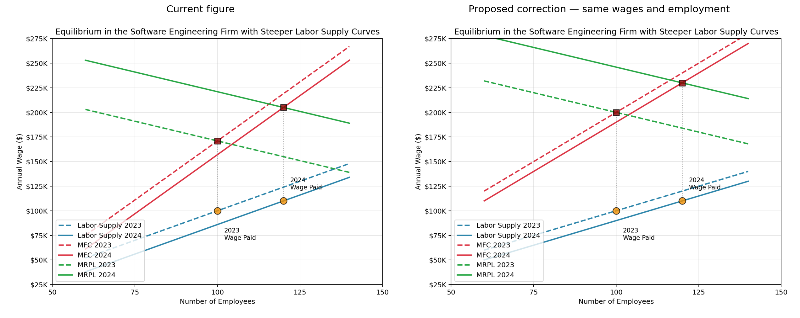

# Item 281: applied figure correction

Applied September 22 after author approval. The corrected plotting code is in `05.qmd`, and the local rendered book now uses the approved figure. The comparison below retains the original figure on the left and the applied correction on the right.

## All numbers in the prose stay the same

| Example | Current text | Proposed text |
| --- | --- | --- |
| 2023 | 100 employees at $100,000 | Unchanged |
| 2024 | 120 employees at $110,000 | Unchanged |
| Wage increase | 10% | Unchanged |
| Employment increase | 20% | Unchanged |
| Naive elasticity calculation | 2 | Unchanged |

No prose edits are needed. The lesson is still that different labor supply curves and shifts can explain the same observed wage/employment points.

## What changes in the figure

The proposed supply curves rise by $1,000 per employee, keeping the arithmetic simple. They remain five times as steep as the preceding flat-supply example ($200 per employee). Both still pass through the original observed points, and the 2024 supply curve still shifts downward.

MFC is calculated from total payroll instead of being positioned independently. MRPL moves to intersect the corrected MFC at the same employment levels. The intersections are $200,000 in 2023 and $230,000 in 2024. These values do not need to be introduced in the prose or labeled on the graph. Axis limits and tick spacing are unchanged.

The correction uses the existing smooth-curve convention throughout. It introduces no fractional employees or additional decimal places.

## Verification and proposed edit

Verified that each supply curve passes through the stated wage/employment point, each MFC curve is the derivative of payroll, and each MRPL–MFC intersection is a unique profit maximum at the stated employment. All chapter content outside the affected plotting block is unchanged in the proposed patch.

- [Proposed figure](proposed.png)
- [Current figure](current.png)
- [Exact proposed source changes](05.qmd.patch)
- [Proposed plotting code](proposed-figure.py)

The code formulas are hidden from students by the chapter's existing `echo: false` setting.
